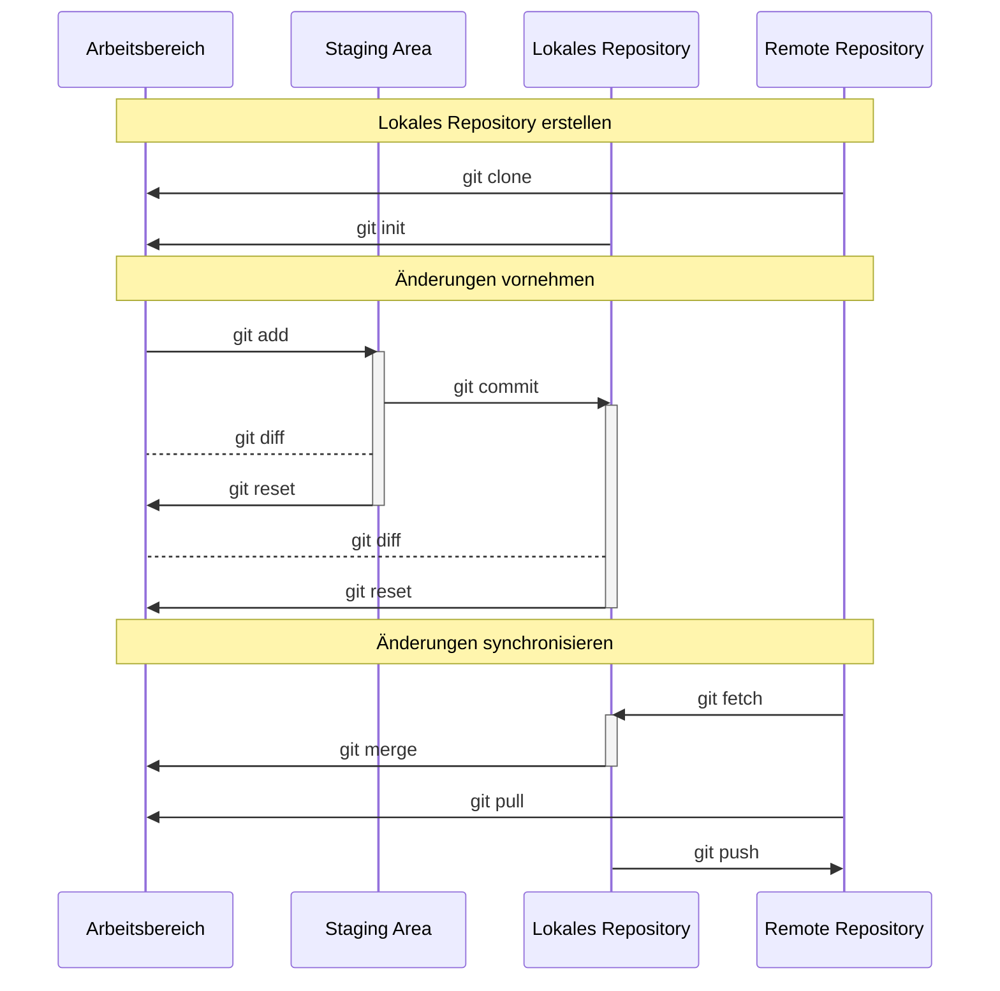

import Tabs from '@theme/Tabs';
import TabItem from '@theme/TabItem';

Git stellt eine Software zur Verwaltung von Dateien mit integrierter
Versionskontrolle dar, dessen Entwicklung unter Anderem von Linus Torvald (dem
Erfinder von Linux) initiiert wurde. Die Versionskontrolle von Git ermöglicht
den Zugriff auf ältere Entwicklungsstände, ohne dabei den aktuellen Stand zu
verlieren. Zudem unterstützt Git die Verwaltung von verteilten Dateien an
verschiedenen Aufbewahrungsorten. Diese Aufbewahrungsorte werden als
_Repositorys_ bezeichnet. Man unterscheidet dabei zwischen lokalen Repositorys
und remote Repositorys. Onlinedienste wie GitHub basieren auf Git und stellen
dem Anwender Speicherplatz für remote Repositorys zur Verfügung.

## Git Workflows

Aufgrund der Flexibilität von Git gibt es keine standardisierten Prozesse für
das Arbeiten mit Git. Ein Git Workflow stellt eine Anleitung zur Verwendung von
Git dar, die eine konsistente und produktive Arbeitsweise ermöglichen soll. Für
eine effiziente und fehlerfreie Arbeitsweise sollten daher alle Mitgleider eines
Teams die gleichen Git Workflows verwenden.

## Git Befehle

Git bietet einen Vielzahl an verschiedenen Kommandozeilen-Befehlen um mit Git zu
arbeiten. Eine ausführliche Dokumentation der einzelnen Befehle samt der
dazugehörigen Optionen können auf der offiziellen
[Git-Homepage](https://git-scm.com/docs) gefunden werden. Zudem kann mit dem
Befehl `git --help` direkt in der Kommandozeile eine Kurzversion der
Dokumentation ausgegeben werden.

<Tabs>
  <TabItem value="a" label="Git einrichten" default>

| Git-Befehl                                          | Beschreibung             |
| --------------------------------------------------- | ------------------------ |
| `git config --global user.name`                     | Benutzername ausgeben    |
| `git config --global user.name "[Benutzername]"`    | Benutzername festlegen   |
| `git config --global user.email`                    | E-Mail-Adresse ausgeben  |
| `git config --global user.email "[E-Mail-Adresse]"` | E-Mail-Adresse festlegen |

  </TabItem>
  <TabItem value="b" label="Lokales Repository erstellen">

| Git-Befehl                      | Beschreibung                 |
| ------------------------------- | ---------------------------- |
| `git clone [Remote Repository]` | Remote Repository klonen     |
| `git init [Lokales Repository]` | Lokales Repository erstellen |

  </TabItem>
  <TabItem value="c" label="Änderungen versionieren">

| Git-Befehl                    | Beschreibung                                                         |
| ----------------------------- | -------------------------------------------------------------------- |
| `git status`                  | Neue und geänderte Dateien ausgeben                                  |
| `git diff`                    | Noch nicht indizierte Änderungen ausgeben                            |
| `git add [Datei]`             | Datei für die Versionierung indizieren                               |
| `git diff --staged`           | Änderungen zwischen dem indizierten und dem aktuellen Stand ausgeben |
| `git reset [Datei]`           | Datei vom Index nehmen                                               |
| `git commit -m "[Nachricht]"` | Alle indizierten Dateien versionieren                                |

  </TabItem>
  <TabItem value="d" label="Änderungen gruppieren">

| Git-Befehl               | Beschreibung                                     |
| ------------------------ | ------------------------------------------------ |
| `git branch`             | Alle Branches ausgeben                           |
| `git branch [Branch]`    | Branch erstellen                                 |
| `git switch [Branch]`    | Branch wechseln und Arbeitsbereich aktualisieren |
| `git merge [Branch]`     | Branches zusammenführen                          |
| `git branch -d [Branch]` | Branch löschen                                   |

  </TabItem>
  <TabItem value="e" label="Änderungen synchronisieren">

| Git-Befehl                                      | Beschreibung                                    |
| ----------------------------------------------- | ----------------------------------------------- |
| `git fetch [Remote Repository]`                 | Versionshistorie vom remote Repository laden    |
| `git merge [Remote Repository]/[Remote Branch]` | Branches zusammenführen                         |
| `git pull`                                      | git fetch + git merge                           |
| `git push [Remote Repository] [Branch]`         | Versionshistorie ins remote Repository schieben |

  </TabItem>
</Tabs>
