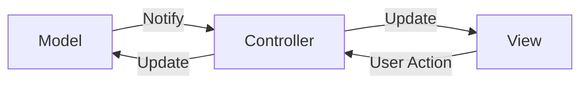

Eine grafische Benutzeroberfläche oder auch _GUI_ (Graphical User Interface) hat
die Aufgabe, Programme mittels grafischer Bildschirmelemente bedienbar zu
machen. So ermöglichen _Controls_ wie Eingabefelder, Drucktasten und
Ausgabefelder die Interaktion mit der Anwendung und _Container_ die
strukturierte Darstellung und Verwaltung anderer Bildschirmelemente. _Dialoge_
wie Nachrichtendialoge und Dateiauswahl-Dialoge widerum stellen vordefinierte
Oberflächen dar, mit deren Hilfe wiederkehrende Anwendungsfälle abgedeckt werden
können.

## Aufbau grafischer Benutzeroberflächen

Da es sich bei grafischen Benutzeroberflächen um komplexe Anwendungen handelt,
werden diese in der Regel in verschiedene Bereiche wie Aufbau, Aussehen und
Verhalten aufgeteilt (_Separation of Concerns_). Als Beispiel sei hier der
Aufbau einer klassischen Webseite aufgeführt: HTML bestimmt den Aufbau, CSS das
Aussehen und JavaScript das Verhalten der Webseite.

Das Entwurfmuster MVC (_Model-View-Controller_) stellt einen gängigen Ansatz zur
Entwicklung von grafischen Benutzeroberflächen dar, bei dem die grafische
Benutzeroberfläche in drei Bereiche unterteilt wird:

- Das _Model_ ist für die Datenhaltung und -verwaltung zuständig
- Die _View_ ist für die Darstellung der Oberfläche zuständig, welche wiederum
  in Aufbau und Aussehen unterteilt ist
- Der _Controller_ übernimmt die Ereignisbehandlung und ermöglicht so die
  Benutzerinteraktion

:::info Hinweis

Der Begriff MVC wird oft auch als Synonym für MVC-ähnliche Varianten wie z.B.
MVP (_Model-View-Presenter_) oder MVVM (_Model-View-ViewModel_) verwendet.

:::

## Ereignisse (Events)

Ereignisse (Events) sind Nachrichten, die über das System weitergeleitet werden.
Auf grafischen Benutzeroberflächen werden Ereignisse z.B. durch das Betätigen
einer Drucktaste ausgelöst. Weitere typische Ergeignisse sind das Betätigen
einer Maustaste, Tastatureingaben oder das Vergrößern bzw. Verkleinern eines
Fensters.

Die Behandlung dieser Ereignisse wird durch das Delegationsmodell festgelegt:

1. Empfänger können sich beim Sender für ein Ereignis registrieren
2. Der Sender löst das Ereignis aus und übergibt das erzeugte Ereignis-Objekt an
   alle registrierten Empfänger
3. Die Empfänger nehmen das Ereignis-Objekt entgegen und haben dadurch die
   Möglichkeit, auf das Ereignis zu reagieren

:::info Hinweis

Die Empfänger werden je nach Bibliothek bzw. Framework als _Handler_ oder
_Listener_ bezeichnet.

:::
