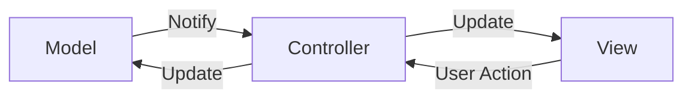

Eine grafische Benutzeroberfläche (_GUI_, Graphical User Interface) macht
Programme durch grafische Bildschirmelemente bedienbar. _Controls_ wie
Eingabefelder, Schaltflächen und Beschriftungen ermöglichen die Interaktion.
_Container_ ordnen und verwalten andere Bildschirmelemente. _Dialoge_ wie
Meldungsfenster und Dateiauswahl-Dialoge decken wiederkehrende Anwendungsfälle
ab.

## Aufbau grafischer Benutzeroberflächen

Da grafische Benutzeroberflächen komplex sind, werden sie nach dem Prinzip der
_Separation of Concerns_ in Bereiche wie Aufbau, Aussehen und Verhalten
aufgeteilt. Ein bekanntes Beispiel ist eine klassische Webseite: HTML definiert
den Aufbau, CSS das Aussehen und JavaScript das Verhalten.

Das Entwurfsmuster MVC (_Model-View-Controller_) ist ein gängiger Ansatz für
GUI-Entwicklung und teilt die Oberfläche in drei Bereiche auf:

- Das _Model_ ist für die Datenhaltung und -verwaltung zuständig
- Die _View_ ist für die Darstellung der Oberfläche zuständig, welche wiederum
  in Aufbau und Aussehen unterteilt ist
- Der _Controller_ übernimmt die Ereignisbehandlung und ermöglicht so die
  Benutzerinteraktion

```mermaid
flowchart LR
   Model --Notify--> Controller
   Controller --Update--> Model
   View --User Action--> Controller
   Controller --Update--> View
```

:::info

Der Begriff MVC wird oft auch als Synonym für MVC-ähnliche Varianten wie z.B.
MVP (_Model-View-Presenter_) oder MVVM (_Model-View-ViewModel_) verwendet.

:::

## Ereignisse (Events)

Ereignisse (Events) sind Nachrichten, die durch Benutzerinteraktionen ausgelöst
werden — z.B. durch das Klicken einer Schaltfläche, eine Tastatureingabe oder
das Vergrößern eines Fensters. Das Delegationsmodell legt fest, wie Ereignisse
behandelt werden:

1. Empfänger können sich beim Sender für ein Ereignis registrieren
2. Der Sender löst das Ereignis aus und übergibt das erzeugte Ereignis-Objekt an
   alle registrierten Empfänger
3. Die Empfänger nehmen das Ereignis-Objekt entgegen und haben dadurch die
   Möglichkeit, auf das Ereignis zu reagieren

:::info

Die Empfänger werden je nach Bibliothek bzw. Framework als _Handler_ oder
_Listener_ bezeichnet.

:::
