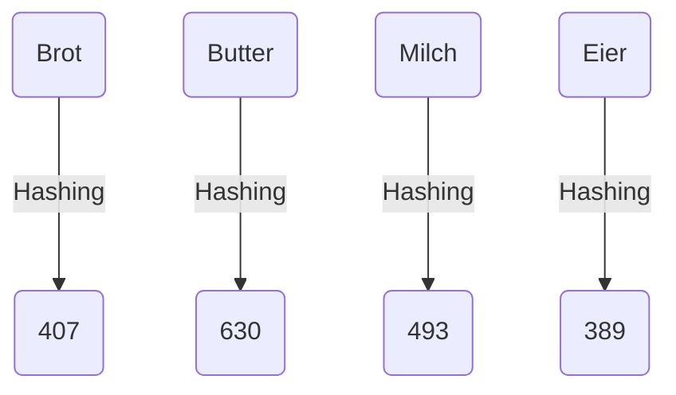

import Tabs from '@theme/Tabs';
import TabItem from '@theme/TabItem';

Unter Schlüsseltransformationen (Hashing) versteht man die Transformation einer
großen Datenmenge in eine kleinere. Die größere Datenmenge wird dabei als
Schlüssel, die kleinere als Hashcode bezeichnet. Die Transformation erfolgt über
eine sogenannte Hashfunktion (auch Streuwertfunktion). Wichtig dabei ist, dass
der Hashcode nur vom Zustand des Schlüssels abhängen darf.

## Hashtabellen

Hashtabellen sind spezielle Datenstrukturen, die für den schnellen Zugriff
konzipiert wurden. Mit Hilfe einer Hashfunktion wird der Index berechnet, an der
ein Schlüssel gespeichert wird. Bei Hashtabellen soll durch das Hashing eine
gleichmäßige Streuung der Einträge in der Tabelle erreicht werden. Aus diesem
Grund werden Hashtabellen auch als Streuwerttabellen bezeichnet.

| Index | Schlüssel | Hashcode |
| ----- | --------- | -------- |
| 0     | Butter    | 630      |
| 1     |           |          |
| 2     | Brot      | 407      |
| 3     | Milch     | 493      |
| 4     | Eier      | 389      |

## Hashfunktionen

<Tabs>
  <TabItem value="a" label="Divisionsrestmethode" default>

Die Divisionsrest-Methode stellt eine einfache und schnelle Hashfunktion dar.
Die Berechnung des Index erfolgt dabei gemäß der Formel `ℎ(𝑘) = 𝑘 𝑚𝑜𝑑 𝑚`.

| Schlüssel | Hashcode | Index         |
| --------- | -------- | ------------- |
| Brot      | 407      | 407 𝑚𝑜𝑑 5 = 2 |
| Butter    | 630      | 630 𝑚𝑜𝑑 5 = 0 |
| Milch     | 493      | 493 𝑚𝑜𝑑 5 = 3 |
| Eier      | 389      | 389 𝑚𝑜𝑑 5 = 4 |

:::note Legende

ℎ(𝑘) = Index, 𝑘 = Hashcode, 𝑚𝑜𝑑 = Modulo-Operation, 𝑚 = Tabellengröße

:::

  </TabItem>
  <TabItem value="b" label="Multiplikative Methode">

Die Multiplikative Methode stellt eine Hashfunktion dar, die man als
Verallgemeinerung der Divisionsrest-Methode sehen kann. Die Berechnung des Index
erfolgt dabei gemäß der Formel `ℎ(𝑘) = ⌊𝑚 ∗ (𝑘 ∗ 𝐴 𝑚𝑜𝑑 1)⌋`.

| Schlüssel | Hashcode | Index                        |
| --------- | -------- | ---------------------------- |
| Brot      | 407      | ⌊5 ∗ (407 ∗ 0,62 𝑚𝑜𝑑 1)⌋ = 1 |
| Butter    | 630      | ⌊5 ∗ (630 ∗ 0,62 𝑚𝑜𝑑 1)⌋ = 3 |
| Milch     | 493      | ⌊5 ∗ (493 ∗ 0,62 𝑚𝑜𝑑 1)⌋ = 3 |
| Eier      | 389      | ⌊5 ∗ (389 ∗ 0,62 𝑚𝑜𝑑 1)⌋ = 0 |

:::note Legende

ℎ(𝑘) = Index, 𝑚 = Tabellengröße, 𝑘 = Hashcode, 𝐴 = Konstante, 𝑚𝑜𝑑 =
Modulo-Operation, ⌊ ⌋ = untere Gaußklammer

:::

:::note Hinweis

Als Wert für die Konstante 𝐴 wird gerne der Goldene Schnitt (~0,62) verwendet.

:::

  </TabItem>
</Tabs>

## Kollisionen

Werden zu unterschiedlichen Schlüsseln dieselben Indizes ermittelt, entstehen
dadurch sogenannte Kollisionen. Um Kollisionen bestmöglichen zu vermeiden, muss
eine geeignete Tabellengröße sowie eine geeignete Hashfunktion gewählt werden.
Zur Auflösung von Kollisionen gibt es verschiedene Möglichkeiten.

<Tabs>
  <TabItem value="a" label="Geschlossenes Hashing mit offener Adressierung" default>

Beim geschlossenen Hashing mit offener Adressierung wird bei einer Kollision
über unterschiedliche Verfahren eine freie Stelle in der Hashtabelle gesucht:
Beim linearen Sondieren wird mit festen Intervallschritten nach einer freien
Stelle gesucht, beim quadratischen Sondieren wird der Intervallschritt nach
jedem erfolglosen Versuch quadriert und beim doppelten Hashing wird der
Intervallschritt mit Hilfe einer zusätzlichen Hashfunktion berechnet.

| Index | Schlüssel |
| ----- | --------- |
| 0     | Eier      |
| 1     | Brot      |
| 2     |           |
| 3     | Butter    |
| 4     | Milch     |

  </TabItem>
  <TabItem value="b" label="Offenes Hashing mit geschlossener Adressierung">

Beim offenen Hashing mit geschlossener Adressierung werden alle Schlüssel mit
demselben Index in einem Behälter (Bucket) gespeichert. Diese Behälter werden
oft mit Hilfe linearer Listen realisiert. Bei der Suche nach einem Schlüssel
muss also zunächst der richtige Behälter ermittelt und anschließend der Behälter
durchsucht werden.

| Index | Schlüssel     |
| ----- | ------------- |
| 0     | Eier          |
| 1     | Brot          |
| 2     |               |
| 3     | Butter, Milch |
| 4     |               |

  </TabItem>
</Tabs>
