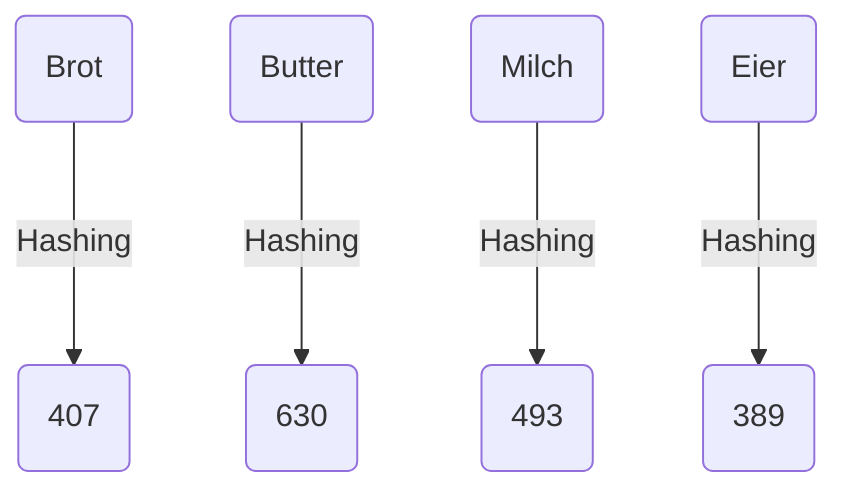

import Tabs from '@theme/Tabs';
import TabItem from '@theme/TabItem';

Schlüsseltransformation (Hashing) bezeichnet die Abbildung einer großen
Datenmenge (Schlüssel) auf eine kleinere Datenmenge (Hashcode) mittels einer
Hashfunktion. Der Hashcode darf dabei nur vom Zustand des Schlüssels abhängen.


```mermaid
flowchart
   string1(Brot) --Hashing---> hash1(407)
   string2(Butter) --Hashing---> hash2(630)
   string3(Milch) --Hashing---> hash3(493)
   string4(Eier) --Hashing---> hash4(389)
```

## Hashtabellen

Hashtabellen sind Datenstrukturen für schnellen Zugriff. Der Index eines
Eintrags wird über eine Hashfunktion berechnet, sodass Einträge gleichmäßig in
der Tabelle gestreut sind. Daher werden Hashtabellen auch Streuwerttabellen
genannt.

| Index | Schlüssel | Hashcode |
| ----- | --------- | -------- |
| 0     | Butter    | 630      |
| 1     |           |          |
| 2     | Brot      | 407      |
| 3     | Milch     | 493      |
| 4     | Eier      | 389      |

## Hashfunktionen

Eine Hashfunktion berechnet aus einem Schlüssel (Hashcode) einen Tabellenindex.
Die beiden gebräuchlichsten Verfahren sind die Divisionsrestmethode und die
multiplikative Methode.

<Tabs>
  <TabItem value="a" label="Divisionsrestmethode" default>

Die Divisionsrestmethode ist eine einfache und schnelle Hashfunktion. Der Index
wird nach der Formel `ℎ(𝑘) = 𝑘 𝑚𝑜𝑑 𝑚` berechnet.

| Schlüssel | Hashcode | Index         |
| --------- | -------- | ------------- |
| Brot      | 407      | 407 𝑚𝑜𝑑 5 = 2 |
| Butter    | 630      | 630 𝑚𝑜𝑑 5 = 0 |
| Milch     | 493      | 493 𝑚𝑜𝑑 5 = 3 |
| Eier      | 389      | 389 𝑚𝑜𝑑 5 = 4 |

:::info

ℎ(𝑘) = Index, 𝑘 = Hashcode, 𝑚𝑜𝑑 = Modulo-Operation, 𝑚 = Tabellengröße

:::

  </TabItem>
  <TabItem value="b" label="Multiplikative Methode">

Die multiplikative Methode ist eine Verallgemeinerung der Divisionsrestmethode.
Der Index wird nach der Formel `ℎ(𝑘) = ⌊𝑚 ∗ (𝑘 ∗ 𝐴 𝑚𝑜𝑑 1)⌋` berechnet.

| Schlüssel | Hashcode | Index                        |
| --------- | -------- | ---------------------------- |
| Brot      | 407      | ⌊5 ∗ (407 ∗ 0,62 𝑚𝑜𝑑 1)⌋ = 1 |
| Butter    | 630      | ⌊5 ∗ (630 ∗ 0,62 𝑚𝑜𝑑 1)⌋ = 3 |
| Milch     | 493      | ⌊5 ∗ (493 ∗ 0,62 𝑚𝑜𝑑 1)⌋ = 3 |
| Eier      | 389      | ⌊5 ∗ (389 ∗ 0,62 𝑚𝑜𝑑 1)⌋ = 0 |

:::info

ℎ(𝑘) = Index, 𝑚 = Tabellengröße, 𝑘 = Hashcode, 𝐴 = Konstante, 𝑚𝑜𝑑 =
Modulo-Operation, ⌊ ⌋ = untere Gaußklammer

:::

:::info

Als Wert für die Konstante 𝐴 wird gerne der Goldene Schnitt (~0,62) verwendet.

:::

  </TabItem>
</Tabs>

## Kollisionen

Ergibt die Hashfunktion für zwei unterschiedliche Schlüssel denselben Index,
spricht man von einer Kollision. Um Kollisionen zu minimieren, müssen
Tabellengröße und Hashfunktion sorgfältig gewählt werden. Für unvermeidliche
Kollisionen gibt es zwei grundlegende Auflösungsstrategien.

<Tabs>
  <TabItem value="a" label="Geschlossenes Hashing mit offener Adressierung" default>

Beim geschlossenen Hashing wird bei einer Kollision eine freie Stelle in der
Hashtabelle gesucht. Beim linearen Sondieren geschieht dies mit festen
Intervallschritten, beim quadratischen Sondieren wächst der Schritt quadratisch,
und beim doppelten Hashing wird der Schritt über eine zweite Hashfunktion
berechnet.

| Index | Schlüssel |
| ----- | --------- |
| 0     | Eier      |
| 1     | Brot      |
| 2     |           |
| 3     | Butter    |
| 4     | Milch     |

  </TabItem>
  <TabItem value="b" label="Offenes Hashing mit geschlossener Adressierung">

Beim offenen Hashing werden alle Schlüssel mit demselben Index in einem Behälter
(Bucket) gespeichert, der in der Regel als verkettete Liste realisiert wird. Bei
einer Suche wird zuerst der Bucket bestimmt, dann der Bucket durchsucht.

| Index | Schlüssel     |
| ----- | ------------- |
| 0     | Eier          |
| 1     | Brot          |
| 2     |               |
| 3     | Butter, Milch |
| 4     |               |

  </TabItem>
</Tabs>

## Hashing in Java

Java verwendet Hashing intern in den Klassen [`HashMap<K, V>`](maps) und
[`HashSet<E>`](java-collections-framework). Der Schlüssel eines Eintrags
bestimmt über seinen Hashcode den Bucket, in dem der Eintrag abgelegt wird. Bei
einer Suche wird zunächst der Bucket über den Hashcode gefunden, anschließend
wird innerhalb des Buckets mit `equals()` verglichen.

Damit diese Mechanismen korrekt funktionieren, müssen die Methoden `hashCode()`
und `equals()` der [Klasse `Object`](object) konsistent überschrieben werden:

- Zwei inhaltlich gleiche Objekte (`equals()` gibt `true` zurück) müssen
  **denselben Hashcode** liefern.
- Zwei Objekte mit demselben Hashcode müssen **nicht** inhaltlich gleich sein
  (eine Kollision ist erlaubt, aber ineffizient).

```java title="Person.java (Auszug)" showLineNumbers
public class Person {

   private String name;
   private int age;

   @Override
   public boolean equals(Object object) {
      if (this == object) return true;
      if (object == null || getClass() != object.getClass()) return false;
      Person other = (Person) object;
      return age == other.age && Objects.equals(name, other.name);
   }

   @Override
   public int hashCode() {
      return Objects.hash(name, age);
   }

}
```

:::warning

Wird `equals()` überschrieben, ohne `hashCode()` anzupassen, verhält sich die
Klasse in `HashMap` und `HashSet` falsch: Zwei inhaltlich gleiche Objekte landen
in unterschiedlichen Buckets und werden nicht als gleich erkannt.

:::
