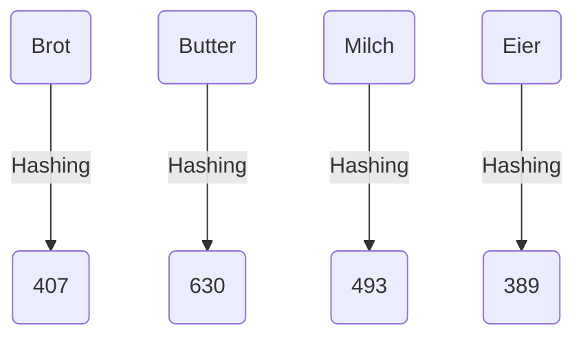
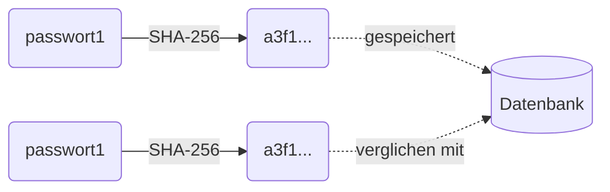

import Tabs from '@theme/Tabs';
import TabItem from '@theme/TabItem';

Schlüsseltransformation (Hashing) bezeichnet die Abbildung eines Schlüssels auf
einen Wert fester Länge, genannt Hashcode, mittels einer Hashfunktion. Der
Hashcode darf dabei nur vom Zustand des Schlüssels abhängen.


```mermaid
flowchart
   string1(Brot) --Hashing---> hash1(407)
   string2(Butter) --Hashing---> hash2(630)
   string3(Milch) --Hashing---> hash3(493)
   string4(Eier) --Hashing---> hash4(389)
```

## Hashtabellen

Hashtabellen sind Datenstrukturen für schnellen Zugriff. Der Index eines
Eintrags wird über eine Hashfunktion berechnet, sodass Einträge gleichmäßig in
der Tabelle gestreut sind. Daher werden Hashtabellen auch Streuwerttabellen
genannt.

| Index | Schlüssel | Hashwert |
| ----- | --------- | -------- |
| 0     | Butter    | 630      |
| 1     |           |          |
| 2     | Brot      | 407      |
| 3     | Milch     | 493      |
| 4     | Eier      | 389      |

## Hashfunktionen

Eine Hashfunktion berechnet aus einem Schlüssel einen Hashcode. Der Hashcode hat
immer dieselbe feste Länge, unabhängig von der Größe des Schlüssels. Die beiden
gebräuchlichsten Hashfunktionen für Zeichenketten sind die _Zeichenweise
Addition_ und der _Polynomial Rolling Hash_.

<Tabs>
  <TabItem value="a" label="Zeichenweise Addition" default>

Bei der _Zeichenweisen Addition_ werden die ASCII-Werte aller Zeichen eines
Schlüssels summiert. Das Ergebnis ist der Hashcode.

| Schlüssel | Berechnung             | Hashcode |
| --------- | ---------------------- | -------- |
| Brot      | 66+114+111+116         | 407      |
| Butter    | 66+117+116+116+101+114 | 630      |
| Milch     | 77+105+108+99+104      | 493      |
| Eier      | 69+105+101+114         | 389      |

  </TabItem>
  <TabItem value="b" label="Polynomial Rolling Hash">

Beim _Polynomial Rolling Hash_ wird jedes Zeichen mit einer Primzahl potenziert
gewichtet und aufsummiert. Das verhindert, dass Anagramme wie "abc" und "bca"
denselben Hashcode erhalten.

| Schlüssel | Berechnung (Basis 31) | Hashcode |
| --------- | --------------------- | -------- |
| ab        | 97 ∗ 31¹ + 98 ∗ 31⁰   | 3105     |
| ba        | 98 ∗ 31¹ + 97 ∗ 31⁰   | 3135     |

:::info

`ℎ(𝑘) = Σ 𝑘ᵢ ∗ 𝑝ⁱ`, wobei `𝑘ᵢ` der ASCII-Wert des i-ten Zeichens und `𝑝` eine
Primzahl (z. B. 31) ist. Java's `String.hashCode()` verwendet dieses Verfahren.

:::

  </TabItem>
</Tabs>

## Index-Mapping

Eine Indexfunktion berechnet aus einem Hashcode einen Tabellenindex. Die beiden
gebräuchlichsten Verfahren sind die Divisionsrestmethode und die multiplikative
Methode.

<Tabs>
  <TabItem value="a" label="Divisionsrestmethode" default>

Die Divisionsrestmethode ist eine einfache und schnelle Indexfunktion. Der Index
wird nach der Formel `ℎ(𝑘) = 𝑘 𝑚𝑜𝑑 𝑚` berechnet.

| Schlüssel | Hashcode | Index         |
| --------- | -------- | ------------- |
| Brot      | 407      | 407 𝑚𝑜𝑑 5 = 2 |
| Butter    | 630      | 630 𝑚𝑜𝑑 5 = 0 |
| Milch     | 493      | 493 𝑚𝑜𝑑 5 = 3 |
| Eier      | 389      | 389 𝑚𝑜𝑑 5 = 4 |

:::info

ℎ(𝑘) = Index, 𝑘 = Hashcode, 𝑚𝑜𝑑 = Modulo-Operation, 𝑚 = Tabellengröße

:::

  </TabItem>
  <TabItem value="b" label="Multiplikative Methode">

Die multiplikative Methode ist eine Verallgemeinerung der Divisionsrestmethode.
Der Index wird nach der Formel `ℎ(𝑘) = ⌊𝑚 ∗ (𝑘 ∗ 𝐴 𝑚𝑜𝑑 1)⌋` berechnet.

| Schlüssel | Hashcode | Index                        |
| --------- | -------- | ---------------------------- |
| Brot      | 407      | ⌊5 ∗ (407 ∗ 0,62 𝑚𝑜𝑑 1)⌋ = 1 |
| Butter    | 630      | ⌊5 ∗ (630 ∗ 0,62 𝑚𝑜𝑑 1)⌋ = 3 |
| Milch     | 493      | ⌊5 ∗ (493 ∗ 0,62 𝑚𝑜𝑑 1)⌋ = 3 |
| Eier      | 389      | ⌊5 ∗ (389 ∗ 0,62 𝑚𝑜𝑑 1)⌋ = 0 |

:::info

ℎ(𝑘) = Index, 𝑚 = Tabellengröße, 𝑘 = Hashcode, 𝐴 = Konstante, 𝑚𝑜𝑑 =
Modulo-Operation, ⌊ ⌋ = untere Gaußklammer

:::

:::info

Als Wert für die Konstante 𝐴 wird gerne der Goldene Schnitt (~0,62) verwendet.

:::

  </TabItem>
</Tabs>

## Kollisionen

Ergibt die Hashfunktion für zwei unterschiedliche Schlüssel denselben Index,
spricht man von einer Kollision. Um Kollisionen zu minimieren, müssen
Tabellengröße und Hashfunktion sorgfältig gewählt werden. Für unvermeidliche
Kollisionen gibt es zwei grundlegende Auflösungsstrategien.

<Tabs>
  <TabItem value="a" label="Geschlossenes Hashing mit offener Adressierung" default>

Beim geschlossenen Hashing wird bei einer Kollision eine freie Stelle in der
Hashtabelle gesucht. Beim linearen Sondieren geschieht dies mit festen
Intervallschritten, beim quadratischen Sondieren wächst der Schritt quadratisch,
und beim doppelten Hashing wird der Schritt über eine zweite Hashfunktion
berechnet.

| Index | Schlüssel |
| ----- | --------- |
| 0     | Eier      |
| 1     | Brot      |
| 2     |           |
| 3     | Butter    |
| 4     | Milch     |

  </TabItem>
  <TabItem value="b" label="Offenes Hashing mit geschlossener Adressierung">

Beim offenen Hashing werden alle Schlüssel mit demselben Index in einem Behälter
(Bucket) gespeichert, der in der Regel als verkettete Liste realisiert wird. Bei
einer Suche wird zuerst der Bucket bestimmt, dann der Bucket durchsucht.

| Index | Schlüssel     |
| ----- | ------------- |
| 0     | Eier          |
| 1     | Brot          |
| 2     |               |
| 3     | Butter, Milch |
| 4     |               |

  </TabItem>
</Tabs>

## Hashing in Java

Java verwendet Hashing intern in den Klassen [`HashMap<K, V>`](maps) und
[`HashSet<E>`](java-collections-framework). Der Schlüssel eines Eintrags
bestimmt über seinen Hashcode den Bucket, in dem der Eintrag abgelegt wird. Bei
einer Suche wird zunächst der Bucket über den Hashcode gefunden, anschließend
wird innerhalb des Buckets mit `equals()` verglichen.

Damit diese Mechanismen korrekt funktionieren, müssen die Methoden `hashCode()`
und `equals()` der [Klasse `Object`](object) konsistent überschrieben werden:

- Zwei inhaltlich gleiche Objekte (`equals()` gibt `true` zurück) müssen
  **denselben Hashcode** liefern.
- Zwei Objekte mit demselben Hashcode müssen **nicht** inhaltlich gleich sein
  (eine Kollision ist erlaubt, aber ineffizient).

```java title="Person.java (Auszug)" showLineNumbers
public class Person {

   private String name;
   private int age;

   @Override
   public boolean equals(Object object) {
      if (this == object) return true;
      if (object == null || getClass() != object.getClass()) return false;
      Person other = (Person) object;
      return age == other.age && Objects.equals(name, other.name);
   }

   @Override
   public int hashCode() {
      return Objects.hash(name, age);
   }

}
```

:::warning

Wird `equals()` überschrieben, ohne `hashCode()` anzupassen, verhält sich die
Klasse in `HashMap` und `HashSet` falsch: Zwei inhaltlich gleiche Objekte landen
in unterschiedlichen Buckets und werden nicht als gleich erkannt.

:::

## Hashing von Passwörtern

Passwörter werden niemals im Klartext gespeichert, sondern als Hashcode. Beim
Login wird das eingegebene Passwort erneut gehasht und mit dem gespeicherten
Hashcode verglichen. Da Hashfunktionen nicht umkehrbar sind, kann ein Angreifer
aus einem gestohlenen Hashcode das ursprüngliche Passwort nicht direkt
rekonstruieren.


```mermaid
flowchart LR
   pw1(passwort1) --SHA-256--> hash1(a3f1...)
   pw2(passwort1) --SHA-256--> hash2(a3f1...)
   hash1 -. gespeichert .-> db[(Datenbank)]
   hash2 -. verglichen mit .-> db
```

:::warning

Einfache Hashfunktionen wie MD5 oder SHA-1 sind für Passwörter ungeeignet, weil
sie sehr schnell berechnet werden können. Angreifer können mit sogenannten
Brute-Force- oder Rainbow-Table-Angriffen Millionen von Kandidaten pro Sekunde
testen. Für Passwörter werden bewusst langsame Algorithmen wie **bcrypt**,
**scrypt** oder **Argon2** eingesetzt.

:::

:::info

Um zu verhindern, dass zwei Nutzer mit demselben Passwort denselben Hashcode
erhalten (was Rainbow-Table-Angriffe erleichtert), wird dem Passwort vor dem
Hashen ein zufälliger Wert — das sogenannte **Salt** — vorangestellt.

:::

## Abgrenzung: Hashing, Encoding und Encryption

Die Begriffe Hashing, Encoding und Encryption werden häufig verwechselt, haben
aber grundlegend unterschiedliche Eigenschaften und Einsatzzwecke.

| Eigenschaft     | Hashing           | Encoding      | Encryption         |
| --------------- | ----------------- | ------------- | ------------------ |
| Umkehrbar       | Nein              | Ja            | Ja (mit Schlüssel) |
| Schlüssel nötig | Nein              | Nein          | Ja                 |
| Ausgabelänge    | Fest              | Variabel      | Variabel           |
| Zweck           | Integrität, Suche | Darstellung   | Vertraulichkeit    |
| Beispiele       | SHA-256, bcrypt   | Base64, UTF-8 | AES, RSA           |

**Hashing** ist eine Einwegfunktion: Der ursprüngliche Wert lässt sich aus dem
Hashcode nicht wiederherstellen. Es wird eingesetzt, um Integrität zu prüfen (z.
B. Prüfsummen) oder Daten effizient zu suchen (Hashtabellen).

**Encoding** wandelt Daten in eine andere Darstellung um — ohne Geheimhaltung
und vollständig umkehrbar. Base64 kodiert z. B. Binärdaten in druckbare
ASCII-Zeichen, damit sie in E-Mails oder URLs übertragen werden können.

**Encryption** (Verschlüsselung) macht Daten für Dritte unlesbar und erfordert
einen Schlüssel zur Entschlüsselung. Symmetrische Verfahren wie AES verwenden
denselben Schlüssel zum Ver- und Entschlüsseln; asymmetrische Verfahren wie RSA
nutzen ein Schlüsselpaar (öffentlich/privat).
