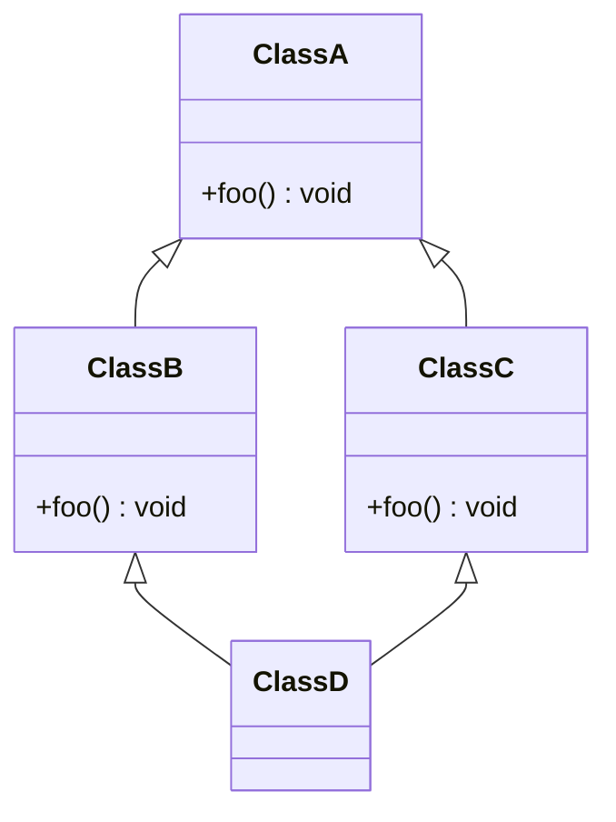

Wird eine Klasse von mehreren Klassen abgeleitet, spricht man von Mehrfachvererbung. Das Prinzip der Mehrfachvererbung wird von vielen Programmiersprachen allerdings nicht (direkt) unterstützt. Der Hauptgrund hier sind mögliche Mehrdeutigkeiten. Erbt eine Klasse
über mehrere mögliche Pfade von einer Basisklasse und werden dabei möglicherweise Methoden der Basisklasse unterschiedlich überschrieben, entstehen dadurch nicht eindeutige Varianten. Aufgrund der Rautenform des Klassendiagramms wird dieses Szenario also
_Diamantenproblem_ bezeichnet.



Zur Lösung des Diamantenproblems werden Schnittstellen (Interfaces) verwendet. Schnittstellen sind im Prinzip abstrakte Klassen, die ausschließlich abstrakte Methoden besitzen. Durch Schnittstellen wird sichergestellt, dass Klassen bestimmte Methoden
bereitstellen und dass verschiedene Klassen miteinander kommunizieren können.

## Definition von Schnittstellen

Die Definition einer Schnittstelle erfolgt analog zur Definition von Klassen. Das Schlüsselwort für Schnittstellen lautet `interface`. Eine Schnittstelle kann nur öffentliche, abstrakte und öffentliche, statische Methoden beinhalten.

```java title="Foo.java" showLineNumbers
public interface Foo {

  void bar();

  void baz();

}
```

:::note Hinweis

Die Angabe von `abstract` und `public` bei Methoden ist nicht erforderlich.

:::

## Implementieren von Schnittstellen

Schnittstellen werden mit Hilfe des Schlüsselworts `implements` von einer Klasse implementiert. Durch die Implementierung der Schnittstelle verpflichtet sich die Klasse, alle Methoden der Schnittstelle zu implementieren.

```java title="Qux.java" showLineNumbers
public class Qux implements Foo {

  public void bar() {
    System.out.println("bar");
  }

  public void baz() {
    System.out.println("baz");
  }

}
```

## Verwenden von Schnittstellen

Schnittstellen können ebenso wie Klassen als Datentypen verwendet werden. Die Typumwandlung von der implementierenden Klasse zur Schnittstelle bezeichnet man als _Upcast_ die Rückumwandlung als _Downcast_

```java title="MainClass.java" showLineNumbers
public class MainClass {

  public static void main(String[] args) {
    Foo foo;
    Qux qux = new Qux();
    foo = qux; // Upcast
  }

}
```
