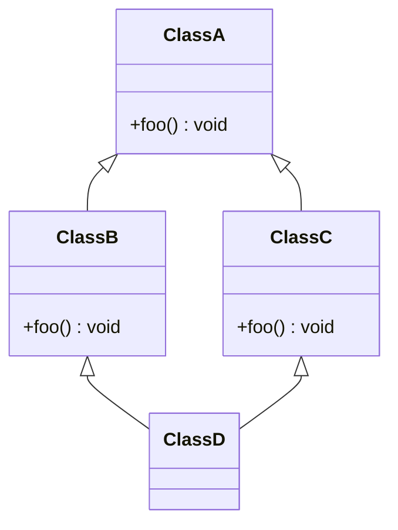

import Tabs from '@theme/Tabs';
import TabItem from '@theme/TabItem';

Wird eine Klasse von mehreren Klassen abgeleitet, spricht man von
Mehrfachvererbung. Das Prinzip der Mehrfachvererbung wird von vielen
Programmiersprachen allerdings nicht (direkt) unterstützt. Der Hauptgrund hier
sind mögliche Mehrdeutigkeiten. Erbt eine Klasse über mehrere mögliche Pfade von
einer Basisklasse und werden dabei möglicherweise Methoden der Basisklasse
unterschiedlich überschrieben, entstehen dadurch nicht eindeutige Varianten.
Aufgrund der Rautenform des Klassendiagramms wird dieses Szenario also
_Diamantenproblem_ bezeichnet.



Zur Lösung des Diamantenproblems werden Schnittstellen (Interfaces) verwendet.
Schnittstellen sind im Prinzip abstrakte Klassen, die ausschließlich abstrakte
Methoden besitzen. Durch Schnittstellen wird sichergestellt, dass Klassen
bestimmte Methoden bereitstellen und dass verschiedene Klassen miteinander
kommunizieren können.

## Definition von Schnittstellen

Die Definition einer Schnittstelle erfolgt analog zur Definition von Klassen.
Das Schlüsselwort für Schnittstellen lautet `interface`. Eine Schnittstelle kann
nur öffentliche, abstrakte und öffentliche, statische Methoden beinhalten.

```java title="MobileDevice.java" showLineNumbers
public interface MobileDevice {

   int getScreenSizeInInches();

}
```

:::info Hinweis

Die Angabe von `abstract` und `public` bei Methoden ist nicht erforderlich.

:::

## Implementieren von Schnittstellen

Schnittstellen werden mit Hilfe des Schlüsselworts `implements` von einer Klasse
implementiert. Durch die Implementierung der Schnittstelle verpflichtet sich die
Klasse, alle Methoden der Schnittstelle zu implementieren.

<Tabs>
  <TabItem value="a" label="Schnittstelle" default>

```java title="MobileDevice.java" showLineNumbers
public interface MobileDevice {

   int getScreenSizeInInches();

}
```

  </TabItem>
  <TabItem value="b" label="Implementierende Klasse">

```java title="Notebook.java (Auszug)" showLineNumbers
public class Notebook extends Computer implements MobileDevice {
   ...
   @Override
   public int getScreenSizeInInches() {
      return screenSizeInInches;
   }
   ...
}
```

  </TabItem>
</Tabs>

## Verwenden von Schnittstellen

Schnittstellen können ebenso wie Klassen als Datentypen verwendet werden. Die
Typumwandlung von der implementierenden Klasse zur Schnittstelle bezeichnet man
als _Upcast_ die Rückumwandlung als _Downcast_

<Tabs>
  <TabItem value="a" label="Schnittstelle" default>

```java title="MobileDevice.java" showLineNumbers
public interface MobileDevice {

   int getScreenSizeInInches();

}
```

  </TabItem>
  <TabItem value="b" label="Implementierende Klasse A">

```java title="Notebook.java (Auszug)" showLineNumbers
public class Notebook extends Computer implements MobileDevice {
   ...
   @Override
   public int getScreenSizeInInches() {
      return screenSizeInInches;
   }

   @Override
   public ArrayList<String> getSpecification() {
      ArrayList<String> specification = new ArrayList<>();
      specification.add("description: " + description);
      specification.add("cpu: " + cpu);
      specification.add("memoryInGb: " + memoryInGb);
      specification.add("screenSizeInInches: " + screenSizeInInches);
      return specification;
   }
   ...
}
```

  </TabItem>
  <TabItem value="c" label="Implementierende Klasse B">

```java title="Smartphone.java (Auszug)" showLineNumbers
public class Smartphone implements MobileDevice {
   ...
   private double widthInInches;
   private double heightInInches;

   @Override
   public int getScreenSizeInInches() {
      return Math.sqrt(Math.pow(widthInInches) + Math.pow(heightInInches));
   }
   ...
}
```

  </TabItem>
  <TabItem value="d" label="Startklasse">

```java title="MainClass.java" showLineNumbers
public class MainClass {

   public static void main(String[] args) {
      ArrayList<MobileDevice> mobileDevices = new ArrayList<>();

      mobileDevices.add(new Notebook("Mein Gaming Laptop", new Cpu(4.7, 8), 32, 16)); // Upcast
      mobileDevices.add(new Smartphone("Google Pixel 9", 2.8, 6)); // Upcast

      for (MobileDevice m : mobileDevices) {
         System.out.println(m.getScreenSizeInInches()); // Polymorphie
         if (m instanceof Notebook n) { // Downcast
            System.out.println(n.getSpecification());
         }
      }
   }

}
```

  </TabItem>
</Tabs>
