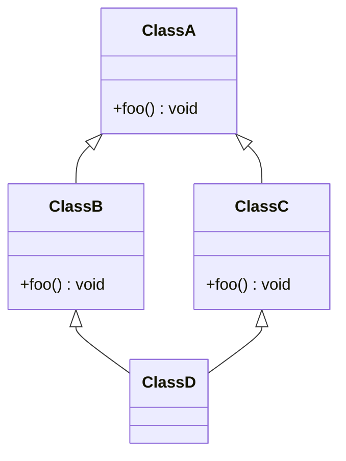

import Tabs from '@theme/Tabs';
import TabItem from '@theme/TabItem';

Erbt eine Klasse von mehreren Klassen gleichzeitig, spricht man von
_Mehrfachvererbung_. Dieses Konzept wird von vielen Programmiersprachen nicht
direkt unterstützt, da es zu Mehrdeutigkeiten führen kann: Erbt eine Klasse über
mehrere Pfade von derselben Basisklasse und wurde dabei eine Methode
unterschiedlich überschrieben, entsteht Unklarheit, welche Implementierung
verwendet werden soll. Aufgrund der Rautenform im Klassendiagramm bezeichnet man
dieses Problem als _Diamantenproblem_.


```mermaid
classDiagram
   ClassA <|-- ClassB
   ClassA <|-- ClassC
   ClassB <|-- ClassD
   ClassC <|-- ClassD
   class ClassA {
      +foo() void
   }
   class ClassB {
      +foo() void
   }
   class ClassC {
      +foo() void
   }
   class ClassD {
   }
```

Zur Lösung des Diamantenproblems werden Schnittstellen (Interfaces) eingesetzt.
Schnittstellen sind im Wesentlichen abstrakte Klassen, die ausschließlich
abstrakte Methoden enthalten. Sie stellen sicher, dass implementierende Klassen
bestimmte Methoden bereitstellen, ohne eine konkrete Vererbungshierarchie
vorzuschreiben.

## Definition von Schnittstellen

Eine Schnittstelle wird ähnlich wie eine Klasse definiert, verwendet aber das
Schlüsselwort `interface`. Sie kann nur öffentliche abstrakte sowie öffentliche
statische Methoden enthalten.

```java title="MobileDevice.java" showLineNumbers
public interface MobileDevice {

   int getScreenSizeInInches();

}
```

:::info

Die Angabe von `abstract` und `public` bei Methoden ist nicht erforderlich.

:::

## Implementieren von Schnittstellen

Eine Schnittstelle wird mit dem Schlüsselwort `implements` von einer Klasse
implementiert. Damit verpflichtet sich die Klasse, alle Methoden der
Schnittstelle zu implementieren.

<Tabs>
  <TabItem value="a" label="Schnittstelle" default>

```java title="MobileDevice.java" showLineNumbers
public interface MobileDevice {

   int getScreenSizeInInches();

}
```

  </TabItem>
  <TabItem value="b" label="Implementierende Klasse">

```java title="Notebook.java (Auszug)" showLineNumbers
public class Notebook extends Computer implements MobileDevice {
   ...
   @Override
   public int getScreenSizeInInches() {
      return screenSizeInInches;
   }
   ...
}
```

  </TabItem>
</Tabs>

## Verwenden von Schnittstellen

Schnittstellen können wie Klassen als Datentypen verwendet werden. Die
Typumwandlung von der implementierenden Klasse zur Schnittstelle bezeichnet man
als _Upcast_, die Rückumwandlung als _Downcast_.

<Tabs>
  <TabItem value="a" label="Schnittstelle" default>

```java title="MobileDevice.java" showLineNumbers
public interface MobileDevice {

   int getScreenSizeInInches();

}
```

  </TabItem>
  <TabItem value="b" label="Implementierende Klasse A">

```java title="Notebook.java (Auszug)" showLineNumbers
public class Notebook extends Computer implements MobileDevice {
   ...
   @Override
   public int getScreenSizeInInches() {
      return screenSizeInInches;
   }

   @Override
   public ArrayList<String> getSpecification() {
      ArrayList<String> specification = new ArrayList<>();
      specification.add("description: " + description);
      specification.add("cpu: " + cpu);
      specification.add("memoryInGb: " + memoryInGb);
      specification.add("screenSizeInInches: " + screenSizeInInches);
      return specification;
   }
   ...
}
```

  </TabItem>
  <TabItem value="c" label="Implementierende Klasse B">

```java title="Smartphone.java (Auszug)" showLineNumbers
public class Smartphone implements MobileDevice {
   ...
   private double widthInInches;
   private double heightInInches;

   @Override
   public int getScreenSizeInInches() {
      return (int) Math.sqrt(Math.pow(widthInInches, 2) + Math.pow(heightInInches, 2));
   }
   ...
}
```

  </TabItem>
  <TabItem value="d" label="Startklasse">

```java title="MainClass.java" showLineNumbers
public class MainClass {

   public static void main(String[] args) {
      ArrayList<MobileDevice> mobileDevices = new ArrayList<>();

      mobileDevices.add(new Notebook("Mein Gaming Laptop", new Cpu(4.7, 8), 32, 16)); // Upcast
      mobileDevices.add(new Smartphone("Google Pixel 9", 2.8, 6)); // Upcast

      for (MobileDevice m : mobileDevices) {
         System.out.println(m.getScreenSizeInInches()); // Polymorphie
         if (m instanceof Notebook n) { // Downcast
            System.out.println(n.getSpecification());
         }
      }
   }

}
```

  </TabItem>
</Tabs>

:::tip

Eine Schnittstelle eignet sich, wenn mehrere, voneinander unabhängige Klassen
dasselbe Verhalten teilen sollen. Eine [abstrakte Klasse](abstract-and-final)
eignet sich, wenn gemeinsame Implementierungen geerbt werden sollen.

:::
