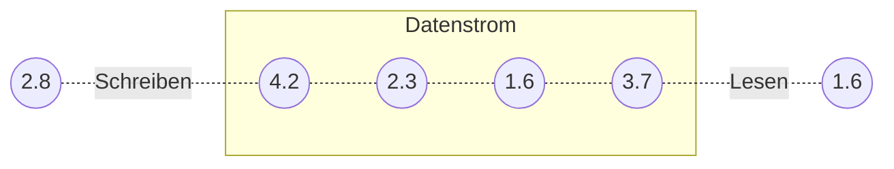

Datenströme (IO-Streams) sind unidirektionale Pipelines, die Schnittstellen
eines Java-Programms nach außen darstellen. Daten können unabhängig von der Art
der Quelle bzw. des Ziels vorne in einen Datenstrom geschrieben und hinten
wieder ausgelesen werden. Ein Datenstrom kann dabei immer nur in eine Richtung
verwendet werden (also entweder zur Ein- oder Ausgabe). Neben den
Standard-Datenströmen zur Ein- und Ausgabe existieren verschiedene Klassen zum
Schreiben und Lesen zeichenorientierter Daten, zum Schreiben und Lesen
byteorientierter Daten und zum Schreiben und Lesen serialisierter Objekte. Das
Arbeiten mit Datenstrom-Klassen kann dabei aufwändig über "normale"
try-catch-Anweisungen oder mit Hilfe von try-with-resources-Anweisungen
realisiert werden.



## Standard-Datenströme zur Ein- und Ausgabe

Java stellt Standard-Datenströme für die Eingabe (`System.in`), die Ausgabe
(`System.out`), sowie die Fehlerausgabe (`System.err`) zur Verfügung.

```java title="MainClass.java" showLineNumbers
public class MainClass {

   public static void main(String[] args) {
      byte input[] = new byte[256];
      int noBytes = 0;
      String output = "";

      try {
         noBytes = System.in.read(input);
      } catch (IOException e) {
         System.err.println(e.getMessage());
      }

      if (noBytes > 0) {
         output = new String(input, 0, noBytes);
         System.out.println(output);
      }
   }

}
```

:::note Hinweis

Die Klasse `Scanner`, die ebenfalls auf dem Datenstrom-Konzept basiert,
ermöglicht eine einfache Möglichkeit der Eingabe.

:::

## Schreiben und Lesen byteorientierter Daten

Für die Verarbeitung von byteorientierten Daten (z.B. Bild- und Video-Dateien)
stehen die abstrakten Basisklassen `InputStream` und `OutputStream` zur
Verfügung.

| Datenstromklasse                                 | Ein- und Ausgabe in... |
| ------------------------------------------------ | ---------------------- |
| `BufferedInputStream` und `BufferedOutputStream` | ...einen Puffer        |
| `FileInputStream` und `FileOutputStream`         | ...eine Datei          |
| `StringInputStream` und `StringOutputStream`     | ...eine Zeichenkette   |

### Schreiben byteorientierter Daten

1. Datei-Objekt erzeugen
2. FileOutputStream-Objekt erzeugen
3. BufferedOutputStream-Objekt erzeugen
4. Daten schreiben

```java title="MainClass.java" showLineNumbers
public class MainClass {

   public static void main(String[] args) {
      File file = new File("stark.bin");

      try (FileOutputStream fos = new FileOutputStream(file);
            BufferedOutputStream bos = new BufferedOutputStream(fos)) {
         bos.write("Winter is Coming".getBytes());
      } catch (IOException e) {
         e.printStackTrace();
      }
   }

}
```

### Lesen byteorientierter Daten

1. Datei-Objekt erzeugen
2. FileInputStream-Objekt erzeugen
3. BufferedInputStream-Objekt erzeugen
4. Werte auslesen

```java title="MainClass.java" showLineNumbers
public class MainClass {

   public static void main(String[] args) {
      File file = new File("stark.bin");

      try (FileInputStream fis = new FileInputStream(file);
            BufferedInputStream bis = new BufferedInputStream(fis)) {
         byte[] input = bis.readAllBytes();
         System.out.println(new String(input));
      } catch (IOException e) {
         e.printStackTrace();
      }
   }

}
```

## Schreiben und Lesen zeichenorientierter Daten

Für die Verarbeitung von zeichenorientierten Daten (z.B. Textdokumente) stehen
die abstrakten Basisklassen `Reader` und `Writer` zur Verfügung.

| Datenstromklasse                      | Ein- und Ausgabe in... |
| ------------------------------------- | ---------------------- |
| `BufferedReader` und `BufferedWriter` | ...einen Puffer        |
| `FileReader` und `FileWriter`         | ...eine Datei          |
| `StringReader` und `StringWriter`     | ...eine Zeichenkette   |

### Schreiben zeichenorientierter Daten

1. Datei-Objekt erzeugen
2. FileWriter-Objekt erzeugen
3. BufferedWriter-Objekt erzeugen
4. Daten schreiben

```java title="MainClass.java" showLineNumbers
public class MainClass {

   public static void main(String[] args) {
      File file = new File("stark.txt");

      try (FileWriter fileWriter = new FileWriter(file);
            BufferedWriter bufferedWriter = new BufferedWriter(fileWriter)) {
         bufferedWriter.write("Winter is Coming");
      } catch (IOException e) {
         e.printStackTrace();
      }
   }

}
```

### Lesen zeichenorientierter Daten

1. Datei-Objekt erzeugen
2. FileReader-Objekt erzeugen
3. BufferedReader-Objekt erzeugen
4. Werte auslesen

```java title="MainClass.java" showLineNumbers
public class MainClass {

   public static void main(String[] args) {
      File file = new File("stark.txt");

      try (FileReader fileReader = new FileReader(file);
            BufferedReader bufferedReader = new BufferedReader(fileReader)) {
         String line;
         while ((line = bufferedReader.readLine()) != null) {
            System.out.println(line);
         }
      } catch (IOException e) {
         e.printStackTrace();
      }
   }

}
```

## Schreiben und Lesen serialisierter Objekte

Um ein Objekt persistent zu machen (also zu sichern) und um ein Objekt durch das
Netzwerk zu schicken (also für entfernte Methodenaufrufe) ist es notwendig, das
Objekt in einen Byte-Strom umzuwandeln. Die Umwandlung eines Objektes in einen
Byte-Strom bezeichnet man als _Serialisierung_ die Rückumwandlung als
_Deserialisierung_ Die Serialisierung erfolgt über die writeObject-Methode der
Klasse `ObjectOutputStream`, die Deserialisierung über die readObject-Methode
der Klasse `ObjectInputStream`.

Damit Objekte einer Klasse serialisiert werden können, muss die entsprechende
Klasse die Schnittstelle `Serializable` implementieren. Die Schnittstelle
`Serializable` ist eine sogenannte Marker-Schnittstelle, d.h. sie besitzt keine
zu implementierenden Methoden.

```java title="Foo.java" showLineNumbers
public record Stark(String name) implements Serializable {}
```

### Schreiben serialisierter Objekte

1. Datei-Objekt erzeugen
2. FileOutputStream-Objekt erzeugen
3. ObjectOutputStream-Objekt erzeugen
4. Objekte schreiben

```java title="MainClass.java" showLineNumbers
public class MainClass {

   public static void main(String[] args) {
      List<Stark> starks = new ArrayList<>();
      starks.add(new Stark("Eddard Stark"));
      starks.add(new Stark("Rob Stark"));
      starks.add(new Stark("Sansa Stark"));
      starks.add(new Stark("Arya Stark"));
      starks.add(new Stark("Bran Stark"));
      starks.add(new Stark("Rickon Stark"));

      File file = new File("starks.bin");

      try (FileOutputStream fos = new FileOutputStream(file);
            ObjectOutputStream oos = new ObjectOutputStream(fos)) {
         for (Stark s : starks) {
            oos.writeObject(s);
         }
      } catch (IOException e) {
         e.printStackTrace();
      }
   }

}
```

### Lesen serialisierter Objekte

1. Datei-Objekt erzeugen
2. FileInputStream-Objekt erzeugen
3. ObjectInputStream-Objekt erzeugen
4. Objekte auslesen

```java title="MainClass.java" showLineNumbers
public class MainClass {

  public static void main(String[] args) {
    File file = new File("starks.bin");

    try (FileInputStream fis = new FileInputStream(file);
        ObjectInputStream ois = new ObjectInputStream(fis)) {
      while (true) {
        Stark stark = (Stark) ois.readObject();
        System.out.println(stark);
      }
    } catch (EOFException e) {
      /* End of File */
    } catch (IOException | ClassNotFoundException e) {
      e.printStackTrace();
    }
  }

}
```

### Versionierung bei der Serialisierung

Die Konstante `serialVersionUID` vom Datentyp `long` dient zur eindeutigen
Identifikation der Version einer serialisierbaren Klasse. Durch die Konstante
kann sichergestellt werden, dass Empfänger von serialisierten Objekten
typkompatibel zum Sender sind, d.h. eine passende Klassenstruktur aufweisen.

```java title="Foo.java" showLineNumbers
public record Stark(String name) implements Serializable {

   public static final long serialVersionUID = 1L;

}
```

:::danger Hinweis

Obwohl jede serialisierbare Klasse automatisch eine ID erhält, wird die manuelle
Zuweisung dringend empfohlen.

:::

## Die try-with-resources-Anweisung

Bei einer "normalen" try-catch-Anweisung müssen die Datenstrom-Klassen manuell
geschlossen werden, was sich als sehr aufwändig darstellt.

```java title="MainClass.java" showLineNumbers
public class MainClass {

   public static void main(String[] args) {
      File file = new File("stark.txt");
      FileWriter fileWriter = null;
      BufferedWriter bufferedWriter = null;

      try {
         fileWriter = new FileWriter(file);
         bufferedWriter = new BufferedWriter(fileWriter);
         bufferedWriter.write("Winter is Coming");
      } catch (IOException e) {
         e.printStackTrace();
      } finally {
         if (bufferedWriter != null) {
            try {
               bufferedWriter.close();
            } catch (IOException e) {
               e.printStackTrace();
            }
         }
      }
   }

}
```

:::note Hinweis

Der finally-Block einer try-Anweisung wird in jedem Fall durchlaufen.

:::

Die try-with-resources-Anweisung ermöglicht die Deklaration von Ressourcen, die
am Ende des try-Blockes automatisch geschlossen werden.

```java title="MainClass.java" showLineNumbers
public class MainClass {

   public static void main(String[] args) {
      File file = new File("stark.txt");

      try (FileWriter fileWriter = new FileWriter(file);
            BufferedWriter bufferedWriter = new BufferedWriter(fileWriter)) {
         bufferedWriter.write("Winter is Coming");
      } catch (IOException e) {
         e.printStackTrace();
      }
   }

}
```

:::note Hinweis

Voraussetzung für den Einsatz der try-with-resources-Anweisung ist, dass die
Ressourcen-Klassen die Schnittstelle `AutoCloseable` implementiert haben.

:::
