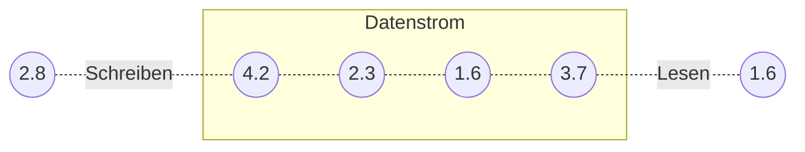

Datenströme (IO-Streams) sind unidirektionale Pipelines zwischen einem
Java-Programm und einer Datenquelle oder einem Datenziel. Daten werden vorne in
den Strom geschrieben und hinten wieder ausgelesen. Ein Datenstrom kann dabei
immer nur in eine Richtung verwendet werden — entweder zur Eingabe oder zur
Ausgabe. Java bietet Klassen für zeichenorientierte Daten (z.B. Textdateien),
byteorientierte Daten (z.B. Bilddateien) und serialisierte Objekte. Für das
korrekte Schließen der Ströme empfiehlt sich die `try-with-resources`-Anweisung.


```mermaid
flowchart LR
   subgraph Datenstrom
      direction LR
      data1((4.2)) -.- data2((2.3)) -.- data3((1.6)) -.- data4((3.7))
   end
   data0((2.8)) -.Schreiben.- data1
   data4 -.Lesen.- data5((1.6))
```

## Standard-Datenströme zur Ein- und Ausgabe

Java stellt drei Standard-Datenströme bereit: `System.in` für die
Standardeingabe (Tastatur), `System.out` für die Standardausgabe (Konsole) und
`System.err` für die Fehlerausgabe.

```java title="MainClass.java" showLineNumbers
public class MainClass {

   public static void main(String[] args) {
      byte input[] = new byte[256];
      int noBytes = 0;
      String output = "";

      try {
         noBytes = System.in.read(input);
      } catch (IOException e) {
         System.err.println(e.getMessage());
      }

      if (noBytes > 0) {
         output = new String(input, 0, noBytes);
         System.out.println(output);
      }
   }

}
```

:::info

Die Klasse `Scanner`, die ebenfalls auf dem Datenstrom-Konzept basiert,
ermöglicht eine einfache Möglichkeit der Eingabe.

:::

## Schreiben und Lesen byteorientierter Daten

Für die Verarbeitung byteorientierter Daten wie Bild- oder Videodateien stehen
die abstrakten Basisklassen `InputStream` und `OutputStream` zur Verfügung.

| Datenstromklasse                                 | Ein- und Ausgabe in... |
| ------------------------------------------------ | ---------------------- |
| `BufferedInputStream` und `BufferedOutputStream` | ...einen Puffer        |
| `FileInputStream` und `FileOutputStream`         | ...eine Datei          |
| `StringInputStream` und `StringOutputStream`     | ...eine Zeichenkette   |

### Schreiben byteorientierter Daten

1. Datei-Objekt erzeugen
2. FileOutputStream-Objekt erzeugen
3. BufferedOutputStream-Objekt erzeugen
4. Daten schreiben

```java title="MainClass.java" showLineNumbers
public class MainClass {

   public static void main(String[] args) {
      File file = new File("stark.bin");

      try (FileOutputStream fos = new FileOutputStream(file);
            BufferedOutputStream bos = new BufferedOutputStream(fos)) {
         bos.write("Winter is Coming".getBytes());
      } catch (IOException e) {
         e.printStackTrace();
      }
   }

}
```

### Lesen byteorientierter Daten

1. Datei-Objekt erzeugen
2. FileInputStream-Objekt erzeugen
3. BufferedInputStream-Objekt erzeugen
4. Werte auslesen

```java title="MainClass.java" showLineNumbers
public class MainClass {

   public static void main(String[] args) {
      File file = new File("stark.bin");

      try (FileInputStream fis = new FileInputStream(file);
            BufferedInputStream bis = new BufferedInputStream(fis)) {
         byte[] input = bis.readAllBytes();
         System.out.println(new String(input));
      } catch (IOException e) {
         e.printStackTrace();
      }
   }

}
```

## Schreiben und Lesen zeichenorientierter Daten

Für die Verarbeitung zeichenorientierter Daten wie Textdateien stehen die
abstrakten Basisklassen `Reader` und `Writer` zur Verfügung.

| Datenstromklasse                      | Ein- und Ausgabe in... |
| ------------------------------------- | ---------------------- |
| `BufferedReader` und `BufferedWriter` | ...einen Puffer        |
| `FileReader` und `FileWriter`         | ...eine Datei          |
| `StringReader` und `StringWriter`     | ...eine Zeichenkette   |

### Schreiben zeichenorientierter Daten

1. Datei-Objekt erzeugen
2. FileWriter-Objekt erzeugen
3. BufferedWriter-Objekt erzeugen
4. Daten schreiben

```java title="MainClass.java" showLineNumbers
public class MainClass {

   public static void main(String[] args) {
      File file = new File("stark.txt");

      try (FileWriter fileWriter = new FileWriter(file);
            BufferedWriter bufferedWriter = new BufferedWriter(fileWriter)) {
         bufferedWriter.write("Winter is Coming");
      } catch (IOException e) {
         e.printStackTrace();
      }
   }

}
```

### Lesen zeichenorientierter Daten

1. Datei-Objekt erzeugen
2. FileReader-Objekt erzeugen
3. BufferedReader-Objekt erzeugen
4. Werte auslesen

```java title="MainClass.java" showLineNumbers
public class MainClass {

   public static void main(String[] args) {
      File file = new File("stark.txt");

      try (FileReader fileReader = new FileReader(file);
            BufferedReader bufferedReader = new BufferedReader(fileReader)) {
         String line;
         while ((line = bufferedReader.readLine()) != null) {
            System.out.println(line);
         }
      } catch (IOException e) {
         e.printStackTrace();
      }
   }

}
```

## Schreiben und Lesen serialisierter Objekte

Serialisierung bezeichnet die Umwandlung eines Objekts in einen Byte-Strom, z.B.
zum Speichern in einer Datei oder zum Versenden über ein Netzwerk. Der
umgekehrte Vorgang wird als _Deserialisierung_ bezeichnet. Die Serialisierung
erfolgt mit der Methode `writeObject()` der Klasse `ObjectOutputStream`, die
Deserialisierung mit `readObject()` der Klasse `ObjectInputStream`.

Damit Objekte einer Klasse serialisiert werden können, muss die Klasse die
Schnittstelle `Serializable` implementieren. Diese sogenannte
Marker-Schnittstelle besitzt keine zu implementierenden Methoden.

```java title="Foo.java" showLineNumbers
public record Stark(String name) implements Serializable {}
```

### Schreiben serialisierter Objekte

1. Datei-Objekt erzeugen
2. FileOutputStream-Objekt erzeugen
3. ObjectOutputStream-Objekt erzeugen
4. Objekte schreiben

```java title="MainClass.java" showLineNumbers
public class MainClass {

   public static void main(String[] args) {
      List<Stark> starks = new ArrayList<>();
      starks.add(new Stark("Eddard Stark"));
      starks.add(new Stark("Rob Stark"));
      starks.add(new Stark("Sansa Stark"));
      starks.add(new Stark("Arya Stark"));
      starks.add(new Stark("Bran Stark"));
      starks.add(new Stark("Rickon Stark"));

      File file = new File("starks.bin");

      try (FileOutputStream fos = new FileOutputStream(file);
            ObjectOutputStream oos = new ObjectOutputStream(fos)) {
         for (Stark s : starks) {
            oos.writeObject(s);
         }
      } catch (IOException e) {
         e.printStackTrace();
      }
   }

}
```

### Lesen serialisierter Objekte

1. Datei-Objekt erzeugen
2. FileInputStream-Objekt erzeugen
3. ObjectInputStream-Objekt erzeugen
4. Objekte auslesen

```java title="MainClass.java" showLineNumbers
public class MainClass {

   public static void main(String[] args) {
      File file = new File("starks.bin");

      try (FileInputStream fis = new FileInputStream(file);
            ObjectInputStream ois = new ObjectInputStream(fis)) {
         while (true) {
            Stark stark = (Stark) ois.readObject();
            System.out.println(stark);
         }
      } catch (EOFException e) {
         // Dateiende erreicht
      } catch (IOException | ClassNotFoundException e) {
         e.printStackTrace();
      }
   }

}
```

### Versionierung bei der Serialisierung

Die Konstante `serialVersionUID` vom Typ `long` identifiziert eindeutig die
Version einer serialisierbaren Klasse. Sie stellt sicher, dass eine
deserialisierte Klasse dieselbe Struktur besitzt wie die ursprünglich
serialisierte Klasse.

```java title="Foo.java" showLineNumbers
public record Stark(String name) implements Serializable {

   public static final long serialVersionUID = 1L;

}
```

:::info

Obwohl jede serialisierbare Klasse automatisch eine ID erhält, wird die manuelle
Zuweisung dringend empfohlen.

:::

## Die try-with-resources-Anweisung

Bei einer gewöhnlichen `try-catch`-Anweisung müssen Datenstrom-Objekte manuell
im `finally`-Block geschlossen werden, was schnell unübersichtlich wird.

```java title="MainClass.java" showLineNumbers
public class MainClass {

   public static void main(String[] args) {
      File file = new File("stark.txt");
      FileWriter fileWriter = null;
      BufferedWriter bufferedWriter = null;

      try {
         fileWriter = new FileWriter(file);
         bufferedWriter = new BufferedWriter(fileWriter);
         bufferedWriter.write("Winter is Coming");
      } catch (IOException e) {
         e.printStackTrace();
      } finally {
         if (bufferedWriter != null) {
            try {
               bufferedWriter.close();
            } catch (IOException e) {
               e.printStackTrace();
            }
         }
      }
   }

}
```

:::info

Der finally-Block einer try-Anweisung wird in jedem Fall durchlaufen.

:::

Die `try-with-resources`-Anweisung deklariert Ressourcen direkt im `try`-Kopf
und schließt sie automatisch am Ende des Blocks.

```java title="MainClass.java" showLineNumbers
public class MainClass {

   public static void main(String[] args) {
      File file = new File("stark.txt");

      try (FileWriter fileWriter = new FileWriter(file);
            BufferedWriter bufferedWriter = new BufferedWriter(fileWriter)) {
         bufferedWriter.write("Winter is Coming");
      } catch (IOException e) {
         e.printStackTrace();
      }
   }

}
```

:::info

Voraussetzung für den Einsatz der `try-with-resources`-Anweisung ist, dass die
verwendeten Klassen die Schnittstelle `AutoCloseable` implementieren.

:::
