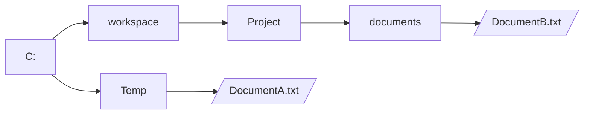

Die Klasse `File` ermöglicht die Arbeit mit Dateien und Verzeichnissen. Mit Hilfe der Methode `boolean exists()` kann beispielsweise geprüft werden, ob ein entsprechendes Verzeichnis bzw. eine entsprechende Datei existiert oder nicht. Die Klasse bietet zudem M
ethoden zum Erstellen und Löschen von Verzeichnissen bzw. Dateien. Zum Erzeugen eines File-Objekts wird entweder ein Pfad zu einem Verzeichnis bzw. zu einer Datei oder ein _URI_ (Unified Resource Identifier) benötigt.

## Lesen von Dateien mit Hilfe der Klasse `Scanner`
Zum Lesen einer Datei können entweder [Datenstromklassen](../io-streams.md) oder die Klasse `Scanner` verwendet werden.

```java title="MainClass.java" showLineNumbers
public class MainClass {

  public static void main(String[] args) throws FileNotFoundException {
    File file = new File("text.txt");
    Scanner scanner = new Scanner(file);

    while (scanner.hasNextLine()) {
      String line = scanner.nextLine();
      System.out.println(line);
    }

    scanner.close();
  }

}
```

:::note Hinweis
Nach der letzten Verwendung sollte die Methode `void close()` der Klasse `Scanner` aufgerufen werden.
:::

## Absolute und relative Pfadangaben
Beim Zugriff auf Verzeichnisse bzw. Dateien unterscheidet man zwischen absoluten und relativen Pfadangaben. Bei absoluten Pfadangaben wird der vollständige Pfad von der Wurzel des jeweiligen Verzeichnissystems bis zum Ziel angegeben, bei relativen der Weg von 
einem festgelegten Bezugspunkt bis zum Ziel.

:::note Hinweis
Alle Klassen im Paket `java.io` verwenden als Bezugspunkt das Arbeitsverzeichnis des Benutzers (Systemeigenschaft `user.dir`).
:::



Die Datei `DocumentA.txt` kann entweder über den absoluten Pfad `C:\Temp\DocumentA.txt` oder über den relativen Pfad `documents/DocumentA.txt` (Bezugspunkt ist das Verzeichnis `Project`); die Datei `DocumentB.txt` über den absoluten Pfad `C:\workspace\Project\documents\documentB.txt` oder über den relativen Pfad `../../Temp/documentA.txt` angesprochen werden.
