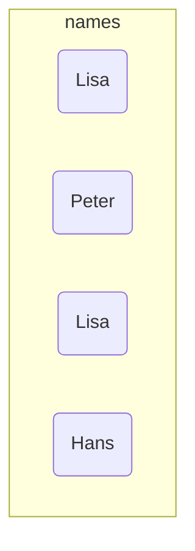
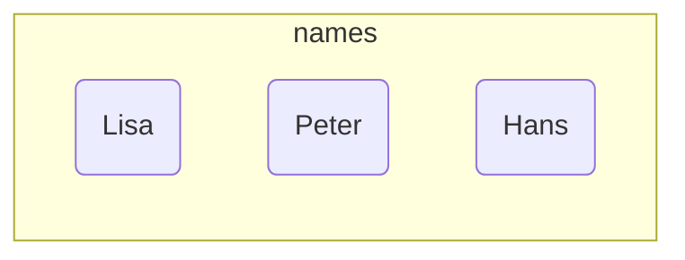
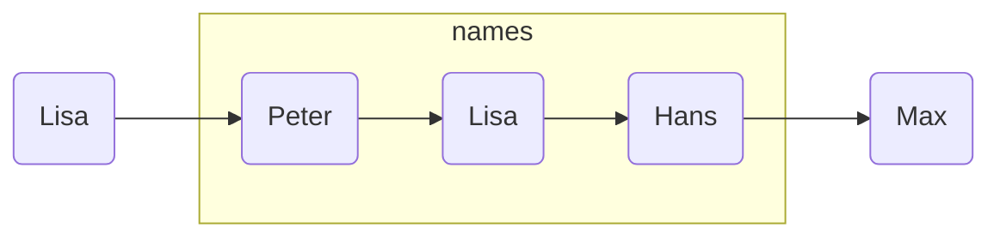

import Tabs from '@theme/Tabs';
import TabItem from '@theme/TabItem';

Collections sind Behälter, die beliebig viele Objekte aufnehmen können. Der
Behälter übernimmt dabei die Verantwortung für die Elemente. Collections werden
auch als (Daten-)Sammlungen bezeichnet. Alle Collections-Schnittstellen und
Klassen befinden sich im Paket `java.util`. Die Grundformen der Datensammlungen
sind die Schnittstellen `List<E>`, `Set<E>` und `Queue<E>`. Zu allen
Schnittstellen existieren konkrete Implementierungen sowie abstrakte Klassen,
die zum Erstellen eigener Collections-Klassen verwendet werden können.

<Tabs>
  <TabItem value="a" label="Listen (Lists)" default>

Unter einer Liste (List) versteht man eine geordnete Folge von Objekten. Listen
können doppelte Elemente enthalten. Der Zugriff auf die Elemente erfolgt über
den Index oder sequentiell.



Konkrete Implementierungen der Schnittstelle `List<E>` stellen die Klassen
`ArrayList<E>` und `LinkedList<E>` (siehe auch
[Feldbasierte Listen](array-lists) und [Listen](lists)) dar.

  </TabItem>
  <TabItem value="b" label="Mengen (Sets)">

Unter einer Menge (Set) versteht man eine Ansammlung von Elementen. Mengen
können keine doppelten Elemente beinhalten. Der Zugriff erfolgt über typische
Mengenoperationen.



Konkrete Implementierungen der Schnittstelle `Set<E>` stellen die Klassen
`HashSet<E>` und `TreeSet<E>` dar. Die Klasse `HashSet<E>` implementiert die
Menge dabei in Form einer Hashtabelle, die Klasse `TreeSet<E>` in Form eines
Binärbaumes.

  </TabItem>
  <TabItem value="c" label="Warteschlangen (Queues)" >

Unter einer Warteschlange (Queue) versteht man eine Folge von Objekten, bei der
das Anfügen und Löschen von Objekten nach dem FIFO-Prinzip (First In First Out)
funktioniert. Bei einer Warteschlange kann ein neues Objekt immer nur am Ende
angefügt werden und nur das Objekt, das am Anfang der Warteschlange steht,
gelöscht werden. Warteschlangen können doppelte Elemente enthalten.



Konkrete Implementierungen der Schnittstelle `Queue<E>` stellen die Klassen
`PriorityQueue<E>` und `LinkedList<E>` dar. Die Klasse `PriorityQueue<E>`
implementiert die Warteschlange als eine Vorrang-Warteschlange. Bei einer
Vorrang-Warteschlange werden die Elemente gemäß ihrer Wichtigkeit sortiert, das
heißt, sie funktioniert nicht nach dem FIFO-Prinzip.

  </TabItem>
</Tabs>

## Iteratoren

Ein Iterator erlaubt den sequentiellen Zugriff auf die Elemente einer
Datensammlung. Iteratoren werden durch die Schnittstelle `Iterator<E>`
definiert; diese bietet die Methoden `boolean hasNext()`, `E next()` und
`void remove()`. Die von `Iterator<E>` abgeleitete Schnittstelle
`ListIterator<E>` bietet zusätzliche Methoden zum Verändern einer Liste.

```java title="MainClass.java" showLineNumbers
public class MainClass {

   public static void main(String[] args) {

      List<String> names = List.of("Hans", "Peter", "Lisa");

      Iterator<String> iterator = names.iterator();
      while (iterator.hasNext()) {
         String name = iterator.next();
         System.out.println(name);
      }

   }

}
```

Auch die bereits bekannte for-each-Schleife basiert auf Iteratoren. Die
ausführliche Schreibeweise mit Iteratoren wird auch als erweiterte for-Schleife
bezeichnet. Beim Kompilieren werden for-each-Schleifen um Iteratoren ergänzt.

```java title="MainClass.java" showLineNumbers
public class MainClass {

   public static void main(String[] args) {

      List<String> names = List.of("Hans", "Peter", "Lisa");

      for (Iterator<String> iterator = names.iterator(); iterator.hasNext();) {
         String name = iterator.next();
         System.out.println(name);
      }

      /* Kurzschreibweise */
      for (String name : names) {
         System.out.println(name);
      }

   }

}
```
