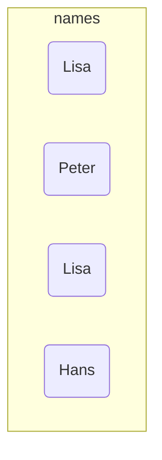
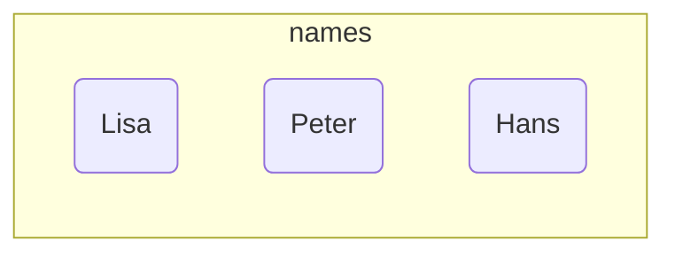
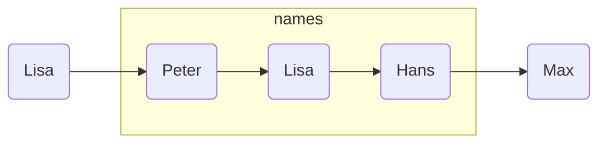

import Tabs from '@theme/Tabs';
import TabItem from '@theme/TabItem';

Das Java Collections Framework stellt Schnittstellen und Klassen für
Datensammlungen bereit. Alle Collections-Typen befinden sich im Paket
`java.util`. Die drei Grundformen sind `List<E>`, `Set<E>` und `Queue<E>`, zu
denen jeweils konkrete Implementierungen existieren.

<Tabs>
  <TabItem value="a" label="Listen (Lists)" default>

Eine Liste ist eine geordnete Folge von Objekten, die doppelte Elemente
enthalten darf. Der Zugriff auf die Elemente erfolgt über den Index oder
sequentiell.


```mermaid
flowchart
   subgraph names
      name1(Lisa)
      name2(Peter)
      name3(Lisa)
      name4(Hans)
   end
```

Konkrete Implementierungen der Schnittstelle `List<E>` stellen die Klassen
`ArrayList<E>` und `LinkedList<E>` (siehe auch
[Feldbasierte Listen](array-lists) und [Listen](lists)) dar.

  </TabItem>
  <TabItem value="b" label="Mengen (Sets)">

Eine Menge ist eine Ansammlung von Objekten, die keine doppelten Elemente
enthalten darf. Der Zugriff erfolgt über typische Mengenoperationen wie
Vereinigung, Schnittmenge und Differenz.


```mermaid
flowchart LR
   subgraph names
      name1(Lisa)
      name2(Peter)
      name3(Hans)
   end
```

Konkrete Implementierungen der Schnittstelle `Set<E>` stellen die Klassen
`HashSet<E>` und `TreeSet<E>` dar. Die Klasse `HashSet<E>` implementiert die
Menge dabei in Form einer Hashtabelle, die Klasse `TreeSet<E>` in Form eines
Binärbaumes.

  </TabItem>
  <TabItem value="c" label="Warteschlangen (Queues)" >

Eine Warteschlange ist eine Folge von Objekten, bei der Elemente nach dem
FIFO-Prinzip (First In, First Out) verwaltet werden: Neue Elemente werden am
Ende eingefügt, entnommen wird immer das vorderste Element. Doppelte Elemente
sind erlaubt.


```mermaid
flowchart LR
   name1 --> name2 --> name3 --> name4 --> name5
   name1(Lisa)
   subgraph names
      direction LR
      name2(Peter)
      name3(Lisa)
      name4(Hans)
   end
   name5(Max)
```

Konkrete Implementierungen der Schnittstelle `Queue<E>` sind `PriorityQueue<E>`
und `LinkedList<E>`. Die Klasse `PriorityQueue<E>` implementiert eine
Vorrang-Warteschlange, bei der die Elemente nicht nach dem FIFO-Prinzip, sondern
nach ihrer Wichtigkeit sortiert entnommen werden.

  </TabItem>
</Tabs>

## Iteratoren

Ein Iterator ermöglicht den sequentiellen Zugriff auf die Elemente einer
Datensammlung, ohne die interne Struktur kennen zu müssen. Die Schnittstelle
`Iterator<E>` bietet die Methoden `boolean hasNext()`, `E next()` und
`void remove()`.

```java title="MainClass.java" showLineNumbers
public class MainClass {

   public static void main(String[] args) {

      List<String> names = List.of("Hans", "Peter", "Lisa");

      Iterator<String> iterator = names.iterator();
      while (iterator.hasNext()) {
         String name = iterator.next();
         System.out.println(name);
      }

   }

}
```

Auch die bereits bekannte for-each-Schleife basiert intern auf Iteratoren. Beim
Kompilieren wird sie automatisch in eine Iterator-Schleife umgewandelt. Die
ausführliche Schreibweise ist daher gleichwertig zur Kurzschreibweise.

```java title="MainClass.java" showLineNumbers
public class MainClass {

   public static void main(String[] args) {

      List<String> names = List.of("Hans", "Peter", "Lisa");

      // Ausführliche Schreibweise mit Iterator
      for (Iterator<String> iterator = names.iterator(); iterator.hasNext();) {
         String name = iterator.next();
         System.out.println(name);
      }

      // Kurzschreibweise mit for-each
      for (String name : names) {
         System.out.println(name);
      }

   }

}
```
