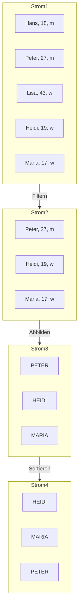

Die Java Stream API ermöglicht die funktionale Verarbeitung von Elementfolgen.
Ein Strom (Stream) repräsentiert eine Sequenz von Elementen, auf der verkettete
Operationen ausgeführt werden können — entweder sequentiell oder parallel. Die
Originaldaten bleiben dabei unverändert. Die Auswertung erfolgt nach dem Prinzip
der Bedarfsauswertung (Lazy Evaluation): Operationen werden erst dann
ausgeführt, wenn eine terminale Operation dies erfordert.



:::info

Ströme (Paket `java.util.stream`) haben nichts mit
[Datenströmen (IO-Streams)](io-streams) (Paket `java.io`) zu tun.

:::

## Erzeugen von Strömen

Ströme lassen sich aus Feldern, Listen, Mengen oder einzelnen Werten erzeugen.

```java title="MainClass.java" showLineNumbers
public class MainClass {

   public static void main(String[] args) {
      int[] array = {4, 8, 15, 16, 23, 42};
      IntStream integerStream = Arrays.stream(array);

      List<Integer> list = List.of(4, 8, 15, 16, 23, 42);
      Stream<Integer> integerStream2 = list.stream();

      Stream<Integer> integerStream3 = Stream.of(4, 8, 15, 16, 23, 42);
   }

}
```

:::note

Die Zahlenfolge 4-8-15-16-23-42 spielt eine große Rolle in der Fernsehserie
_Lost_.

:::

Im Gegensatz zu `Stream<T>` bieten die spezialisierten Klassen `IntStream`,
`DoubleStream` und `LongStream` zusätzliche Methoden zur Verarbeitung primitiver
Werte, wie etwa `sum()` oder `average()`.

```java title="MainClass.java" showLineNumbers
public class MainClass {

   public static void main(String[] args) {
      int[] array = {4, 8, 15, 16, 23, 42};
      IntStream integerStream = Arrays.stream(array);
      int sum = integerStream.sum();
   }

}
```

## Intermediäre Operationen

Intermediäre Operationen transformieren einen Strom in einen neuen Strom. Sie
werden erst dann ausgeführt, wenn eine terminale Operation folgt. Typische
intermediäre Operationen sind Filtern, Abbilden und Sortieren.

| Operation     | Methode                                                    | Schnittstellen-Methode           |
| ------------- | ---------------------------------------------------------- | -------------------------------- |
| Filtern       | `Stream<T> filter(predicate: Predicate<T>)`                | `boolean test(t: T)`             |
| Abbilden      | `Stream<R> map(mapper: Function<T, R>)`                    | `R apply(t: T)`                  |
| Abbilden      | `DoubleStream mapToDouble(mapper: ToDoubleFunction<T, R>)` | `double applyAsDouble(value: T)` |
| Abbilden      | `IntStream mapToInt(mapper: ToIntFunction<T, R>)`          | `int applyAsInt(value: T)`       |
| Abbilden      | `LongStream mapToLong(mapper: ToLongFunction<T, R>)`       | `long applyAsLong(value: T)`     |
| Spähen        | `Stream<T> peek(consumer: Consumer<T>)`                    | `void accept(t: T)`              |
| Sortieren     | `Stream<T> sorted(comparator: Comparator<T>)`              | `int compare(o1: T, o2: T)`      |
| Unterscheiden | `Stream<T> distinct()`                                     | -                                |
| Begrenzen     | `Stream<T> limit(maxSize: long)`                           | -                                |
| Überspringen  | `Stream<T> skip(n: long)`                                  | -                                |

## Terminale Operationen

Terminale Operationen schließen den Strom ab und liefern ein Ergebnis. Da der
Strom danach nicht mehr verwendbar ist, können keine weiteren Operationen
folgen. Typische Anwendungsfälle sind das Prüfen, Aggregieren und Sammeln von
Elementen.

| Operation   | Methode                                      | Schnittstellen-Methode      |
| ----------- | -------------------------------------------- | --------------------------- |
| Finden      | `Optional<T> findAny()`                      | -                           |
| Finden      | `Optional<T> findFirst()`                    | -                           |
| Prüfen      | `boolean allMatch(predicate: Predicate<T>)`  | `boolean test(t: T)`        |
| Prüfen      | `boolean anyMatch(predicate: Predicate<T>)`  | `boolean test(t: T)`        |
| Prüfen      | `boolean noneMatch(predicate: Predicate<T>)` | `boolean test(t: T)`        |
| Aggregieren | `Optional<T> min(comparator: Comparator<T>)` | `int compare(o1: T, o2: T)` |
| Aggregieren | `Optional<T> max(comparator: Comparator<T>)` | `int compare(o1: T, o2: T)` |
| Aggregieren | `long count()`                               | -                           |
| Sammeln     | `R collect(collector: Collector<T, A, R>)`   | -                           |
| Ausführen   | `void forEach(action: Consumer<T>)`          | `void accept(t: T)`         |

Zahlenströme (`IntStream`, `DoubleStream`, `LongStream`) bieten zusätzlich die
terminalen Operationen `sum()` und `average()`.

## Bedarfsauswertung (Lazy Evaluation)

Bei der Bedarfsauswertung werden intermediäre Operationen nicht sofort
ausgeführt, sondern erst dann, wenn eine terminale Operation den Strom
abschließt. Zudem werden bei verketteten Operationen alle Schritte für jedes
Element nacheinander durchlaufen — nicht erst alle Elemente durch Schritt 1,
dann alle durch Schritt 2.

Das folgende Beispiel filtert den Zahlenstrom 4-8-15-16-23-42 zunächst nach
geraden Zahlen, dann nach Zahlen größer als 15, und gibt die verbliebenen Zahlen
aus. Zur Veranschaulichung wird jeder Filterschritt ebenfalls ausgegeben.

```java title="MainClass.java" showLineNumbers
public class MainClass {

   public static void main(String[] args) {
      Stream.of(4, 8, 15, 16, 23, 42).filter(i -> {
         System.out.println(i + ": filter 1");
         return i % 2 == 0;
      }).filter(i -> {
         System.out.println(i + ": filter 2");
         return i > 15;
      }).forEach(i -> System.out.println(i + ": forEach"));
   }

}
```

Ohne Bedarfsauswertung würden die Operationen nacheinander für alle Elemente
ausgeführt:

```
 4: filter 1
 8: filter 1
 15: filter 1
 16: filter 1
 23: filter 1
 42: filter 1
 4: filter 2
 8: filter 2
 16: filter 2
 42: filter 2
 16: forEach
 42: forEach
```

Aufgrund der Bedarfsauswertung werden alle Operationen für jedes Element einzeln
nacheinander ausgeführt:

```
4: filter 1
4: filter 2
8: filter 1
8: filter 2
15: filter 1
16: filter 1
16: filter 2
16: forEach
23: filter 1
42: filter 1
42: filter 2
42: forEach
```

## Unendliche Ströme

Die Java Stream API stellt Methoden bereit, mit denen sich theoretisch unendlich
viele Elemente erzeugen lassen. In der Praxis werden solche Ströme durch
`limit()` begrenzt.

- `Stream<T> iterate(seed: T, f: UnaryOperator<T>)` — erzeugt einen unendlichen
  Strom aus einem Startwert und einer Funktion, die jeweils das nächste Element
  berechnet
- `Stream<T> iterate(seed: T, hasNext: Predicate<T>, next: UnaryOperator<T>)` —
  wie oben, aber mit einer Abbruchbedingung
- `Stream<T> generate(s: Supplier<T>)` — erzeugt Elemente über einen
  Lieferanten, z.B. Zufallszahlen

```java title="MainClass.java" showLineNumbers
public class MainClass {

   public static void main(String[] args) {
      // Zahlen 0 bis 99 ausgeben (unendlicher Strom, begrenzt auf 100)
      Stream.iterate(0, i -> ++i).limit(100).forEach(System.out::println);
      // Zahlen 0 bis 99 mit Abbruchbedingung
      Stream.iterate(0, i -> i < 100, i -> ++i).forEach(System.out::println);
      // 100 Pseudozufallszahlen von 0 bis 99
      Stream.generate(() -> new Random().nextInt(100)).limit(100).forEach(System.out::println);
   }

}
```

Die ersten beiden Ströme geben die Zahlen von 0 bis 99 aus. Der dritte erzeugt
100 Pseudozufallszahlen von 0 bis 99 und wird durch `limit(100)` begrenzt.
