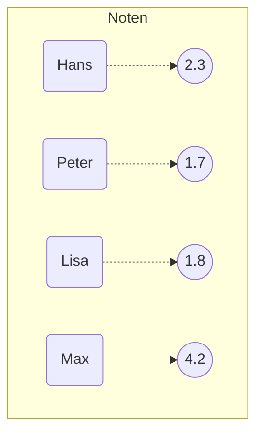
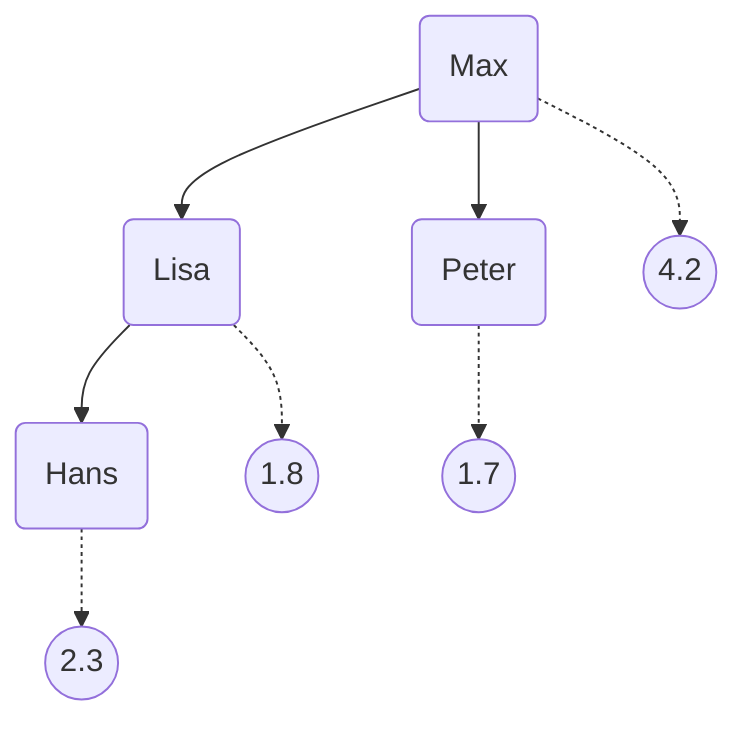

Unter einem Assoziativspeicher (Map) versteht man eine Menge zusammengehöriger Paare von Objekten. Das erste Objekt stellt dabei den Schlüssel (Key), das zweite Objekt den Wert (Value) dar. Jeder Schlüssel kann dabei nur einmal in einem Assoziativspeicher 
vorhanden sein. Aufgrund dieses Aufbaus werden Assoziativspeicher auch als Wörterbücher bezeichnet.



Um auf die Einträge, Schlüssel und Werte eines Assoziativspeichers zugreifen können, stellt die Schnittstelle `Map` die Methoden `Set<Entry<K, V>> entrySet()`, `Set<K> keySet()` und `Collection<V> values()` zur Verfügung. 

```java title="MainClass.java" showLineNumbers
public class MainClass {

  public static void main(String[] args) {

    HashMap<Integer, String> foos = new HashMap<>();
    foos.put(834, "Hans");
    foos.put(269, "Peter");
    foos.put(771, "Lisa");

    for (Entry<Integer, String> entry : foos.entrySet()) {
      System.out.println(entry.getKey());
      System.out.println(entry.getValue());
    }

    for (Integer i : foos.keySet()) {
      System.out.println(i);
    }

    for (String s : foos.values()) {
      System.out.println(s);
    }

  }

}
```

Die Klasse `HashMap<K, V>` implementiert den Assoziativspeicher in Form einer Hashtabelle. Für den Einsatz einer Hashtabelle ist es zwingend erforderlich, dass die Klasse, die den Schlüssel bildet, die Methoden `int hashCode()` und `boolean equals(object: Object)` 
gemäß den entsprechenden Dokumentationskommentaren überschrieben hat. Im Gegensatz zu einem Binärbaum liegen die Paare in einer Hashtabelle unsortiert vor.

| Index | Schlüssel | Wert |
| ----- | --------- | ---- |
| 0     | Hans      | 2.3  |
| 2     | Peter     | 1.7  |
| 13    | Lisa      | 1.8  |
| 14    | Max       | 4.2  |

Die Klasse `TreeMap<K, V>` implementiert den Assoziativspeicher in Form eines Binärbaumes. Als Datenstruktur wird dabei ein balancierter Baum verwendet, d.h. spezielle Einfüge- und Löschoperationen stellen sicher, dass der Baum nicht zu einer linearen Liste 
entartet. Da die Paare in einem Binärbaum sortiert vorliegen, ist es für den Einsatz zwingend erforderlich, dass die Klasse, die den Schlüssel bildet, die Schnittstelle `Comparable<T>` implementiert hat. Alternativ kann dem Konstruktor der Klasse `TreeMap<K, V>`
ein Komparator für den Schlüssel mitgegeben werden.



