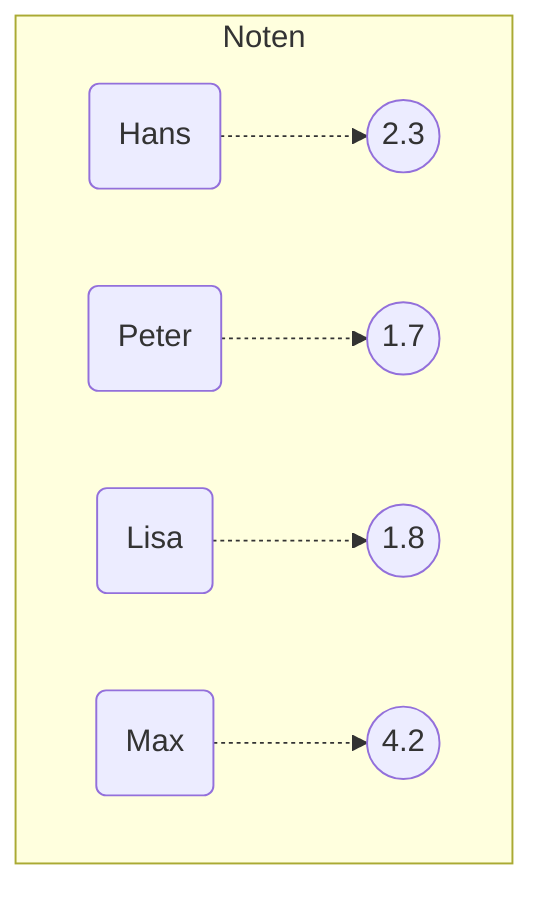
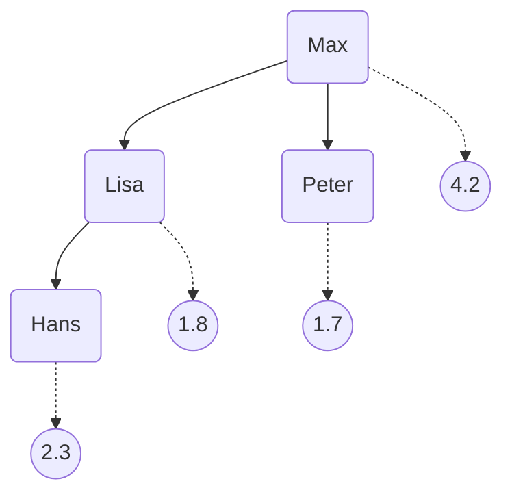

Ein Assoziativspeicher (Map) ist eine Sammlung von Schlüssel-Wert-Paaren. Jeder
Schlüssel (Key) ist eindeutig und verweist auf genau einen Wert (Value). Wegen
dieser Struktur werden Assoziativspeicher auch als _Wörterbücher_ bezeichnet.


```mermaid
flowchart LR
   subgraph Noten
      direction LR
      hans(Hans) -.-> g1((2.3))
      peter(Peter) -.-> g2((1.7))
      lisa(Lisa) -.-> g3((1.8))
      max(Max) -.-> g4((4.2))
   end
```

Für den Zugriff auf Einträge, Schlüssel und Werte eines Assoziativspeichers
stellt die Schnittstelle `Map` die Methoden `Set<Entry<K, V>> entrySet()`,
`Set<K> keySet()` und `Collection<V> values()` bereit.

```java title="MainClass.java" showLineNumbers
public class MainClass {

   public static void main(String[] args) {

      Map<Integer, String> persons = new HashMap<>();
      persons.put(829134, "Hans");
      persons.put(209769, "Peter");
      persons.put(723871, "Lisa");

      for (Entry<Integer, String> entry : persons.entrySet()) {
         System.out.println(entry.getKey());
         System.out.println(entry.getValue());
      }

      for (Integer id : persons.keySet()) {
         System.out.println(id);
      }

      for (String name : persons.values()) {
         System.out.println(name);
      }

   }

}
```

Die Klasse `HashMap<K, V>` implementiert den Assoziativspeicher als Hashtabelle.
Voraussetzung ist, dass die Schlüsselklasse die Methoden `int hashCode()` und
`boolean equals(object: Object)` korrekt überschrieben hat. Die Einträge liegen
in einer Hashtabelle unsortiert vor.

| Index | Schlüssel | Wert |
| ----- | --------- | ---- |
| 0     | Hans      | 2.3  |
| 2     | Peter     | 1.7  |
| 13    | Lisa      | 1.8  |
| 14    | Max       | 4.2  |

Die Klasse `TreeMap<K, V>` implementiert den Assoziativspeicher als Binärbaum.
Dabei wird ein balancierter Baum verwendet, sodass spezielle Einfüge- und
Löschoperationen sicherstellen, dass der Baum nicht zu einer linearen Liste
entartet. Die Einträge liegen sortiert vor, weshalb die Schlüsselklasse die
Schnittstelle `Comparable<T>` implementieren oder dem Konstruktor ein
`Comparator` übergeben werden muss.


```mermaid
flowchart TD
   max --> lisa
   lisa --> hans
   max --> peter
   hans(Hans) -.-> g1((2.3))
   peter(Peter) -.-> g2((1.7))
   lisa(Lisa) -.-> g3((1.8))
   max(Max) -.-> g4((4.2))
```
