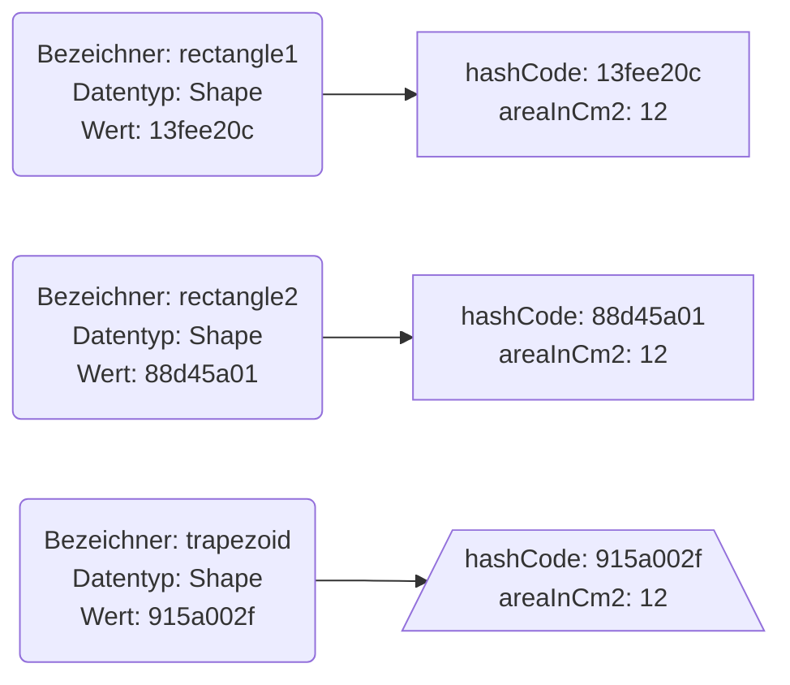
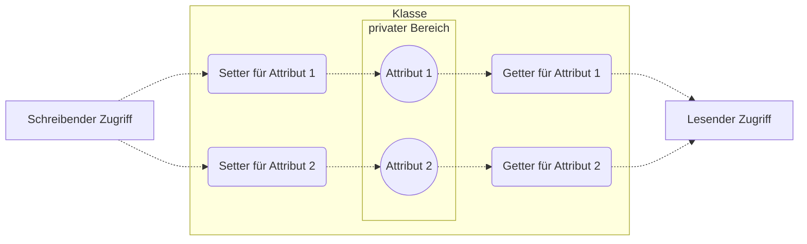
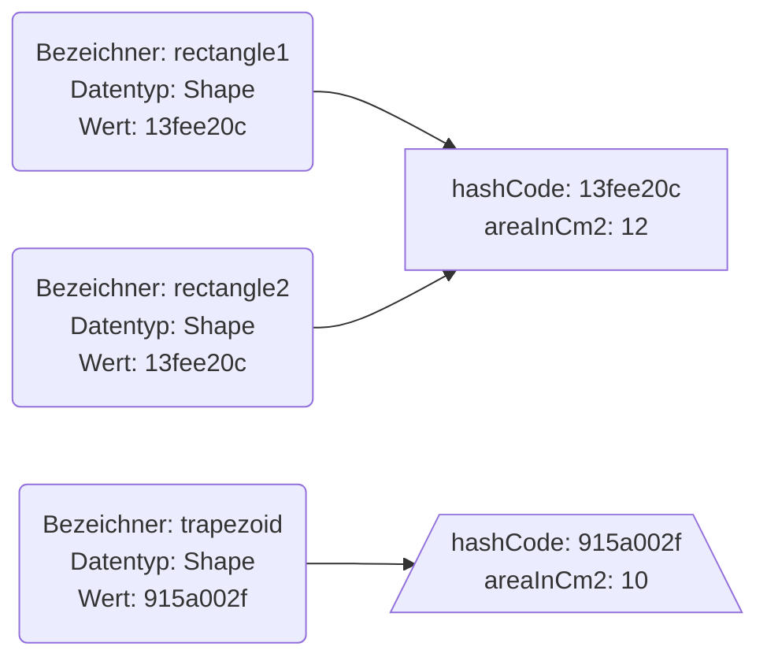

Die reale Welt besteht aus Objekten mit individuellen Eigenschaften und
individuellem Verhalten. Für ein einfacheres Verständnis werden Objekte
kategorisiert, also zu sinnhaften Einheiten verbunden. In der objektorientierten
Programmierung werden Beobachtungen aus der realen Welt zum Konzept der
Objektorientierung zusammengefasst:

- Eine Kategorie von ähnlichen Objekten bezeichnet man als _Klasse_
- Konkrete Ausprägungen bzw. Instanzen einer Klasse werden wiederum als
  _Objekte_ bezeichnet
- Die Eigenschaften von Objekten werden als _Attribute_ das Verhalten als
  _Methoden_ bezeichnet



:::note Hinweis

Jedes Objekt ist eindeutig identifizierbar.

:::

## Datenkapselung

Ein wesentlicher Grundsatz der Objektorientierung ist, dass Attribute durch
Methoden gekapselt werden. Datenkapselung bedeutet, dass auf Attribute nicht
direkt zugegriffen werden kann, sondern nur indirekt über Methoden. Typische
Methoden zum Lesen und Schreiben von Attributen sind die sogenannten Getter bzw.
Setter (auch Set- und Get-Methoden bzw. Accessors genannt).



## Sichtbarkeit von Klassen, Attributen und Methoden

Um die Sichtbarkeit von Klassen, Attributen und Methoden zu definieren,
existieren verschiedene Zugriffsrechte. Die Sichtbarkeit bestimmt, von welchem
Ort aus Klassen, Attribute und Methoden verwendet bzw. aufgerufen werden dürfen.

| Zugriffsrecht | Zugriff aus gleicher Klasse | Zugriff von einer Klasse aus dem gleichen Paket | Zugriff von einer Unterklasse | Zugriff von einer beliebigen Klasse |
| ------------- | --------------------------- | ----------------------------------------------- | ----------------------------- | ----------------------------------- |
| public        | ja                          | ja                                              | ja                            | ja                                  |
| protected     | ja                          | ja                                              | ja                            | nein                                |
| package       | ja                          | ja                                              | nein                          | nein                                |
| private       | ja                          | nein                                            | nein                          | nein                                |

## Definition von Klassen

Klassen werden in Java mit dem Schlüsselwort `class` definiert. Die Angabe des
Zugriffsrechts legt die Sichtbarkeit der Klasse fest.

```java title="Computer.java" showLineNumbers
public class Computer {
}
```

```java title="CPU.java" showLineNumbers
public class CPU {
}
```

```java title="GraphicCard.java" showLineNumbers
public class GraphicCard {
}
```

## Definition von Attributen

Die Attribute einer Klasse sind Datenobjekte und werdern daher analog zu
Variablen und Konstanten definiert. Das Schlüsselwort `final` erlaubt die
Definition von unveränderlichen Attributen, also Attributen, deren Wert nicht
geändert werden kann. Die Initialisierung dieser unveränderlichen Attribute
erfolgt durch [Konstruktoren](oo#konstruktoren).

```java title="Computer.java" showLineNumbers
public class Computer {

  private CPU cpu;
  private int mainMemoryInGB;
  private GraphicCard graphicCard;

}
```

```java title="CPU.java" showLineNumbers
public class CPU {

  private final double powerInGHz;
  private final int numberOfCores;

  public CPU(double powerInGHz, int numberOfCores) {
    this.powerInGHz = powerInGHz;
    this.numberOfCores = numberOfCores;
  }

}
```

```java title="GraphicCard.java" showLineNumbers
public class GraphicCard {

  private final String description;
  private final String graphicsChip;

  public GraphicCard(String description, String graphicsChip) {
    this.description = description;
    this.graphicsChip = graphicsChip;
  }

}
```

:::note Hinweis

Die Selbstreferenz `this` verweist innerhalb einer Klasse auf das eigene Objekt
(siehe auch
[Deklaration von Referenzvariablen](oo#deklaration-von-referenzvariablen)).

:::

## Definition und Implementierung von Methoden

Methoden sind in der Programmierung eine Verallgemeinerung von mathematischen
Funktionen. Eine Methode besteht aus einem Methodennamen, einer Liste von
Eingabeparameter (optional), einem Rückgabewert (optional) sowie dem
Methodenrumpf. Die Kombination aus Methodenname und den Datentypen der
Parameterliste bezeichent man als _Signatur einer Methode_.

Methoden können entweder genau einen Rückgabewert oder keinen Rückgabewert
besitzen. Methoden mit genau einem Rückgabewert müssen vor dem Methodennamen den
Datentyp des Rückgabewerts angeben und am Ende des Methodenrumpfes immer die
Anweisung `return` besitzen, Methoden ohne Rückgabewert müssen dies mit dem
Schlüsselwort `void` kenntlich machen.

```java title="Computer.java" showLineNumbers
public class Computer {

  private CPU cpu;
  private int mainMemoryInGB;
  private GraphicCard graphicCard;

  public void setCPU(){
    this.cpu = cpu;
  }

  public CPU getCPU(){
    return cpu;
  }

  public void setMainMemoryInGB(int mainMemoryInGB) {
    this.mainMemoryInGB = mainMemoryInGB;
  }

  public int getMainMemoryInGB() {
    return= mainMemoryInGB;
  }

  public void setGraphicCard(GraphicCard graphicCard) {
    this.graphicCard = graphicCard;
  }

  public GraphicCard getGraphicCard() {
    return graphicCard;
  }

}
```

## Deklaration von Referenzvariablen

Technisch gesehen handelt es sich bei einer Klasse um einen komplexen Datentyp.
Analog zu den primitiven Datentypen können auch für Klassen Variablen –
sogenannte _Referenzvariablen_ – definiert werden.

Im Gegensatz zu "normalen" Variablen werden bei Referenzvariablen nicht die
eigentlichen Werte in den Variablen gespeichert, sondern die Speicheradressen
der erzeugten Objekte. Die Selbstreferenz `this` verweist innerhalb einer Klasse
auf das eigene Objekt.



:::note Hinweis

Der Standarwert von Referenzvariablen ist `null` (auch Nullreferenz genannt).

:::

## Erzeugen von Objekten

Beim Erzeugen eines Objekts mit Hilfe des Operators `new` wird der bei der
Deklaration reservierte Speicherplatz durch das Objekt belegt.

```java title="MainClass.java" showLineNumbers
public class MainClass {

  public static void main(String[] args) {
    CPU myCPU = new CPU(3.5, 8);
    GraphicCard myGraphicCard = new GraphicCard("Gigabyte RTX 4090 Gaming", "GeForce RTX 4090");
    Computer myComputer = new Computer();
  }

}
```

:::danger Hinweis

Nach dem new-Operator muss immer ein [Konstruktor](oo#konstruktoren) der Klasse
stehen.

:::

## Zugriff auf Attribute und Aufruf von Methoden

Erlauben die Zugriffsrechte den Zugriff auf ein Attribut, kann über die
deklarierte Referenzvariable und einem nachgestellten Punkt auf das Attribut
zugegriffen werden. Auch sichtbare Methoden werden über diese Syntax aufgerufen.

```java title="MainClass.java" showLineNumbers
public class MainClass {

  public static void main(String[] args) {
    CPU myCPU = new CPU(3.5, 8);
    GraphicCard myGraphicCard = new GraphicCard("Gigabyte RTX 4090 Gaming", "GeForce RTX 4090");
    Computer myComputer = new Computer();
    myComputer.setCPU(myCPU);
    myComputer.setMainMemoryInGB(32);
    myComputer.setGraphicCard(myGraphicCard);
  }

}
```

:::danger Hinweis

Beim Aufruf einer Methode müssen alle Parameter in der richtigen Reihenfolge
versorgt werden. Parameter, die diesem Prinzip folgen, bezeichnet man als
_Positionsparameter_

:::

## Überladene Methoden

Gleichnamige Methoden mit unterschiedlichen Parameterlisten einer Klasse werden
als überladene Methoden bezeichnet. Man spricht in diesem Zusammenhang auch von
statischer Polymorphie, da der Aufruf gleichnamiger Methoden unterschiedliche
Ergebnisse liefern kann.

```java title="Computer.java" showLineNumbers
public class Computer {

  private CPU cpu;
  private int mainMemoryInGB;
  private GraphicCard graphicCard;

  public void setCPU(){
    this.cpu = cpu;
  }

  public void getCPU(){
    return cpu;
  }

  public void setMainMemoryInGB(int mainMemoryInGB) {
    this.mainMemoryInGB = mainMemoryInGB;
  }

  public int getMainMemoryInGB() {
    return= mainMemoryInGB;
  }

  public void setGraphicCard(GraphicCard graphicCard) {
    this.graphicCard = graphicCard;
  }

  public void setGraphicCard(String description, String graphicsChip) {
    graphicCard = new GraphicCard(description, graphicsChip);
  }

  public GraphicCard getGraphicCard() {
    return graphicCard;
  }

}
```

```java title="MainClass.java" showLineNumbers
public class MainClass {

  public static void main(String[] args) {
    GraphicCard myGraphicCard = new GraphicCard("Gigabyte RTX 4090 Gaming", "GeForce RTX 4090");
    Computer myComputer1 = new Computer();
    myComputer1.setGraphicCard(myGraphicCard);

    Computer myComputer2 = new Computer();
    myComputer2.setGraphicCard("ASUS ATI Radeon RX 6800", "ATI Radeon RX 6800");
  }

}
```

:::danger Hinweis

Überladene Methoden können keine unterschiedlichen Rückgabewerte besitzen.

:::

## Konstruktoren

Bei Konstruktoren handelt es sich um spezielle Methoden, die zur Initialisierung
eines Objekts verwendet werden. Konstruktoren heißen wie ihre Klasse und können
eine beliebige Anzahl an Parametern haben. Allerdings kann für Konstruktoren
kein Rückgabewert festgelegt werden, da diese implizit die Referenz auf das
Objekt zurückgeben.

Im Gegensatz zu z.B. C++ existieren in Java keine Destruktoren, die nicht mehr
benötigte Objekte aus dem Speicher entfernen. Stattdessen läuft im Hintergrund
der sogenannte Garbage Collector, der nicht mehr benötigte Objekte (also
Objekte, die nicht mehr über eine Referenzvariable angesprochen werden können)
löscht.

```java title="Computer.java" showLineNumbers
public class Computer {

  private CPU cpu;
  private int mainMemoryInGB;
  private GraphicCard graphicCard;

  public Computer() {
  }

  public Computer(CPU cpu, int mainMemoryInGB) {
    this.cpu = cpu;
    this.mainMemoryInGB = mainMermoryInGB;
  }

  public Computer(CPU cpu, int mainMemoryInGB, GraphicCard graphicCard) {
    this(cpu, mainMermoryInGB);
    this.graphicCard = graphicCard;
  }

  public void setCPU(){
    this.cpu = cpu;
  }

  public void getCPU(){
    return cpu;
  }

  public void setMainMemoryInGB(int mainMemoryInGB) {
    this.mainMemoryInGB = mainMemoryInGB;
  }

  public int getMainMemoryInGB() {
    return= mainMemoryInGB;
  }

  public void setGraphicCard(GraphicCard graphicCard) {
    this.graphicCard = graphicCard;
  }

  public void setGraphicCard(String description, String graphicsChip) {
    graphicCard = new GraphicCard(description, graphicsChip);
  }

  public GraphicCard getGraphicCard() {
    return graphicCard;
  }

}
```

```java title="MainClass.java" showLineNumbers
public class MainClass {

  public static void main(String[] args) {
    GraphicCard myGraphicCard = new GraphicCard("Gigabyte RTX 4090 Gaming", "GeForce RTX 4090");
    CPU myCPU = new CPU(3.5, 8);
    Computer myComputer1 = new Computer(myCPU, 32, myGraphicCard);

    Computer myComputer2 = new Computer();
  }

}
```

:::note Hinweis

Auch Konstruktoren können überladen werden, dass heißt eine Klasse kann über
mehrere Konstruktoren verfügen. Der Aufruf eines Konstruktors innerhalb eines
anderen Konstruktors erfolgt dabei über die Selbstreferenz `this`.

:::

## Statische Attribute und Methoden

Neben "normalen" Attributen und Methoden kann eine Klasse auch statische
Attribute und statische Methoden besitzen. Im Gegensatz zu "normalen" Attributen
existieren statische Attribute nur einmal pro Klasse und besitzen daher für alle
Objekte dieser Klasse dieselben Werte. Innerhalb einer statischen Methode kann
nur auf die statischen Attribute der Klasse zugegriffen werden.

Bei der Deklaration von statischen Attributen und statischen Methoden kommt das
Schlüsselwort `static` zum Einsatz. Für den Zugriff auf ein statisches Attribut
bzw. den Aufruf einer statischen Methode wird keine Instanziierung benötigt,
d.h. der der Zugriff bzw. Aufruf erfolgt über den Klassennamen.

```java title="CPU.java" showLineNumbers
public class CPU {

  private final double powerInGHz;
  private final int numberOfCores;

  private static int numberOfCPUs;

  public CPU(double powerInGHz, int numberOfCores) {
    this.powerInGHz = powerInGHz;
    this.numberOfCores = numberOfCores;
    numberOfCPUs++;
  }

  public static int getNumberOfCPUs() {
    return numberOfCPUs;
  }

}
```

```java title="MainClass.java" showLineNumbers
public class MainClass {

  public static void main(String[] args) {
    System.out.println(CPU.getNumberOfCPUs());
    CPU myCPU = new CPU(3.5, 8);
    System.out.println(CPU.getNumberOfCPUs());
  }

}
```

:::note Hinweis

"Normale" Attribute und Methoden werden auch als Instanzattribute bzw.
Instanzmethoden bezeichnet, statische Attribute und Methoden auch
Klassenattribute bzw. Klassenmethoden.

:::
