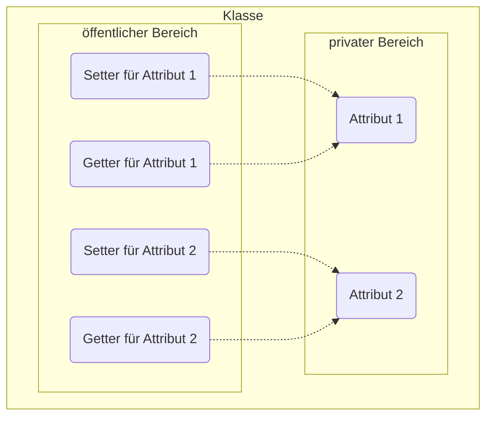
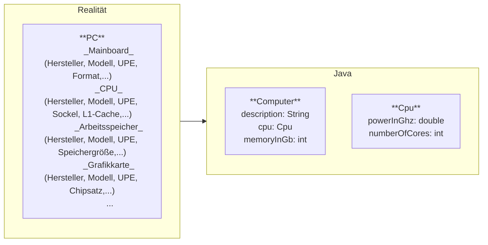

Die reale Welt besteht aus Objekten mit individuellen Eigenschaften und
individuellem Verhalten. Für ein einfacheres Verständnis werden Objekte
kategorisiert, also zu sinnhaften Einheiten verbunden. In der objektorientierten
Programmierung werden Beobachtungen aus der realen Welt zum Konzept der
Objektorientierung zusammengefasst:

- Eine Kategorie von ähnlichen Objekten bezeichnet man als _Klasse_
- Konkrete Ausprägungen bzw. Instanzen einer Klasse werden wiederum als
  _Objekte_ bezeichnet
- Die Eigenschaften von Objekten werden als _Attribute_ das Verhalten als
  _Methoden_ bezeichnet

## Datenkapselung

Ein wesentlicher Grundsatz der Objektorientierung ist, dass Attribute durch
Methoden gekapselt werden. Datenkapselung bedeutet, dass auf Attribute nicht
direkt zugegriffen werden kann, sondern nur indirekt über Methoden. Typische
Methoden zum Lesen und Schreiben von Attributen sind die sogenannten Getter bzw.
Setter (auch Set- und Get-Methoden bzw. Accessors genannt).

## Abstraktion

Abstraktion bedeutet das Zerlegen von komplexen Systeme in kleinere,
überschaubare Einheiten, indem der Fokus auf die wesentlichen Eigenschaften und
das wesentliche Verhalten gesetzt und unwichtige Details ausgeblendet werden.
Dies bringt einige Vorteile wie bessere Wiederverwendbarkeit, bessere
Wartbarkeit sowie bessere Lesbarkeit mit sich. In der Objektorientierten
Programmierung erfolgt die Abstraktion durch den Einsatz von (abstrakten)
Klassen bzw. Schnittstellen (Interfaces).

