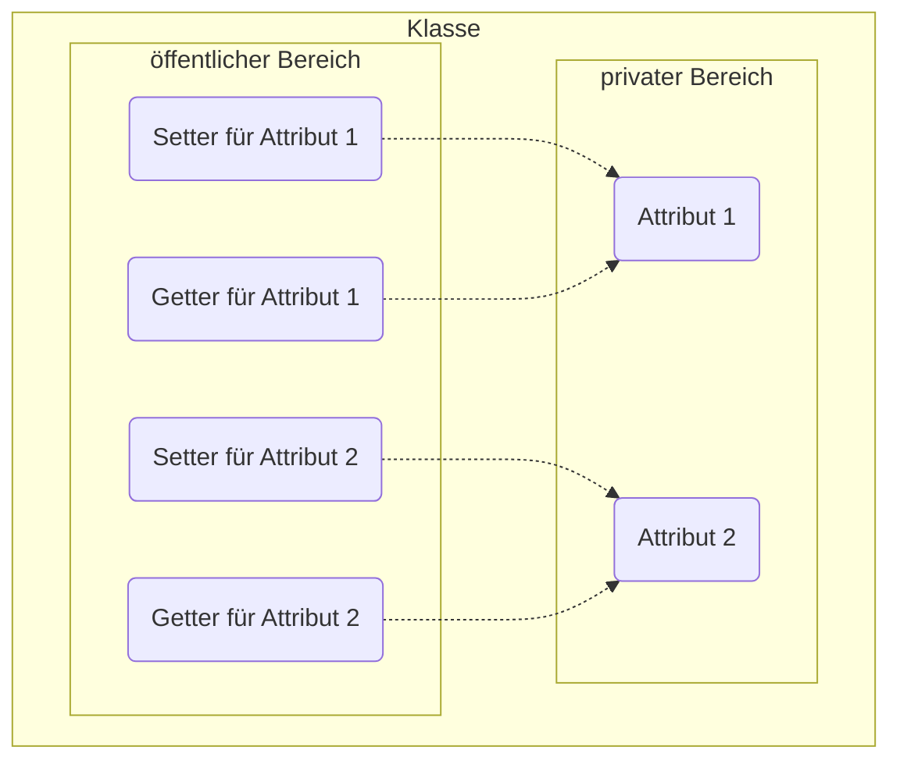
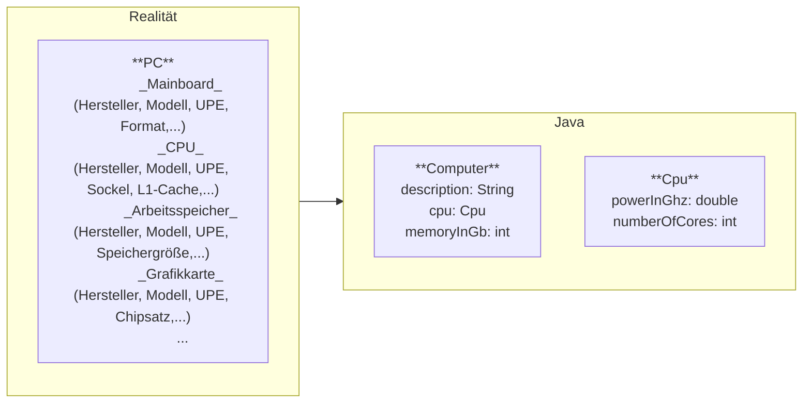

Die reale Welt besteht aus Objekten mit individuellen Eigenschaften und
individuellem Verhalten. Um diese Komplexität handhabbar zu machen, werden
Objekte kategorisiert und zu sinnvollen Einheiten zusammengefasst. Die
objektorientierte Programmierung überträgt dieses Prinzip auf Software:

- Eine Kategorie ähnlicher Objekte bezeichnet man als _Klasse_
- Konkrete Ausprägungen einer Klasse nennt man _Objekte_ (auch _Instanzen_)
- Die Eigenschaften von Objekten werden als _Attribute_, ihr Verhalten als
  _Methoden_ bezeichnet

## Datenkapselung

Ein wesentlicher Grundsatz der Objektorientierung ist, dass Attribute durch
Methoden gekapselt werden. _Datenkapselung_ bedeutet, dass auf Attribute nicht
direkt zugegriffen werden kann, sondern nur indirekt über Methoden. Typische
Methoden zum Lesen und Schreiben von Attributen sind Getter bzw. Setter (auch
Accessors und Mutators genannt).

```mermaid
flowchart LR
   subgraph Klasse
      direction LR
      subgraph privater Bereich
         attribut1(Attribut 1)
         attribut2(Attribut 2)
      end
      subgraph öffentlicher Bereich
         setter1(Setter für Attribut 1) -.-> attribut1
         setter2(Setter für Attribut 2) -.-> attribut2
         getter1(Getter für Attribut 1) -.-> attribut1
         getter2(Getter für Attribut 2) -.-> attribut2
      end
   end
```

## Abstraktion

_Abstraktion_ bedeutet, komplexe Systeme in kleinere, überschaubare Einheiten zu
zerlegen — indem der Fokus auf die wesentlichen Eigenschaften und das
wesentliche Verhalten gelegt und unwichtige Details ausgeblendet werden. Das
bringt Vorteile wie bessere Wiederverwendbarkeit, Wartbarkeit und Lesbarkeit. In
Java wird Abstraktion durch den Einsatz von (abstrakten) Klassen und
Schnittstellen (Interfaces) realisiert.

```mermaid
flowchart LR
   subgraph Realität
      computer["**PC**
               _Mainboard_ (Hersteller, Modell, UPE, Format,...)
               _CPU_ (Hersteller, Modell, UPE, Sockel, L1-Cache,...)
               _Arbeitsspeicher_ (Hersteller, Modell, UPE, Speichergröße,...)
               _Grafikkarte_ (Hersteller, Modell, UPE, Chipsatz,...)
               ..."]
   end
   subgraph Java
      computer2[**Computer**
               description: String
               cpu: Cpu
               memoryInGb: int]
      cpu[**Cpu**
          powerInGhz: double
          numberOfCores: int]
   end
   Realität --> Java
```
