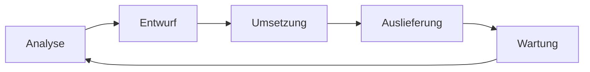
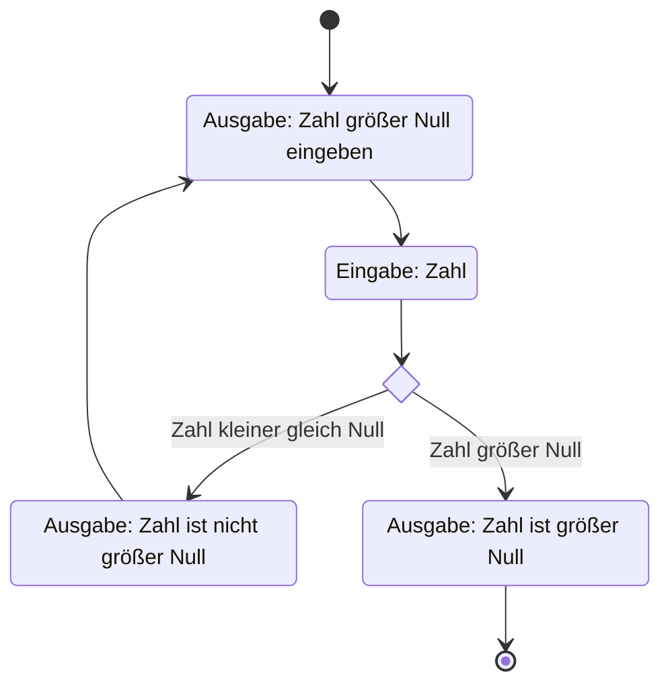
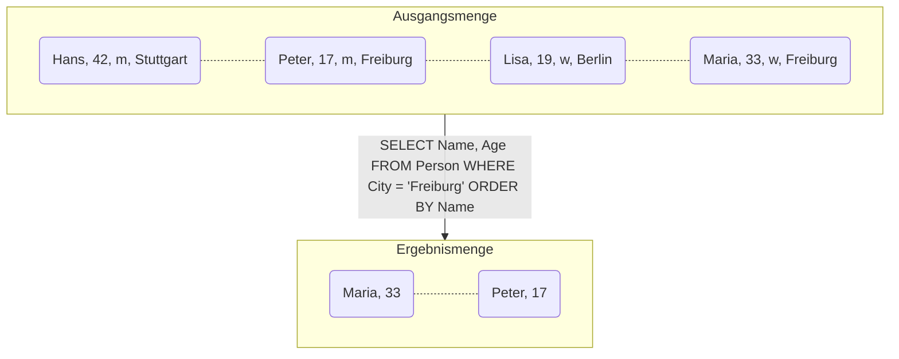
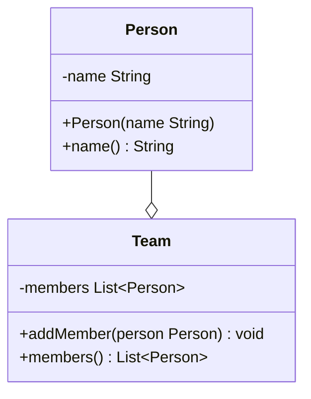
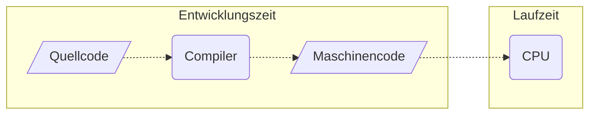
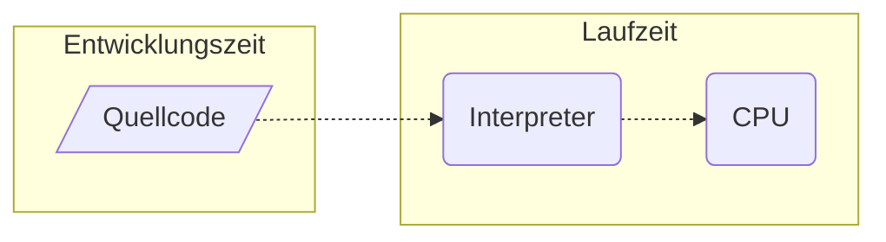
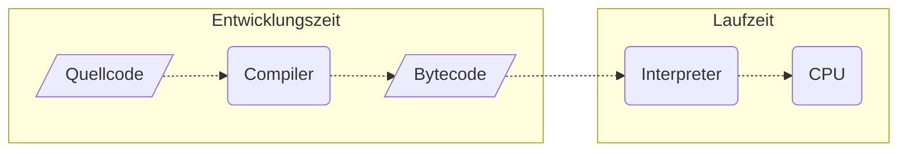

Als ein Teilbereich der Softwareentwicklung umfasst das Programmieren vor allem die Umsetzung eines Softwareentwurfes in Quellcode. Generell versteht man unter Programmieren die Umsetzung von Algorithmen in lauffähige Computer-Programme.

:::note Hinweis
Ein Algorithmus ist eine Handlungsvorschrift zur Lösung eines Problems.
:::

## Programmierparadigmen
Unter einem Programmierparadigma versteht man die grundlegende Herangehensweise, Probleme mit Hilfe einer Programmiersprache zu lösen:

:::note Hinweis
Auch wenn Programmiersprachen oft anhand ihrer grundlegenden Merkmale genau einem Programmierparadigma zugeordnet werden, unterstützen viele Programmiersprachen mehrere Programmierparadigmen.
:::

### Imperative Programmierung
Bei der imperativen Programmierung bestehen Programme aus verzweigten und sich wiederholenden Folgen von Anweisungen, die den Programmablauf steuern.

### Deklarative Programmierung
Die deklarative Programmierung stellt einen Gegenentwurf zur imperativen Programmierung dar, bei der nicht das "Wie", sondern das "Was" im Vordergrund steht.

### Objektorientierte Programmierung
Die ojektorientierte Programmierung baut auf der imperativen Programmierung auf, setzt den Fokus aber auf abstrakte Datentypen und die Verbindung von Daten und Routinen.

## Programmausführung
Programme auf einem Computer können auf unterschiedliche Arten ausgeführt werden:
_Compiler_ übersetzen den Quellcode in eine Datei, die vom jeweiligen Betriebssystem ausgeführt werden kann

_Interpreter_ übersetzen den Quellcode direkt in den Arbeitsspeicher und führt das Programm sofort aus

_Just-In-Time-Compiler_ vereinen die Vorteile von Compiler und Interpreter: Der Compiler übersetzt den Quellcode zunächst in den sogenannten Bytecode, anschließend überführt der Interpreter den Bytecode in Maschinencode

:::note Hinweis
In Java wird der Interpreter als _Java Virtual Machine_ bezeichnet.
:::

Compilersprachen wie z.B. C++ sind deutlich performanter und ermöglichen eine sicherere Entwicklung, Interpretersprachen wie z.B. PHP sind dagegen plattformunabhängig.

## Programmiersprachen
Maschinen sind im Vergleich zu menschlichen Gehirnen sehr primitive Gebilde. Die Diskrepanz zwischen der menschlichen Denkweise und der Arbeitsweise von Maschinen bezeichnet mal als _Semantische Lücke_. Programmiersprachen ermöglichen es, Problemstellungen der 
realen Welt abstrahiert und maschinengerecht abzubilden und damit die Semantische Lücke zu verringern. Je höher die Abstraktion einer Programmiersprache dabei ist, desto mehr kann die Semantische Lücke verringert werden: Maschinenorientierte Programmiersprachen
(wie z.B. Assembler) abstrahieren kaum und sind daher für den Menschen schwerer verständlich, problemorientierte Programmiersprachen (wie z.B. Java) abstrahieren stark und sind daher für den Menschen leichter verständlich.

Die Programmiersprachen Java, Python und JavaScript gehören zu den am weitesten verbreiteten bzw. beliebtesten Programmiersprachen.

| TIOBE  | RedMonk    | PYPL       |
| ------ | ---------- | ---------- |
| Python | JavaScript | Python     |
| C      | Python     | Java       |
| Java   | Java       | JavaScript |
| C++    | PHP        | C#         |
| C#     | C++        | C/C++      |

:::note Quellen
Tiobe Programming Community Index November 2021, RedMonk Programming Language Rankings Juni 2021, PopularitY of Programming Language November 2021
:::

## Die Programmiersprache Java
Die Programmiersprache Java gehört zu den problemorientierten Programmiersprachen und ist daher einfacher zu erlernen und einfacher zu verstehen als maschinenorientierte Programmiersprachen. Bei der Entwicklung von Java verfolgte man das Ziel, eine einfache, 
objektorientierte, robuste, architekturneutrale und parallelisierbare Programmiersprache zu entwickeln. Java wurde hauptsächlich von C und C++ beeinflusst, ist allerdings im Gegensatz zu C und C++ nicht darauf ausgelegt, möglichst leistungsfähige Programme zu 
erzeugen, sondern möglichst sichere und fehlerfreie Programme.

### Die Geschichte von Java
Anfang der 90er begannen bei der Firma Sun Microsystems unter Federführung des Chefentwicklers James Gosling die Arbeiten an einem Projekt mit dem Codenamen _The Green Project_ mit dem Ziel, eine vollständige Betriebssystemumgebung für unterschiedliche Zwecke 
(interaktives Kabelfernsehen, intelligente Kaffeemaschinen etc.) zu entwickeln. Die daraus entstehende Programmiersprache sollte ursprünglich den Namen _Oak_ (Object Application Kernel) tragen, wurde aber schließlich im Mai 1995 unter dem Namen _Java_ 
veröffentlicht. Der große Durchbruch von Java kam 1996 durch eine Kooperation mit der Firma Netscape zustande, die eine Integration von Java-Applets mit Hilfe von JavaScript in den Browser Netscape Navigator 2.0 ermöglichte. Weitere wichtige Meilensteine in der
Geschichte von Java waren die Veröffentlichungen der Google-Entwicklungsumgebung Android 2008 sowie des Computerspiels Minecraft 2009.

:::note Hinweis
Java war der Name der beliebtesten Kaffeesorte der Entwickler.
:::

### JDK und JRE
Das JDK (Java Development Kit) stellt die wichtigste Komponente zum Programmieren von Java-Programmen dar. Es enthält neben dem Compiler und Debugger weitere wichtige Werkzeuge sowie umfangreiche Bibliotheken (siehe [Die Java API](java-api/java-api.md)). Die 
JRE (Java Runtime Environment) enthält den Interpreter (die _Java Virtual Machine_) und wird zum Ausführen von Java-Applikationen benötigt.
