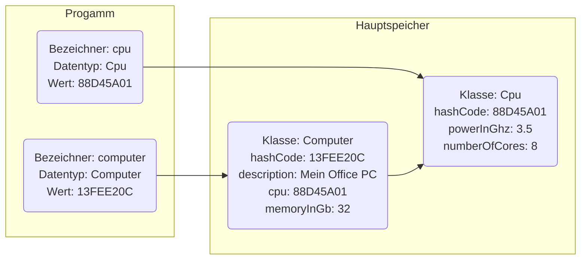

import Tabs from '@theme/Tabs';
import TabItem from '@theme/TabItem';

Technisch gesehen ist eine Klasse ein komplexer Datentyp. Analog zu primitiven
Datentypen können für Klassen Variablen — sogenannte _Referenzvariablen_ —
deklariert werden.

Im Gegensatz zu einfachen Variablen speichern Referenzvariablen nicht den Wert
direkt, sondern die Speicheradresse des erzeugten Objekts. Die Selbstreferenz
`this` verweist innerhalb einer Klasse auf das eigene Objekt.


```mermaid
flowchart LR
   subgraph Progamm
   computer(Bezeichner: computer
            Datentyp: Computer
            Wert: 13FEE20C)
   cpu(Bezeichner: cpu
       Datentyp: Cpu
       Wert: 88D45A01)
   end
   subgraph Hauptspeicher
   o1(Klasse: Computer
      hashCode: 13FEE20C
      description: Mein Office PC
      cpu: 88D45A01
      memoryInGb: 32)
   o2(Klasse: Cpu
      hashCode: 88D45A01
      powerInGhz: 3.5
      numberOfCores: 8)
   end
   computer --> o1
   cpu --> o2
   o1 --> o2
```

:::info

Der Standardwert von Referenzvariablen ist `null` (auch _Nullreferenz_ genannt).

:::

## Erzeugen von Objekten

Mit dem `new`-Operator wird ein neues Objekt erzeugt und der zugehörige
Speicherplatz belegt. Nach `new` muss immer ein
[Konstruktor](classes#definition-von-konstruktoren) der Klasse angegeben werden.

```java title="MainClass.java" showLineNumbers
public class MainClass {

   public static void main(String[] args) {
      Cpu cpu = new Cpu(3.5, 8);
      Computer computer = new Computer("Mein Office PC");
   }

}
```

## Zugriff auf Attribute und Aufruf von Methoden

Sofern die Zugriffsrechte es erlauben, erfolgt der Zugriff auf ein Attribut oder
der Aufruf einer Methode über die Referenzvariable gefolgt von einem Punkt.
Statische Attribute und Methoden werden über den Klassennamen angesprochen.

```java title="MainClass.java" showLineNumbers
public class MainClass {

   public static void main(String[] args) {
      Cpu cpu = new Cpu(3.5, 8);
      Computer computer = new Computer("Mein Office PC");
      computer.setCpu(cpu);
      computer.setMemoryInGb(32);
      System.out.println(Computer.getNumberOfComputers());
   }

}
```

:::info

Beim Aufruf einer Methode müssen alle Parameter in der richtigen Reihenfolge
übergeben werden. Solche Parameter bezeichnet man als _Positionsparameter_.

:::
