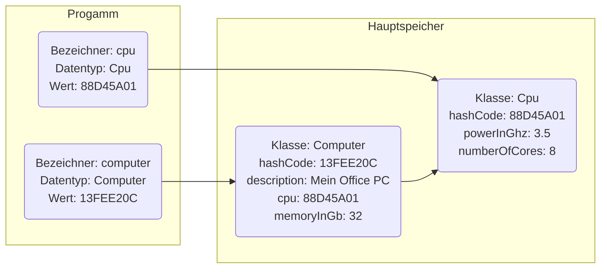

import Tabs from '@theme/Tabs';
import TabItem from '@theme/TabItem';

Technisch gesehen handelt es sich bei einer Klasse um einen komplexen Datentyp.
Analog zu den primitiven Datentypen können auch für Klassen Variablen –
sogenannte _Referenzvariablen_ – definiert werden.

Im Gegensatz zu "normalen" Variablen werden bei Referenzvariablen nicht die
eigentlichen Werte in den Variablen gespeichert, sondern die Speicheradressen
der erzeugten Objekte. Die Selbstreferenz `this` verweist innerhalb einer Klasse
auf das eigene Objekt.



:::info Hinweis

Der Standarwert von Referenzvariablen ist `null` (auch Nullreferenz genannt).

:::

## Erzeugen von Objekten

Beim Erzeugen eines Objekts mit Hilfe des Operators `new` wird der bei der
Deklaration reservierte Speicherplatz durch das Objekt belegt.

```java title="MainClass.java" showLineNumbers
public class MainClass {

   public static void main(String[] args) {
      Cpu cpu = new Cpu(3.5, 8);
      Computer computer = new Computer("Mein Office PC");
   }

}
```

:::info Hinweis

Nach dem new-Operator muss immer ein
[Konstruktor](classes#definition-von-konstruktoren) der Klasse stehen.

:::

## Zugriff auf Attribute und Aufruf von Methoden

Erlauben die Zugriffsrechte den Zugriff auf ein Attribut bzw. den Aufruf einer
Methode, kann über die deklarierte Referenzvariable und einem nachgestellten
Punkt auf das Attribut zugegriffen bzw. die Methode aufgerufen werden. Der
Zugriff auf statische Attribute bzw. der Aufruf statischer Methoden erfolgt über
den Klassennamen sowie einem nachgestellten Punkt.

```java title="MainClass.java" showLineNumbers
public class MainClass {

   public static void main(String[] args) {
      Cpu cpu = new Cpu(3.5, 8);
      Computer computer = new Computer("Mein Office PC");
      computer.setCpu(cpu);
      computer.setMemoryInGb(32);
     System.out.println(Computer.getNumberOfComputers());
   }

}
```

:::info Hinweis

Beim Aufruf einer Methode müssen alle Parameter in der richtigen Reihenfolge
versorgt werden. Parameter, die diesem Prinzip folgen, bezeichnet man als
_Positionsparameter_

:::
