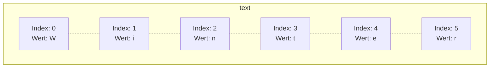

Ketten von beliebigen Zeichen werden durch die Klasse `String` realisiert. Diese
stellt einige hilfreiche Methoden zur Verfügung, die bei der Analyse und der
Verarbeitung von Zeichenketten Verwendung finden. Die Angabe einer Zeichenkette
erfolgt über die Anführungszeichen.



```java title="MainClass.java" showLineNumbers
public class MainClass {

  public static void main(String[] args) {
    String text = "Winter";
    String text2 = "Coming";

    String text3 = text + " is " + text2;

    int length = text3.length();
    char charAt1 = text3.charAt(0);
    String upperCase = text3.toUpperCase();
  }

}
```

## Escape-Sequenzen

Steuer- und Sonderzeichen in Zeichenketten können mit Hilfe einer Escape-Sequenz
realisiert werden.

| Escape-Squenz       | Beschreibung      |
| ------------------- | ----------------- |
| \\n                 | Zeilensprung      |
| \\t                 | Tabulatorsprung   |
| \\\\                | Schräger rechts   |
| \\"                 | Anführungszeichen |
| \\'                 | Hochkomma         |
| \\u0000 bis \\uFFFF | Unicode-Zeichen   |

## Textblöcke

Seit Java 15 ermöglichen Textblöcke mehrzeilige Zeichenketten ohne umständliche
Umwege.

```java title="MainClass.java" showLineNumbers
public class MainClass {

  public static void main(String[] args) {
    String text = """
        <html>
          <body>
            <p>Winter is Coming</p>
          </body>
        </html>""";
    System.out.println(text);
  }

}
```
