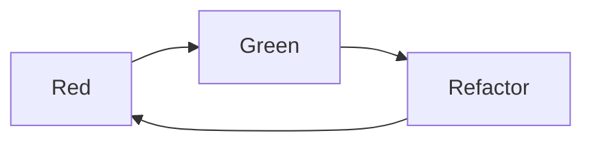

Softwaretests sollen sicherstellen, dass bei der Entwicklung oder Änderung einer
Software der Quellcode in allen festgelegten Anwendungsfällen korrekt
funktioniert. Mit Hilfe von Softwaretests können Softwareentwickler im Idealfall
schon während des Entwicklungsprozesses mögliche Fehler identifizieren und
beheben. Man unterscheidet dabei zwischen verschiedenen Testarten:

- Akzeptanztests: Testen des gesamten Systems unter realitätsgetreuen
  Bedingungen
- Systemtests: Testen des gesamten Systems
- Integrationstests: Testen mehrerer, voneinander abhängiger Komponenten
- Komponententests: Testen einzelner, abgeschlossener Softwarebausteine

Komponententests (Unit Tests) sowie Integrationstests spielen vor allem bei
agilen Vorgehensweisen wie z.B. der testgetriebenen Entwicklung (Test Driven
Development) eine große Rolle. Hierbei werden Anwendungen Schritt für Schritt
(also inkrementell) um neue Funktionen erweitert (z.B. nach der
Red-Green-Refactor-Methode): Zuerst wird ein Test geschrieben, der zunächst
fehlschlägt (Red), anschließend wird genau soviel Produktivcode geschrieben,
damit der Test erfolgreich durchläuft (Green). Schließlich werden beim
Refactoring Testcode und Produktivcode aufgeräumt (also vereinfacht und
verbessert).

:::info Hinweis

Da durch die vorangestellten Tests eine kontinuierliche Designverbesserung
stattfindet, wird die testgetriebene Entwicklung zu den Designstrategien
gezählt.

:::
