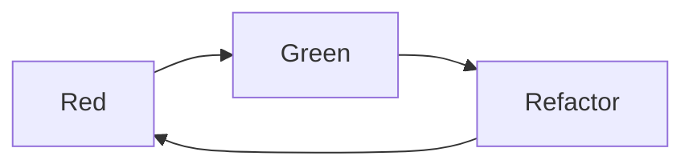

Softwaretests stellen sicher, dass eine Anwendung in allen vorgesehenen
Anwendungsfällen korrekt funktioniert. Durch frühzeitiges Testen können Fehler
bereits während der Entwicklung erkannt und behoben werden. Man unterscheidet
vier Testebenen:

- Akzeptanztests: Testen des gesamten Systems unter realitätsgetreuen
  Bedingungen
- Systemtests: Testen des gesamten Systems
- Integrationstests: Testen mehrerer, voneinander abhängiger Komponenten
- Komponententests: Testen einzelner, abgeschlossener Softwarebausteine

Komponententests (Unit Tests) sowie Integrationstests spielen besonders bei
agilen Vorgehensweisen wie der testgetriebenen Entwicklung (Test Driven
Development) eine wichtige Rolle. Beim TDD wird eine Anwendung inkrementell nach
der Red-Green-Refactor-Methode entwickelt: Zunächst wird ein Test geschrieben,
der fehlschlägt (Red). Dann wird gerade so viel Produktivcode geschrieben, dass
der Test besteht (Green). Anschließend wird der Code aufgeräumt und vereinfacht
(Refactor).

```mermaid
flowchart LR
   Red --> Green --> Refactor --> Red
```

:::info

Da durch die vorangestellten Tests eine kontinuierliche Designverbesserung
stattfindet, wird die testgetriebene Entwicklung zu den Designstrategien
gezählt.

:::
