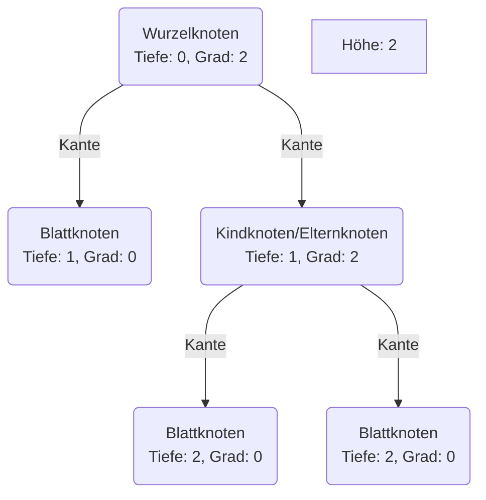
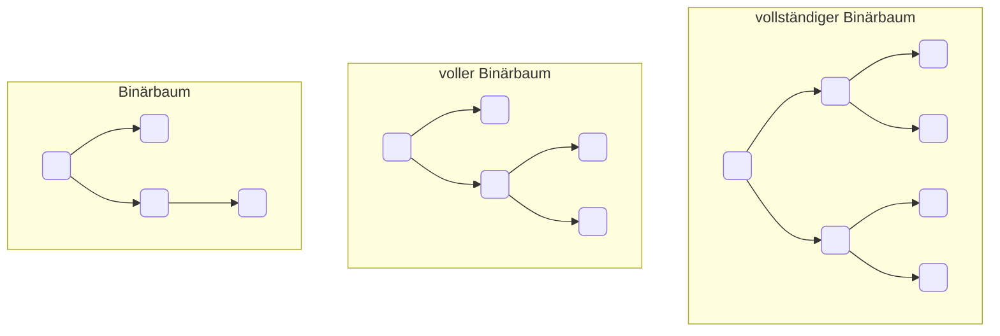
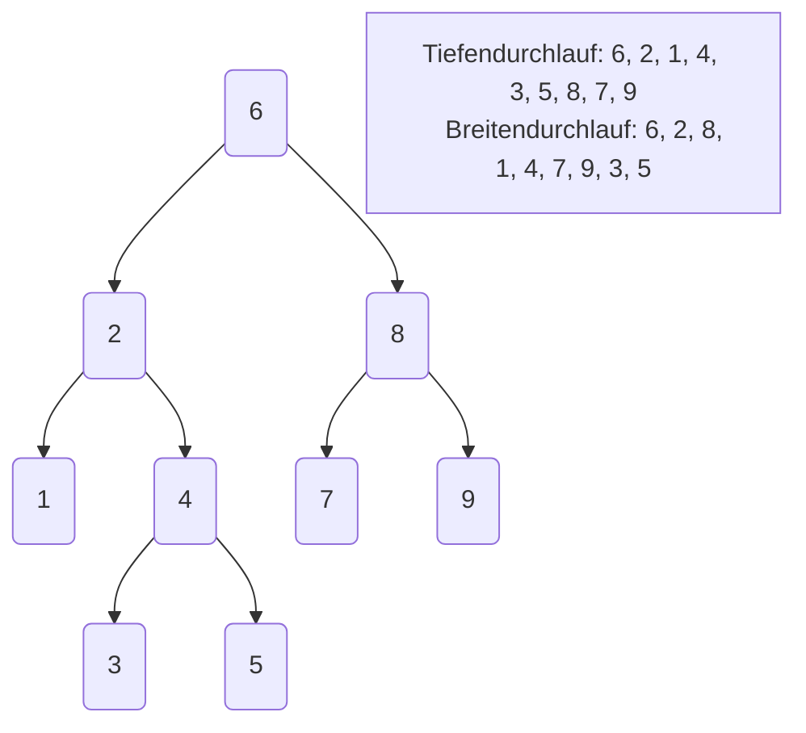

Bäume sind abstrakte Datenstrukturen zum Darstellen von hierarchischen
Strukturen. Sie bestehen i.d.R. aus beliebig vielen Elementen (Knoten), sowie
Verbindungen zwischen den Elementen (Kanten). Den Ursprungsknoten bezeichnet man
als _Wurzelknoten_, untergeordnete Knoten als _Kindknoten_, übergeordnete Knoten
als _Elternknoten_ und Kinder ohne weitere untergeordnete Knoten als
_Blattknoten_. Bäume sind im Prinzip Erweiterungen von Listen: in einer Liste
hat ein Knoten maximal einen Nachfolger, in einem Baum kann ein Knoten mehrere
Nachfolger besitzen.

:::note Hinweis

Unter der Tiefe eines Knotens versteht man die Länge des Pfades vom Knoten bis
zum Wurzelknoten, unter der Höhe eines Baumes die maximale Tiefe eines seiner
Knoten und unter dem Grad eines Knotens die Anzahl seiner Kindknoten.

:::

## Binärbäume

Bei Binärbäumen darf jeder Knoten maximal zwei Nachfolger besitzen. Besitzen
alle inneren Knoten eines Binärbaumes den Grad 2, spricht man von einem _vollen
Binärbaum_, besitzen alle Blätter eines vollen Binärbaum die gleiche Tiefe,
spricht man von einem _vollständigen Binärbaum_.

## Traversierung von Bäumen

Unter der Traversierung eines Baumes versteht man das Durchlaufen aller Elemente
eines Baumes. Im Gegensatz zu Listen, wo es genau eine natürliche Ordnung für
den Durchlauf der Elemente gibt (von vorne nach hinten), existieren bei Bäumen
mehrere sinnvolle Reihenfolgen:

- Beim Tiefendurchlauf wird ausgehend vom Wurzelknoten zunächst der linke
  Teilbaum mit Tiefendurchlauf besucht, anschließend der rechte Teilbaum
- Beim Breitendurchlauf werden die Knoten nach der Breite des Baumes geordnet
  besucht

