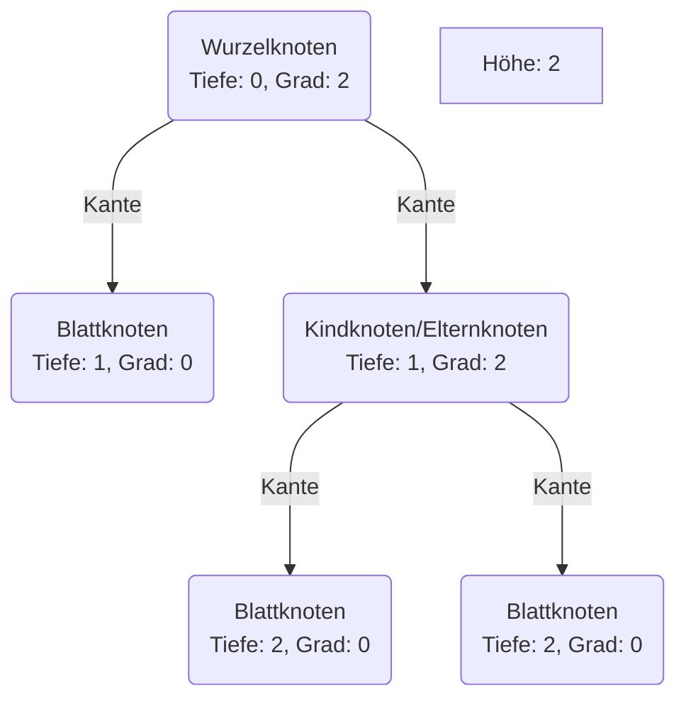
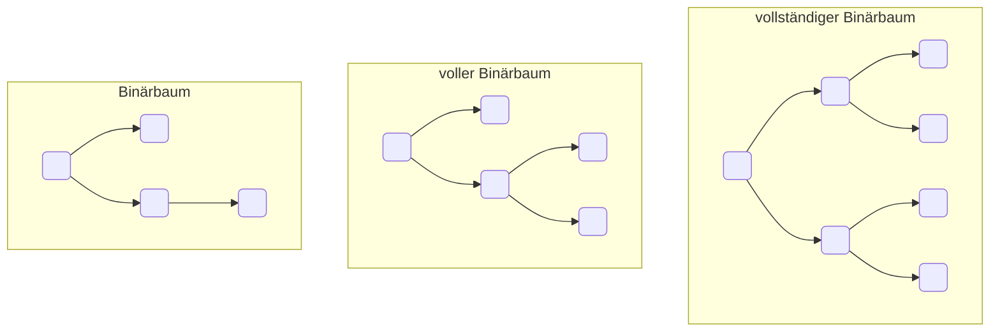
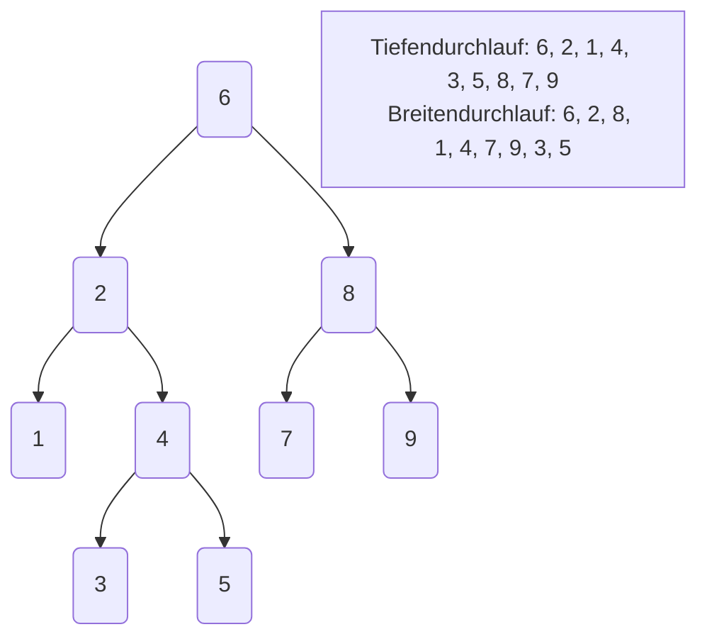

Bäume sind abstrakte Datenstrukturen zur Darstellung hierarchischer Beziehungen.
Sie bestehen aus Knoten und Kanten zwischen den Knoten. Der oberste Knoten heißt
_Wurzelknoten_, Knoten ohne Kindknoten heißen _Blattknoten_, dazwischenliegende
Knoten sind gleichzeitig _Kind-_ und _Elternknoten_. Bäume erweitern das Konzept
der Liste: Während ein Listenknoten maximal einen Nachfolger hat, kann ein
Baumknoten mehrere Nachfolger besitzen.


```mermaid
flowchart
   node1 --Kante---> node2
   node1 --Kante---> node3
   node3 --Kante---> node4
   node3 --Kante---> node5
   size[Höhe: 2]
   node1(Wurzelknoten
         Tiefe: 0, Grad: 2)
   node2(Blattknoten
         Tiefe: 1, Grad: 0)
   node3(Kindknoten/Elternknoten
         Tiefe: 1, Grad: 2)
   node4(Blattknoten
         Tiefe: 2, Grad: 0)
   node5(Blattknoten
         Tiefe: 2, Grad: 0)
```

:::info

Unter der Tiefe eines Knotens versteht man die Länge des Pfades vom Knoten bis
zum Wurzelknoten, unter der Höhe eines Baumes die maximale Tiefe eines seiner
Knoten und unter dem Grad eines Knotens die Anzahl seiner Kindknoten.

:::

## Binärbäume

Bei Binärbäumen hat jeder Knoten maximal zwei Nachfolger. Hat jeder innere
Knoten genau zwei Kinder, spricht man von einem _vollen Binärbaum_. Haben dabei
alle Blattknoten dieselbe Tiefe, heißt er _vollständiger Binärbaum_.


```mermaid
flowchart TD
   node1 --> node2
   node1 --> node3
   node2 --> node4
   node2 --> node5
   node3 --> node6
   node3 --> node7
   subgraph vollständiger Binärbaum
      node1( )
      node2( )
      node3( )
      node4( )
      node5( )
      node6( )
      node7( )
   end
   node8 --> node9
   node8 --> node10
   node10 --> node11
   node10 --> node12
   subgraph voller Binärbaum
      node8( )
      node9( )
      node10( )
      node11( )
      node12( )
   end
   node13 --> node14
   node13 --> node15
   node15 --> node16
   subgraph Binärbaum
      node13( )
      node14( )
      node15( )
      node16( )
   end
```

## Traversierung von Bäumen

Unter Traversierung versteht man das systematische Durchlaufen aller Knoten
eines Baumes. Anders als bei Listen, wo die Reihenfolge eindeutig ist, gibt es
bei Bäumen mehrere sinnvolle Durchlaufreihenfolgen:

- Beim Tiefendurchlauf wird ausgehend vom Wurzelknoten zuerst der linke, dann
  der rechte Teilbaum rekursiv besucht.
- Beim Breitendurchlauf werden alle Knoten ebenenweise von oben nach unten
  besucht.


```mermaid
flowchart TD
   node1 --> node2
   node1 --> node3
   node2 --> node4
   node2 --> node5
   node3 --> node6
   node3 --> node7
   node5 --> node8
   node5 --> node9
   node1(6)
   node2(2)
   node3(8)
   node4(1)
   node5(4)
   node6(7)
   node7(9)
   node8(3)
   node9(5)
   depth[Tiefendurchlauf: 6, 2, 1, 4, 3, 5, 8, 7, 9
   Breitendurchlauf: 6, 2, 8, 1, 4, 7, 9, 3, 5]
```

## Binäre Suchbäume in Java

Java verwendet binäre Suchbäume intern in den Klassen
[`TreeSet<E>`](java-collections-framework) und [`TreeMap<K, V>`](maps). Ein
binärer Suchbaum hält seine Elemente stets sortiert: Jeder Knoten ist größer als
alle Knoten im linken Teilbaum und kleiner als alle Knoten im rechten Teilbaum.
Dadurch ist die Suche, das Einfügen und das Löschen in 𝒪(log 𝑛) möglich.

Damit `TreeSet` und `TreeMap` Elemente vergleichen können, muss die gespeicherte
Klasse entweder `Comparable<T>` implementieren oder beim Erzeugen der Sammlung
ein `Comparator<T>` übergeben werden (siehe [Komparatoren](comparators)).

```java title="MainClass.java" showLineNumbers
public class MainClass {

   public static void main(String[] args) {
      TreeSet<Integer> numbers = new TreeSet<>();
      numbers.add(6);
      numbers.add(2);
      numbers.add(8);
      numbers.add(1);
      numbers.add(4);

      // Ausgabe erfolgt aufsteigend sortiert: 1 2 4 6 8
      numbers.forEach(System.out::println);
   }

}
```
