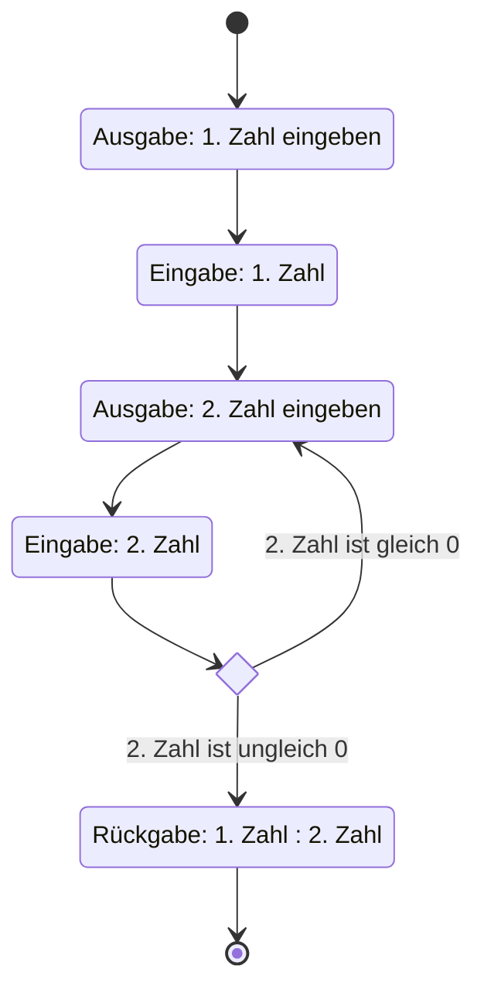

Aktivitätsdiagramme sind ein Diagrammtyp der UML und gehören dort zum Bereich
der Verhaltensdiagramme. Der Fokus von Aktivitätsdiagrammen liegt auf
imperativen Verarbeitungsaspekten. Eine Aktivität stellt einen gerichteten
Graphen dar, der über Knoten (Aktionen, Datenknoten und Kontrollknoten) und
Kanten (Kontrollflüsse und Datenflüsse) verfügt:

- Aktionen sind elementare Bausteine für beliebiges, benutzerdefiniertes
  Verhalten
- Kontrollknoten steuern den Kontroll- und Datenfluss in einer Aktivität:
  - Startknoten: legen den Beginn der Aktivität fest
  - Endknoten: legen das Ende der Aktivität fest
  - Ablaufendknoten: legen das Ende eines Ablaufes fest
  - Verzweigungsknoten: ermöglichen die Verzweigung von Abläufen
  - Zusammenführungsknoten: ermöglichen die Zusammenführung von Abläufen
- Datenknoten sind Hilfsknoten, die als ein- oder ausgehende Parameter einer
  Aktion verwendet werden können
- Kontroll- und Datenflüsse legen Abläufe zwischen Vorgänger- und
  Nachfolger-Knoten fest

