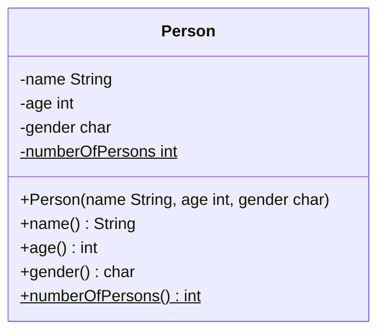
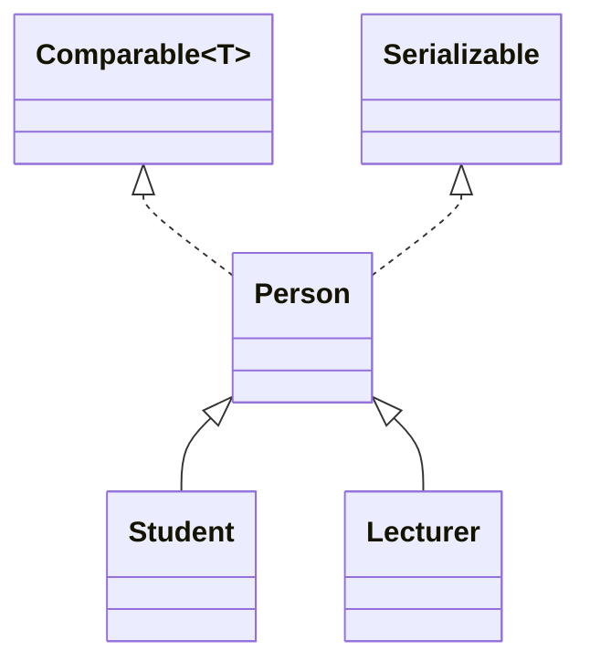
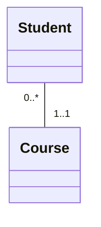

import Tabs from '@theme/Tabs';
import TabItem from '@theme/TabItem';

Klassendiagramme sind ein Diagrammtyp der UML und gehören dort zum Bereich der Strukturdiagramme. Das Klassendiagramm dient zur leicht lesbaren Dokumentation des Aufbaus von Klassen und deren Beziehungen (Relationen). Klassendiagramme können Informationen zu 
den Attributen, den Methoden und weiteren Klassen-Bestandteilen enthalten.

## Darstellung von Klassen
Klassen werden im Klassendiagramm als Rechteck mit verschiedenen Bereichen (Klassenname, Attribute, Methoden und weitere Klassen-Bestandteile) dargestellt:
- Der Klassenname wird zentriert, fett gedruckt und mit einem Großbuchstaben beginnend dargestellt
- Attribute werden nach dem Muster _[Sichtbarkeit]_ _[Attributname]: [Datentyp] = [Anfangswert]_ dargestellt
- Methoden nach dem Muster _[Sichtbarkeit]_ _[Methoden-Signatur]: [Datentyp des Rückgabewertes]_ dargestellt
- Statische Attribute und Methoden werden durch Unterstriche kenntlich gemacht
- Durch geschweifte Klammern können Attribute, Methoden und Klassen um zusätzliche Merkmale ergänzt werden
- Die Sichtbarkeit von Attributen und Methoden wird durch (farbige) Symbole dargestellt:
    - Die Sichtbarkeit `public` wird durch das Symbol **+** bzw. die Farbe **grün** dargestellt
    - Die Sichtbarkeit `protected` wird durch das Symbol **#** bzw. die Farbe **gelb** dargestellt
    - Die Sichtbarkeit `packaged` wird durch das Symbol **~** bzw. die Farbe **blau** dargestellt
    - Die Sichtbarkeit `private` wird durch das Symbol **-** bzw. die Farbe **rot** dargestellt



## Darstellung spezieller Klassen

<Tabs>
  <TabItem value="enumerations" label="Aufzählungen" default>

  Aufzählungen werden im Klassendiagramm durch den Stereotypen `enumeration` kenntlich gemacht. Die Aufzählungskonstanten werden in einem zusätzlichen Bereich
  aufgeführt. Der Stereotyp impliziert, dass die Aufzählung einen privaten Konstruktor sowie ggbfs. passende Setter und Getter besitzt.

  ```mermaid
  classDiagram
      class WeekDay {
          <<enumeration>>
          MONDAY = Monday
          TUESDAY = Tuesday
          WEDNESDAY = Wednesday
          THURSDAY = Thursday
          FRIDAY = Friday
          SATURDAY = Saturday
         SUNDAY = Sunday
          -description String
      }
  ```

  </TabItem>
  <TabItem value="interfaces" label="Schnittstellen" default>

  Schnittstellen werden im Klassendiagramm durch den Stereotypen `interface` kenntlich gemacht. Dieser impliziert, dass alle Methoden der Schnittstelle abstrakt
  sind.

  ```mermaid
  classDiagram
      class Comparable~T~ {
          <<interface>>
          +compareTo(o T) int
      }
  ```

  </TabItem>
  <TabItem value="records" label="Datenklassen" default>

  Datenklassen werden im Klassendiagramm durch den Stereotypen `record` kenntlich gemacht. Dieser impliziert, dass die Datenklasse einen entsprechenden
  Konstruktor, Getter zu allen Attributen sowie entsprechende Implementierungen für die Object-Methoden besitzt.

  ```mermaid
  classDiagram
      class Person {
          <<record>>
          -name String
          -age int
          -gender char
      }
  ```

  </TabItem>
  <TabItem value="generics" label="Generische Klassen" default>

  Die formalen Typparameter einer generischen Klassen werden in einem zusätzlichen Rechteck dargestellt.

  ```mermaid
  classDiagram
      class Box~T~ {
          -content T
          +setContent(content T) void
          +getContent() T
      }
  ```

  </TabItem>
</Tabs>

## Darstellung von Assoziationen
Assoziationen stellen allgemeine Relationen zwischen zwei Klassen dar, bei der eine Klasse eine andere Klasse verwendet. Assoziationen können in eine Richtung (unidirektional) und in beide Richtungen (bidirektional) vorliegen. 

Aggregationen und Kompositionen stellen spezielle Formen von Assoziationen dar, bei denen ein Objekt der einen Klasse Teil einer anderen Klasse ist. Im Gegensatz zu Aggregationen hängen bei Kompositionen die Teile von der Existenz des Ganzen ab. Aggregationen 
werden daher auch als ist-Teil-von-Relationen, Kompositionen als existenzabhängige ist-Teil-von-Relationen bezeichnet.

<Tabs>
  <TabItem value="associations" label="Assoziationen" default>

  Assoziationen werden mit einem offenen Pfeil hin zur verwendeten Klasse dargestellt.

  ```mermaid
  classDiagram
      Persons --> Person
      class Persons {
          +getPersons() List~Person~
      }
  ```

  </TabItem>
  <TabItem value="aggregations" label="Aggregationen" default>

  Aggregationen werden mit einer nicht ausgefüllten Raute hin zur besitzenden Klasse dargestellt.

  ```mermaid
  classDiagram
      Person --o Team
      class Team {
          +members List~Person~
      }
  ```

  </TabItem>
  </TabItem>
  <TabItem value="compositions" label="Kompositionen" default>

  Kompositionen werden mit einer ausgefüllten Raute hin zur besitzenden Klasse dargestellt.

  ```mermaid
  classDiagram
      OrderItem --* Order
      class Order {
          +items List~OrderItem~
      }
  ```

  </TabItem>
</Tabs>

:::note Hinweis
Assoziationen können gerichtet und ungerichtet dargestellt werden.
:::

## Darstellung von Vererbungs-und Realisierungs-Beziehungen
Vererbungs-Beziehungen werden mit einem geschlossenen Pfeil hin zur Oberklasse sowie einer durchgezogenen Linie dargestellt, Realisierungs-Beziehungen mit einem geschlossenen Pfeil hin zur Schnittstelle sowie einer gestrichelten Linie.



## Darstellung von Multiplizitäten
Die Multiplizität einer Beziehung legt fest, mit wie vielen Objekten der gegenüberliegenden Klasse ein Objekt in Beziehung stehen kann. Die Multiplizität wird als Intervall aus nicht-negativen ganzen Zahlen dargestellt und wird in der Form 
_[untere Schranke]..[obere Schranke]_ angegeben. Besitzen beide Schranken den gleichen Wert, muss nur eine der beiden Schranken angegeben werden. Eine nach oben unbeschränkte Schranke wird mit **\*** angegeben.


