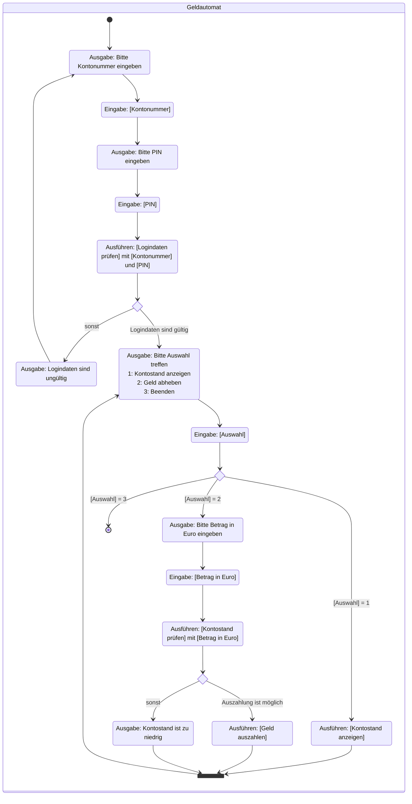

Erstelle die ausführbare Klasse `CashMachine` anhand des abgebildeten
Aktivitätsdiagramms. Erstelle zum Testen eine Klasse, die die benötigten
Methoden zur Verfügung stellt.

## Aktivitätsdiagramm zur Klasse _CashMachine_

