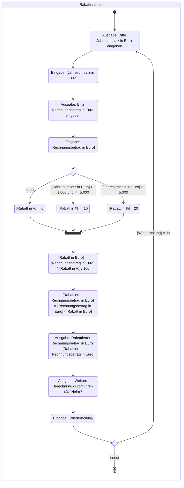

Erstelle die ausführbare Klasse `DiscountCalculator` anhand des abgebildeten
Aktivitätsdiagramms.

## Aktivitätsdiagramm zur Klasse _DiscountCalculator_

```mermaid
stateDiagram-v2
    state "Ausgabe: Bitte Jahresumsatz in Euro eingeben" as state1
    state "Eingabe: [Jahresumsatz in Euro]" as state2
    state "Ausgabe: Bitte Rechnungsbetrag in Euro eingeben" as state3
    state "Eingabe: [Rechnungsbetrag in Euro]" as state4
    state "[Rabatt in %] = 0" as state5
    state "[Rabatt in %] = 10" as state6
    state "[Rabatt in %] = 20" as state7
    state "[Rabatt in Euro] = [Rechnungsbetrag in Euro] * [Rabatt in %] / 100" as state8
    state "[Rabattierter Rechnungsbetrag in Euro] = [Rechnungsbetrag in Euro] - [Rabatt in Euro]" as state9
    state "Ausgabe: Rabattierter Rechnungsbetrag in Euro: [Rabattierter Rechnungsbetrag in Euro]" as state10
    state "Ausgabe: Weitere Berechnung durchführen (Ja, Nein)?" as state11
    state "Eingabe: [Wiederholung]" as state12

    state if1 <<choice>>
    state if2 <<choice>>
    state fork1 <<fork>>

    state "Rabattrechner" as main {
        [*] --> state1
        state1 --> state2
        state2 --> state3
        state3 --> state4
        state4 --> if1
        if1 --> state5: sonst
        if1 --> state6: [Jahresumsatz in Euro] > 1.000 und <= 5.000
        if1 --> state7: [Jahresumsatz in Euro] > 5.000
        state5 --> fork1
        state6 --> fork1
        state7 --> fork1
        fork1 --> state8
        state8 --> state9
        state9 --> state10
        state10 --> state11
        state11 --> state12
        state12 --> if2
        if2 --> state1: [Wiederholung] = Ja
        if2 --> [*]: sonst
    }
```
