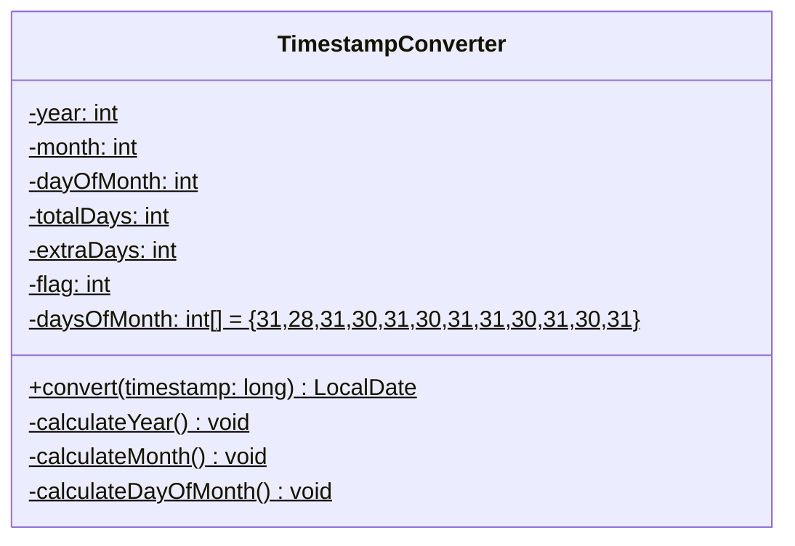
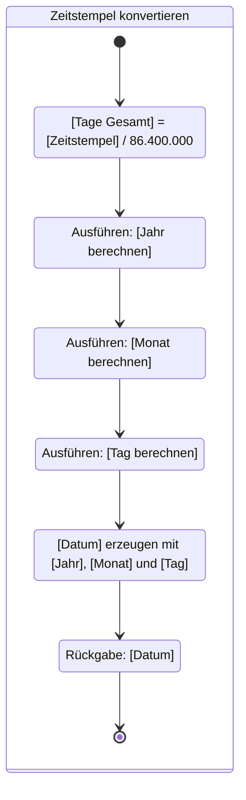
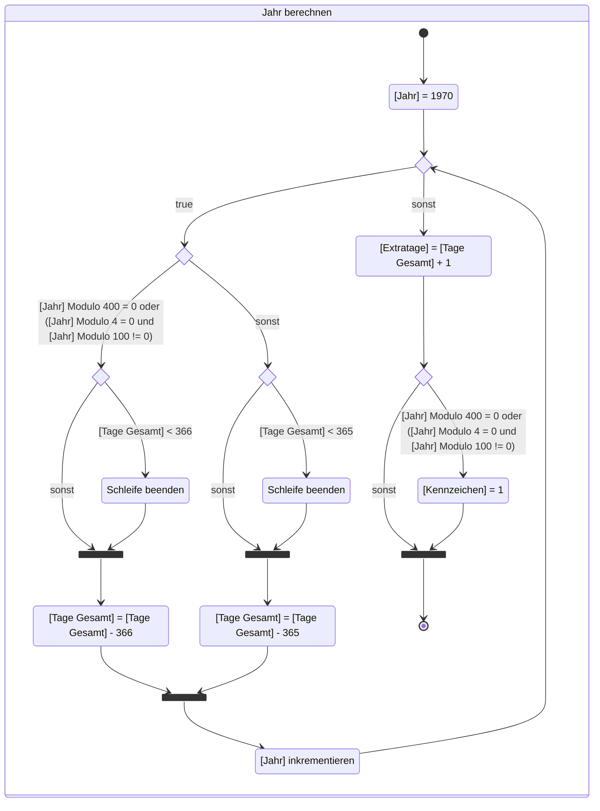
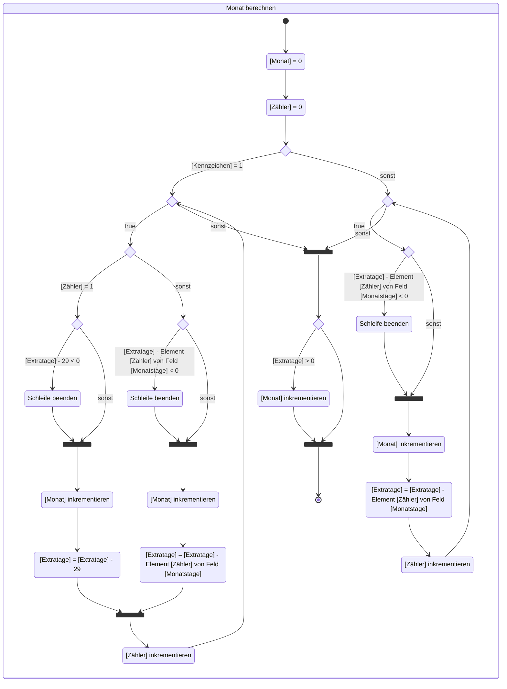
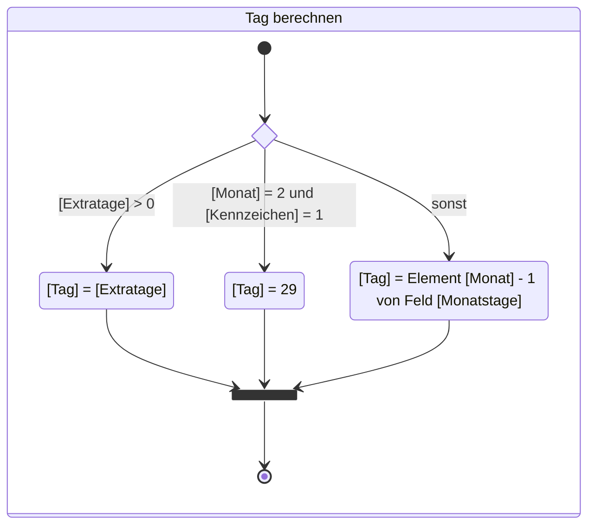

Erstelle die Klasse `TimestampConverter` anhand des abgebildeten
Klassendiagramms sowie anhand der abgebildeten Aktivitätsdiagramme. Erstelle zum
Testen eine ausführbare Klasse.

## Klassendiagramm

## Aktivitätsdiagramm zur Methode _LocalDate convert(timestamp: long)_

## Aktivitätsdiagramm zur Methode _void calculateYear()_

## Aktivitätsdiagramm zur Methode _void calculateMonth()_

## Aktivitätsdiagramm zur Methode _void calculateDayOfMonth()_

