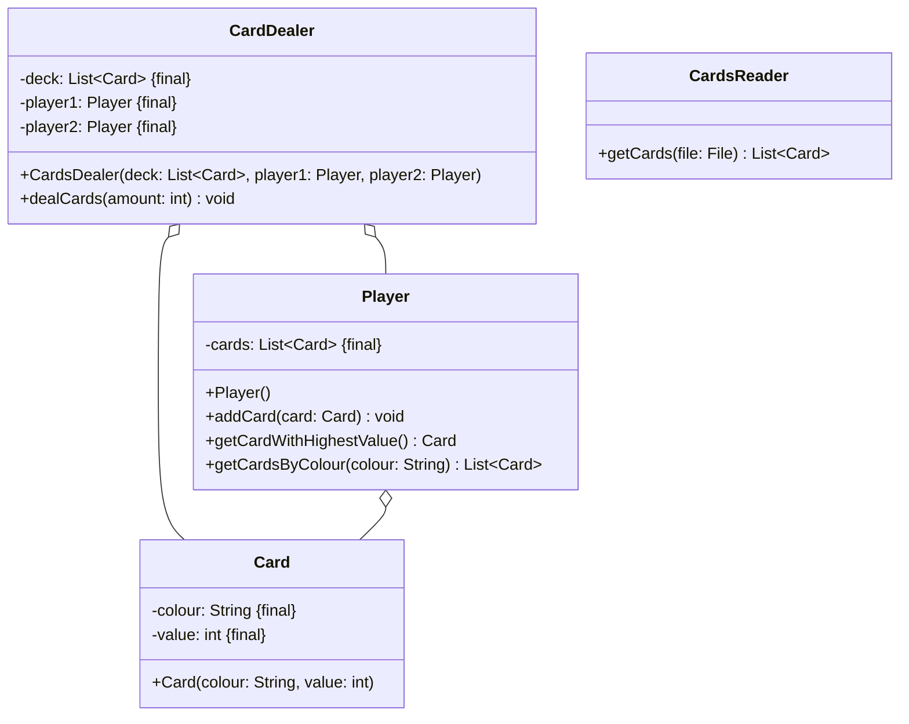

Setze das abgebildete Klassendiagramm vollständig um. Erstelle zum Testen eine
ausführbare Klasse.

## Klassendiagramm



## Allgemeine Hinweise

- Aus Gründen der Übersicht werden im Klassendiagramm keine Getter und
  Object-Methoden dargestellt
- So nicht anders angegeben, sollen Konstruktoren, Setter, Getter sowie die
  Object-Methoden wie gewohnt implementiert werden

## Hinweise zur Klasse _Player_

- Die Methode `void addCard(card: Card)` soll dem Spieler die eingehende Karte
  hinzufügen
- Die Methode `List<Card> getCardsByColour(colour: String)` soll alle Karten des
  Spielers zur eingehenden Farbe zurückgeben
- Die Methode `Card getCardWithHighestValue()` soll die Karte des Spielers mit
  dem höchsten Wert zurückgeben

## Hinweis zur Klasse _CardsDealer_

Die Methode `void dealCards(amount: int)` soll den beiden Spielern die
eingehende Anzahl an zufälligen Karten des Decks austeilen

## Hinweis zur Klasse _CardsReader_

Die Methode `List<Card> getCards(file: File)` soll alle Karten der eingehenden
Datei zurückgeben.

## Beispielhafter Aufbau der Kartendatei

```
Karo;1
Karo;2
Karo;3
Karo;4
Karo;5
Herz;1
Herz;2
Herz;3
Herz;4
Herz;5
Pik;1
Pik;2
Pik;3
Pik;4
Pik;5
Kreuz;1
Kreuz;2
Kreuz;3
Kreuz;4
Kreuz;5
```
