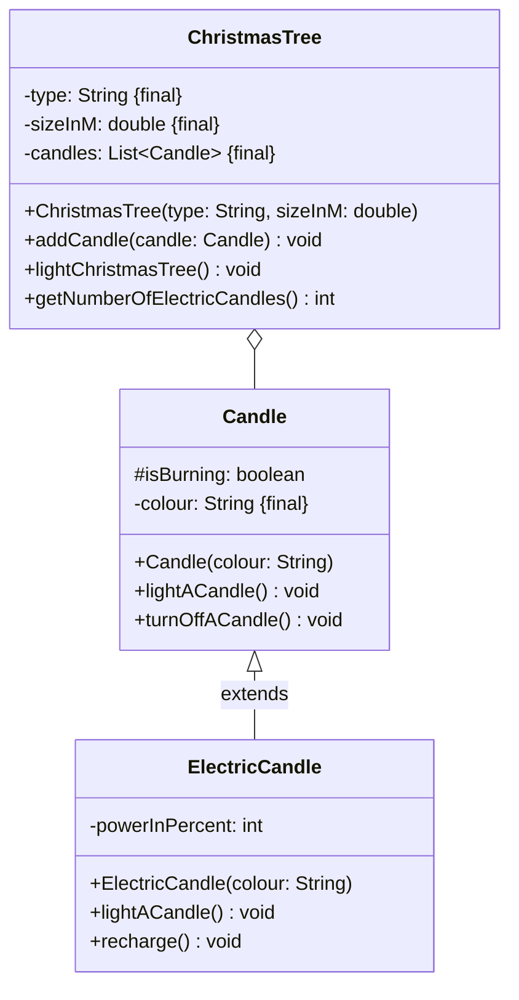

Setze das abgebildete Klassendiagramm vollständig um. Erstelle zum Testen eine
ausführbare Klasse.

## Klassendiagramm

## Allgemeine Hinweise

- Aus Gründen der Übersicht werden im Klassendiagramm keine Getter und
  Object-Methoden dargestellt
- So nicht anders angegeben, sollen Konstruktoren, Setter, Getter sowie die
  Object-Methoden wie gewohnt implementiert werden

## Hinweise zur Klasse _ChristmasTree_

- Die Methode `void addCandle(candle: Candle)` soll der Kerzenliste (`candles`)
  die eingehende Kerze hinzufügen
- Die Methode `void lightChristmasTree()` soll alle Kerzen "entzünden"
- Die Methode `int getNumberOfElectricCandles()` soll die Anzahl elektrischer
  Kerzen zurückgeben

## Hinweise zur Klasse _Candle_

- Die Methode `void lightACandle()` soll die Kerze "entzünden"
- Die Methode `void turnOffACandle()` soll die Kerze "ausmachen"

## Hinweise zur Klasse _ElectricCandle_

- Der Konstruktor soll die Energie (`powerInPercent`) auf den Wert _100_ setzen
- Die Methode `void lightACandle()` soll die elektrische Kerze "entzünden", wenn
  diese noch über Energie verfügt und die Energie um den Wert _10_ reduzieren
- Die Methode `void recharge()` soll die Energie der elektrische Kerze wieder
  auf den Wert _100_ setzen
