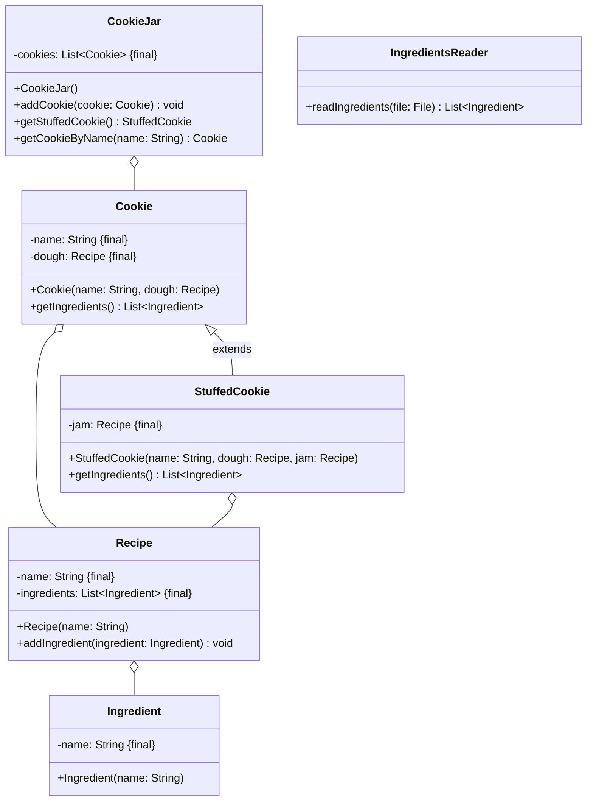

Setze das abgebildete Klassendiagramm vollständig um. Erstelle zum Testen eine
ausführbare Klasse.

## Klassendiagramm



## Allgemeine Hinweise

- Aus Gründen der Übersicht werden im Klassendiagramm keine Getter und
  Object-Methoden dargestellt
- So nicht anders angegeben, sollen Konstruktoren, Setter, Getter sowie die
  Object-Methoden wie gewohnt implementiert werden
-

## Hinweis zur Klasse _Cookie_

Die Methode `List<Ingredient> getIngredients()` soll alle Zutaten des Teigs
zurückgeben.

## Hinweis zur Klasse _StuffedCookie_

Die Methode `List<Ingredient> getIngredients()` soll alle Zutaten des Teigs
sowie der Füllung zurückgeben.

## Hinweis zur Klasse _Recipe_

Die Methode `void addIngredient(ingredient: Ingredient)` soll dem Rezept die
eingehende Zutat hinzufügen.

## Hinweise zur Klasse _CookieJar_

- Die Methode `void addCookie(cookie: Cookie)` soll der Plätzchendose das
  eingehende Plätzchen hinzufügen
- Die Methode `StuffedCookie getStuffedCookie()` soll ein beliebiges gefülltes
  Plätzchen der Plätzchendose zurückgeben
- Die Methode `Cookie getCookieByName(name: String)` soll ein Plätzchen der
  Plätzchendose zum eingehenden Namen zurückgeben

## Hinweis zur Klasse _IngredientsReader_

Die Methode `List<Ingredient> readIngredients()` soll alle Zutaten der
eingehenden Datei auslesen und zurückgeben.

## Beispielhafter Aufbau der Zutatendatei

```
200g Butter
300g Mehl
1 Prise Salz
100g gemahlene Mandeln
150g Zucker
1 Pck. Vanillezucker
2 Eier
```
