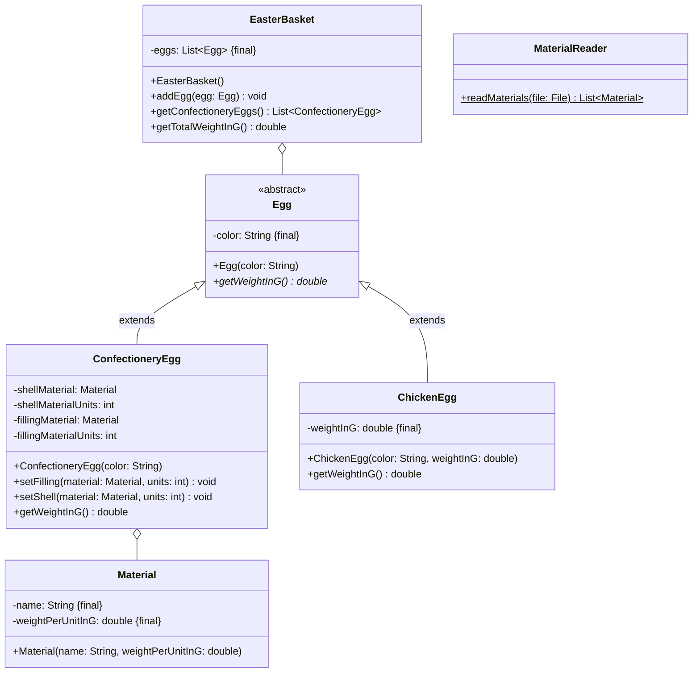

Setze das abgebildete Klassendiagramm vollständig um. Erstelle zum Testen eine
ausführbare Klasse.

## Klassendiagramm



## Allgemeine Hinweise

- Aus Gründen der Übersicht werden im Klassendiagramm keine Object-Methoden
  dargestellt
- So nicht anders angegeben, sollen Konstruktoren, Setter, Getter sowie die
  Object-Methoden wie gewohnt implementiert werden

## Hinweise zur Klasse _ConfectioneryEgg_

- Der Konstruktor soll die Farbe des Genusseis initialisieren
- Die Methode `void setFilling(material: Material, units: int)` soll das
  Material sowie die Einheiten der Füllung initialisieren
- Die Methode `void setShell(material: Material, units: int)` soll das Material
  sowie die Einheiten der Hülle initialisieren
- Die Methode `double getWeightInG()` soll das Gewicht des Genusseis gemäß der
  Formel _(Gewicht pro Einheit der Hülle × Einheiten der Hülle) + (Gewicht pro
  Einheit der Füllung × Einheiten der Füllung)_ berechnen und zurückgeben

## Hinweise zur Klasse _EasterBasket_

- Die Methode `void addEgg(egg: Egg)` soll der Eierliste das eingehende Ei
  hinzufügen
- Die Methode `List<ConfectioneryEgg> getConfectioneryEggs()` soll alle
  Genusseier zurückgeben
- Die Methode `double getTotalWeightInG()` soll das Gesamtgewicht aller Eier
  zurückgeben

## Hinweis zur Klasse _MaterialReader_

Die statische Methode `List<Material> readMaterials(file: File)` soll alle
Materialien der eingehenden Datei zurückgeben.

## Beispielhafter Aufbau der Materialdatei

```
Schokolade;2
Haselnusscreme;1
Marzipan;3
Fruchtsirup;0.5
```
