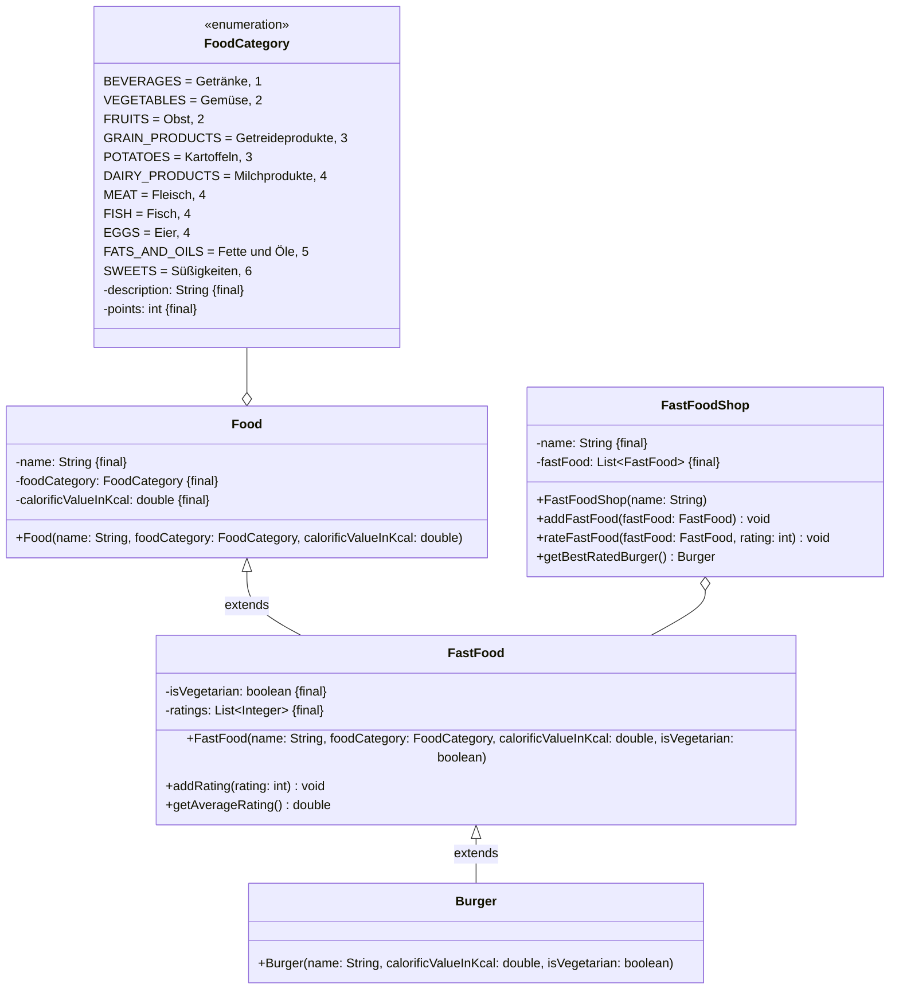

Setze das abgebildete Klassendiagramm vollständig um. Erstelle zum Testen eine
ausführbare Klasse.

## Klassendiagramm

## Allgemeine Hinweise

- Aus Gründen der Übersicht werden im Klassendiagramm keine Getter und
  Object-Methoden dargestellt
- So nicht anders angegeben, sollen Konstruktoren, Setter, Getter sowie die
  Object-Methoden wie gewohnt implementiert werden

## Hinweise zur Klasse _FastFood_

- Die Methode `void addRating(rating: int)` soll den Bewertungen (`ratings`) die
  eingehende Bewertung hinzufügen
- Die Methode `double getAverageRating()` soll die durchschnittliche Bewertung
  zurückgeben

## Hinweise zur Klasse _FastFoodShop_

- Die Methode `void addFastFood(fastFood: FastFood)` soll das eingehende Fast
  Food zum Sortiment hinzufügen
- Die Methode `void rateFastFood(fastFood: FastFood, rating: int)` soll dem
  eingehenden Fast Food die eingehende Bewertung hinzufügen
- Die Methode `Burger getBestRatedBurger()` soll den Burger mit der höchsten
  Bewertung zurückgeben
