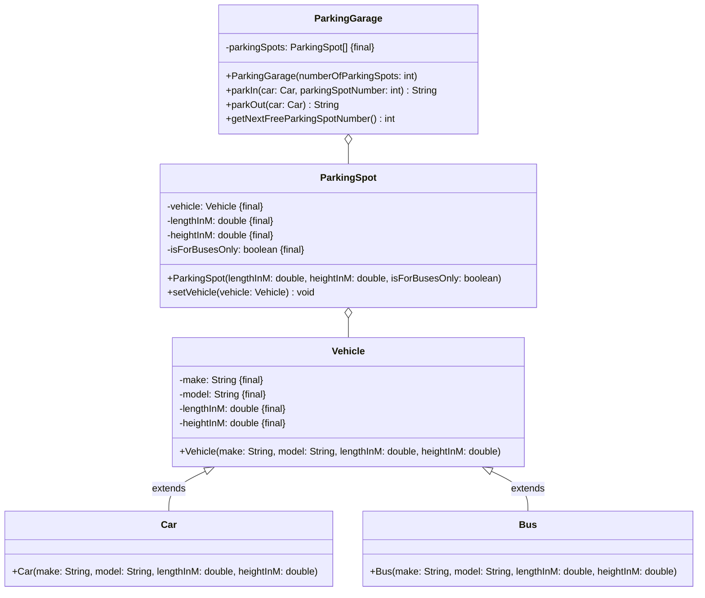

Setze das abgebildete Klassendiagramm vollständig um. Erstelle zum Testen eine
ausführbare Klasse.

## Klassendiagramm

## Allgemeine Hinweise

- Aus Gründen der Übersicht werden im Klassendiagramm keine Getter und
  Object-Methoden dargestellt
- So nicht anders angegeben, sollen Konstruktoren, Setter, Getter sowie die
  Object-Methoden wie gewohnt implementiert werden

## Hinweise zur Klasse _ParkingGarage_

- Die Methode `String parkIn(car: Car, parkingSpotNumber: int)` soll das
  eingehende Fahrzeug dem Parkplatz mit der eingehenden Parkplatznummer zuweisen
  und eine enstprechende Erfolgsmeldung zurückgegeben. Für den Fall, dass der
  Parkplatz bereits besetzt ist, oder dass es sich bei dem eingehenden Fahrzeug
  um ein Auto handelt, der Parkplatz aber nur für Busse ist, oder dass der
  Parkplatz zu klein ist, soll eine entsprechende Fehlermeldung zurückgegeben
  werden
- Die Methode `String parkOut(car: Car)` soll das eingehende Fahrzeug
  "ausparken" und eine enstsprechende Erfolgsmeldung zurückgeben. Für den Fall,
  dass das Fahrzeug in der Tiefgarage nicht vorhanden ist, soll eine
  entsprechende Fehlermeldung zurückgegeben werden
- Die Methode `int getNextFreeParkingSpotNumber()` soll die Nummer des nächsten
  freien Parkplatzes zurückgeben
