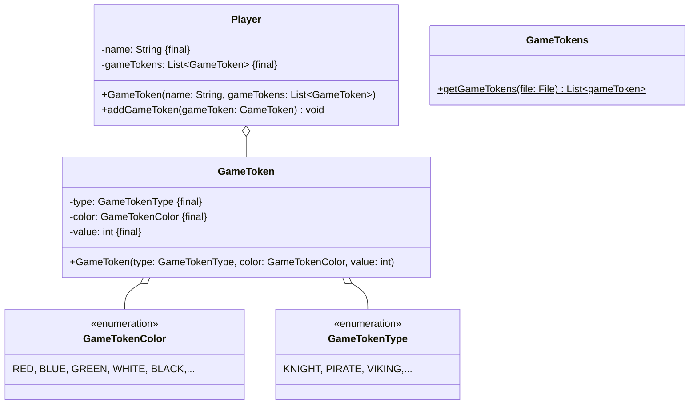

Setze das abgebildete Klassendiagramm vollständig um. Erstelle zum Testen eine
ausführbare Klasse.

## Klassendiagramm



## Allgemeine Hinweise

- Aus Gründen der Übersicht werden im Klassendiagramm keine Getter und
  Object-Methoden dargestellt
- So nicht anders angegeben, sollen Konstruktoren, Setter, Getter sowie die
  Object-Methoden wie gewohnt implementiert werden

## Hinweis zur Klasse _Player_

Die Methode `void addGameToken(gameToken: gameToken)` soll den Spielfiguren die
eingehene Spielfigur hinzufügen.

## Hinweis zur Klasse _GameTokens_

Die Methode `List<GameToken> getGameTokens(file: File)` soll alle Spielfiguren
der eingehenden Datei in einer zufälligen Reihenfolge zurückgeben.

## Beispielhafter Aufbau der Spielfigurendatei

```
KNIGHT;RED;3
PIRATE;BLUE;2
PIRATE;GREEN;4
VIKING;WHITE;1
```
