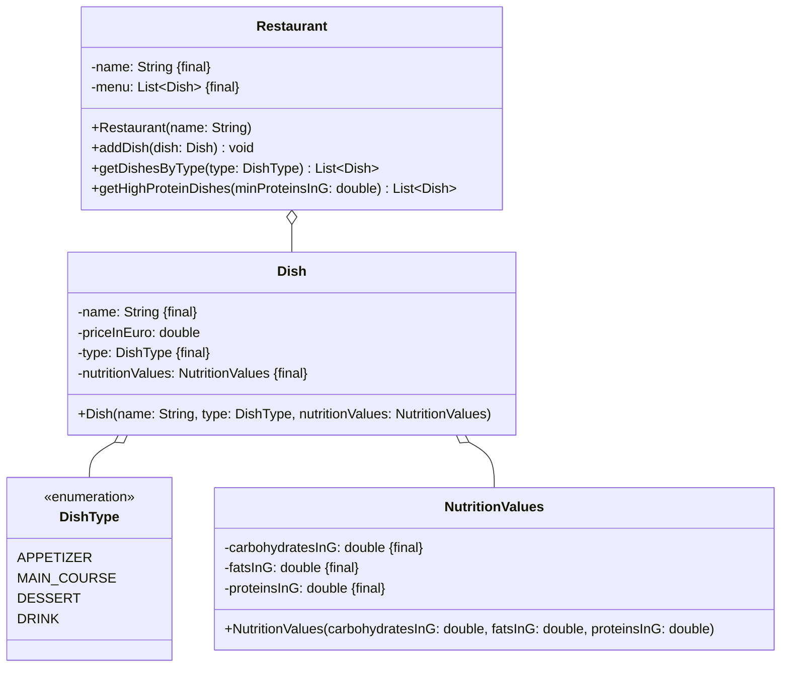

Setze das abgebildete Klassendiagramm vollständig um. Erstelle zum Testen eine
ausführbare Klasse und/oder eine Testklasse.

## Klassendiagramm

## Allgemeine Hinweise

- Aus Gründen der Übersicht werden im Klassendiagramm keine Object-Methoden
  dargestellt
- So nicht anders angegeben, sollen Konstruktoren, Setter, Getter sowie die
  Object-Methoden wie gewohnt implementiert werden

## Hinweise zur Klasse _Restaurant_

- Die Methode `void addDish(dish: Dish)` soll dem Menü das eingehende Gericht
  hinzufügen
- Die Methode `List<Dish> getDishesByType(type: DishType)` soll alle Gerichte
  vom eingehenden Typ zurückgeben
- Die Methode `List<Dish> getHighProteinDishes(minProteinsInG: double)` soll
  alle Gerichte zurückgeben, die mindestens über den eingehenden Eiweißwert
  verfügen
