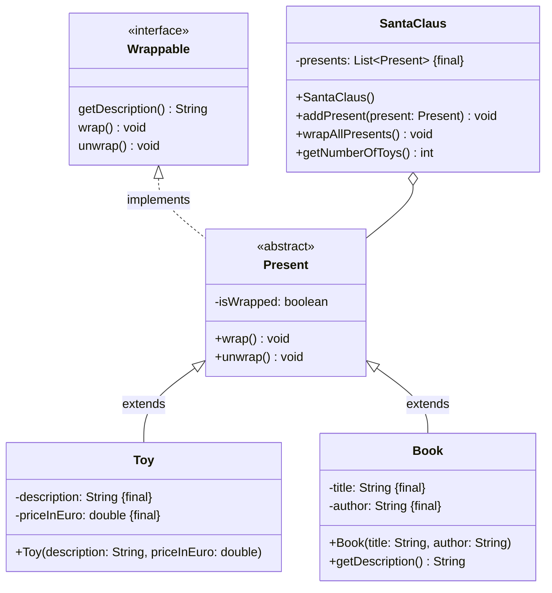

Setze das abgebildete Klassendiagramm vollständig um. Erstelle zum Testen eine
ausführbare Klasse.

## Klassendiagramm

## Allgemeine Hinweise

- Aus Gründen der Übersicht werden im Klassendiagramm keine Getter und
  Object-Methoden dargestellt
- So nicht anders angegeben, sollen Konstruktoren, Setter, Getter sowie die
  Object-Methoden wie gewohnt implementiert werden

## Hinweise zur Klasse _Present_

- Die Methode `void wrap()` soll das Geschenk einpacken
- Die Methode `void unwrap()` soll das Geschenk auspacken

## Hinweis zur Klasse _Book_

Die Methode `String getDescription()` soll die Beschreibung in der Form _[Titel]
[Autor]_ zurückgeben

## Hinweise zur Klasse _SantaClaus_

- Die Methode `void addPresent(present: Present)` soll der Geschenkeliste das
  eingehende Geschenk hinzufügen
- Die Methode `int getNumberOfToys()` soll die Anzahl Spielzeuge in der
  Geschenkeliste zurückgeben
- Die Methode `void wrapAllPresents()` soll alle Geschenke der Geschenkeliste
  einpacken
