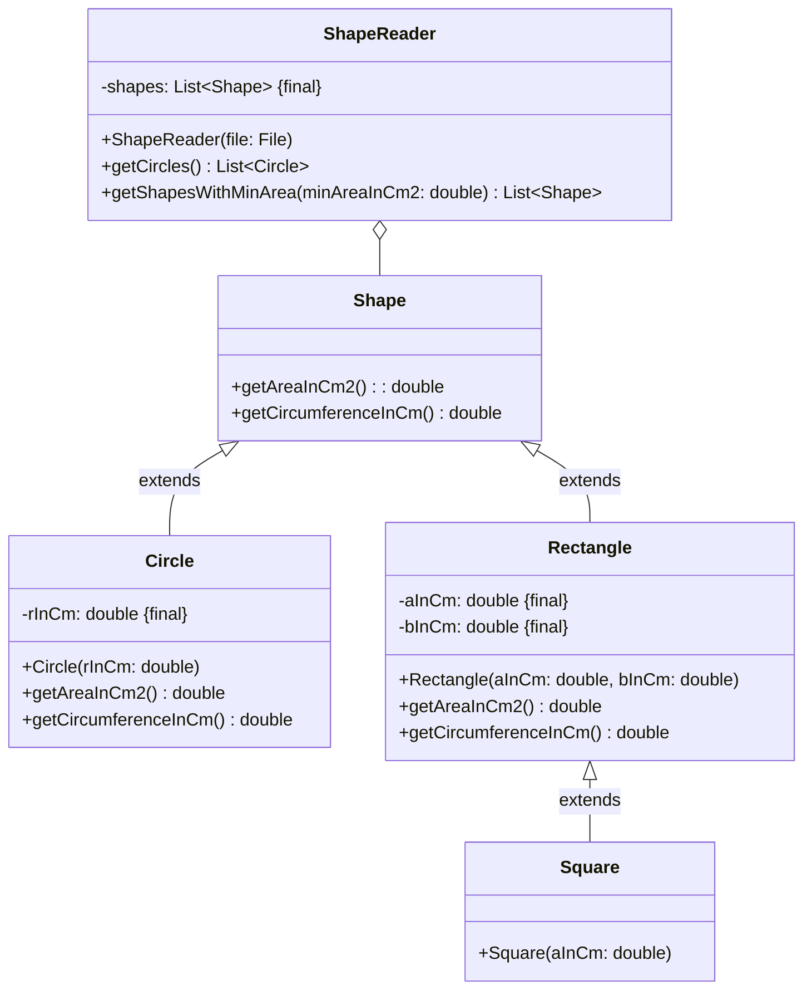

Setze das abgebildete Klassendiagramm vollständig um. Erstelle zum Testen eine
ausführbare Klasse.

## Klassendiagramm


```mermaid
classDiagram
    ShapeReader o-- Shape
    Shape <|-- Circle : extends
    Shape <|-- Rectangle : extends
    Rectangle <|-- Square : extends

    class ShapeReader {
        -shapes: List~Shape~ &#123final&#125
        +ShapeReader(file: File)
        +getCircles() List~Circle~
        +getShapesWithMinArea(minAreaInCm2: double) List~Shape~
    }

    class Shape {
        +getAreaInCm2(): double
        +getCircumferenceInCm() double
    }

    class Circle {
        -rInCm: double &#123final&#125
        +Circle(rInCm: double)
        +getAreaInCm2() double
        +getCircumferenceInCm() double
    }

    class Rectangle {
        -aInCm: double &#123final&#125
        -bInCm: double &#123final&#125
        +Rectangle(aInCm: double, bInCm: double)
        +getAreaInCm2() double
        +getCircumferenceInCm() double
    }

    class Square {
        +Square(aInCm: double)
    }
```

## Allgemeine Hinweise

- Aus Gründen der Übersicht werden im Klassendiagramm keine Getter und
  Object-Methoden dargestellt
- So nicht anders angegeben, sollen Konstruktoren, Setter, Getter sowie die
  Object-Methoden wie gewohnt implementiert werden
- Die statische Konstante `PI` der Klasse `Math` stellt die Kreiszahl Pi dar

## Hinweise zur Klasse _Shape_

- Die Methode `double getAreaInCm2()` soll den Wert _0_ zurückgeben
- Die Methode `double getCircumferenceInCm()` soll den Wert _0_ zurückgeben

## Hinweise zur Klasse _Circle_

- Die Methode `double getAreaInCm2()` soll den Flächeninhalt gemäß der Formel
  `𝐴 = 𝜋 ∗ 𝑟 ∗ 𝑟` berechnen und zurückgeben
- Die Methode `double getCircumferenceInCm()` soll den Umfang gemäß der Formel
  `U = 2 ∗ 𝜋 ∗ 𝑟` berechnen und zurückgeben

## Hinweise zur Klasse _Rectangle_

- Die Methode `double getAreaInCm2()` soll den Flächeninhalt gemäß der Formel
  `𝐴 = 𝑎 ∗ 𝑏` berechnen und zurückgeben
- Die Methode `double getCircumferenceInCm()` soll den Umfang gemäß der Formel
  `U = 2 ∗ 𝑎 + 2 ∗ 𝑏` berechnen und zurückgeben

## Hinweise zur Klasse _ShapeReader_

- Der Konstruktor soll der Formenliste (`shapes`) alle Formen der eingehenden
  Datei hinzufügen
- Die Methode `List<Circle> getCircles()` soll alle Kreise der Formenliste
  (`shapes`) zurückgeben
- Die Methode `List<Shape> getShapesWithMinArea(minAreaInCm2: double)` soll alle
  Formen der Formenliste (`shapes`) zurückgeben, die mindestens den eingehenden
  Flächeninhalt aufweisen

## Beispielhafter Aufbau der Formendatei

```
Circle;4
Square;5
Rectangle;3;4
Rectangle;1;7
Circle;2
Circle;3
```
