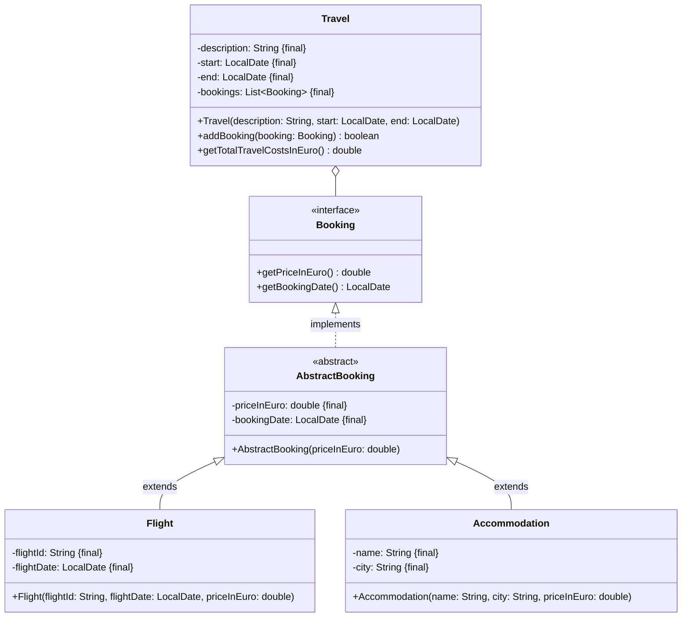

Setze das abgebildete Klassendiagramm vollständig um. Erstelle zum Testen eine
ausführbare Klasse.

## Klassendiagramm

## Allgemeine Hinweise

- Aus Gründen der Übersicht werden im Klassendiagramm keine Getter und
  Object-Methoden dargestellt
- So nicht anders angegeben, sollen Konstruktoren, Setter, Getter sowie die
  Object-Methoden wie gewohnt implementiert werden

## Hinweis zur Klasse _AbstractBooking_

Der Konstruktor soll den Preis mit dem eingehenden Wert initialisieren und das
Buchungsdatum auf das aktuelle Datum setzen.

## Hinweise zur Klasse _Travel_

- Die Methode `void booking: Booking)` soll den Buchungen die eingehende Buchung
  hinzufügen
- Die Methode `double getTotalTravelCostsInEuro()` soll die Gesamtkosten aller
  Buchungen der Reise in Euro zurückgeben
- Die Methode `List<Flight> getFlights()` soll alle Flüge der Reise zurückgeben
