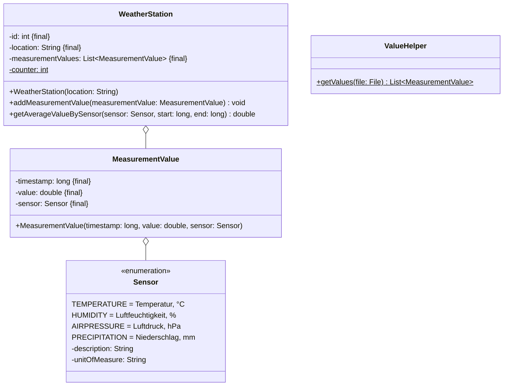

Setze das abgebildete Klassendiagramm vollständig um. Erstelle zum Testen eine
ausführbare Klasse.

## Klassendiagramm



## Allgemeine Hinweise

- Aus Gründen der Übersicht werden im Klassendiagramm keine Getter und
  Object-Methoden dargestellt
- So nicht anders angegeben, sollen Konstruktoren, Setter, Getter sowie die
  Object-Methoden wie gewohnt implementiert werden

## Hinweise zur Klasse _WeatherStation_

- Der Konstruktor soll den Zähler inkrementieren, den Standort sowie die
  Messwerte initialisieren und der ID den Wert des Zählers zuweisen
- Die Methode `void addMeasurementValue(measurementValue: MeasurementValue)`
  soll den Messwerten den eingehenden Messwert hinzufügen
- Die Methode `String toString()` soll die Wetterstation in der Form _[ID],
  [Standort]: [Messwerte]_ zurückgeben
- Die Methode
  `double getAverageValueBySensor(sensor: Sensor, start: long, end: long)` soll
  den Durchschnittswert aller Messwerte, die innerhalb der eingehenden
  Zeitstempel liegen und zum eingehenden Sensor gehören, zurückgeben

## Hinweis zur Klasse _ValueHelper_

Die statische Methode `List<MeasurementValue> getValues(file: File)` soll alle
Messwerte der eingehenden Datei zurückgeben.

## Beispielhafter Aufbau der Messwertedatei

```console
1732702614139;25.4;TEMPERATURE
1732702614139;66.21;HUMIDITY
1732702614139;1013.66;AIRPRESSURE
1732702614139;0;PRECIPITATION
1732789072901;19.7;TEMPERATURE
1732789072901;33.89;HUMIDITY
1732789072901;1040.12;AIRPRESSURE
1732789072901;0;PRECIPITATION
```
