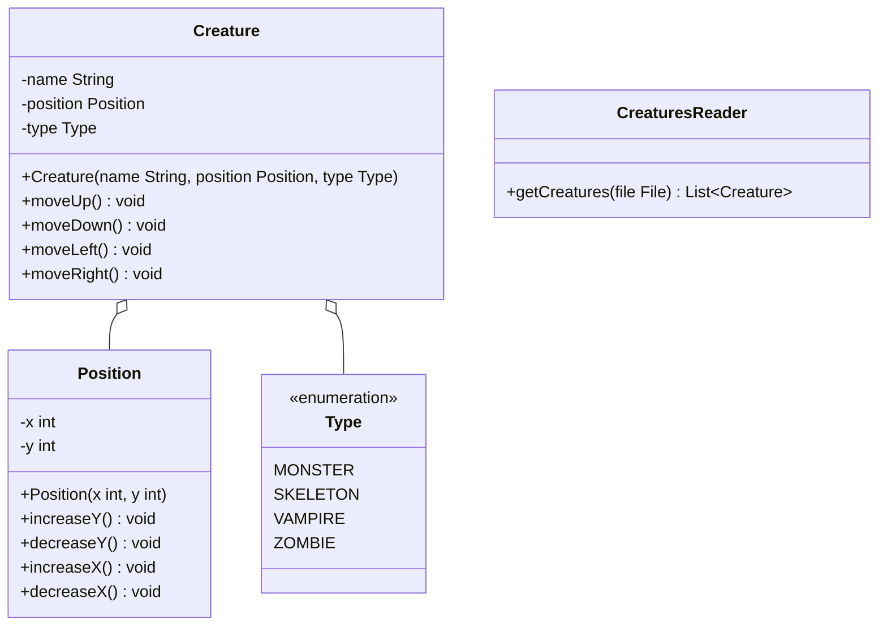

Setze das abgebildete Klassendiagramm vollständig um. Erstelle zum Testen eine ausführbare Klasse.

## Klassendiagramm



## Allgemeine Hinweise

- Aus Gründen der Übersicht werden im Klassendiagramm keine Getter und Object-Methoden dargestellt
- So nicht anders angegeben, sollen Konstruktoren, Setter, Getter sowie die Object-Methoden wie gewohnt implementiert werden

## Hinweise zur Klasse Creature

- Die Methode `void moveUp()` soll den Y-Wert der Position inkrementieren
- Die Methode `void moveDown()` soll den Y-Wert der Position dekrementieren
- Die Methode `void moveLeft()` soll den X-Wert der Position dekrementieren
- Die Methode `void moveRigth()` soll den X-Wert der Position inkrementieren

## Hinweis zur Klasse CreaturesReader

Die Methode `List<Creature> getCreatures(file: File)` soll alle Kreaturen der eingehenden Datei zurückgeben und die Kreaturen die Bewegungen der eingehenden Datei ausführen lassen.

## Beispielhafter Aufbau der Kreaturendatei

```
Frankensteins Monster;MONSTER;0;5
DOWN;DOWN;LEFT;LEFT
Dracula;VAMPIRE;3;3
UP;RIGHT;UP
Kurt;ZOMBIE;-2;-2
DOWN
```
