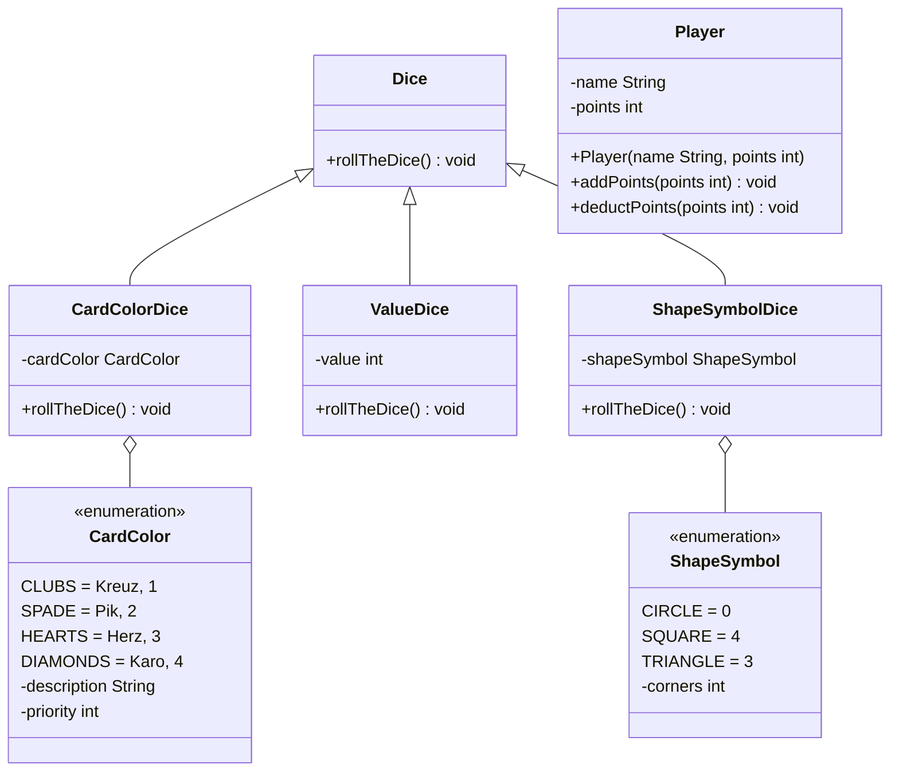

Setze das abgebildete Klassendiagramm vollständig um. Erstelle für jedes
Würfelspiel eine ausführbare Klasse.

## Klassendiagramm

## Allgemeine Hinweise

- Aus Gründen der Übersicht werden im Klassendiagramm keine Getter und
  Object-Methoden dargestellt
- So nicht anders angegeben, sollen Konstruktoren, Setter, Getter sowie die
  Object-Methoden wie gewohnt implementiert werden

## Hinweis zur Klasse CardColorDice

Die Methode `void rollTheDice()` soll mit einer gleichverteilten
Wahrscheinlichkeit der Kartenfarbe (`cardColor`) einen Wert zuweisen

## Hinweis zur Klasse ValueDice

Die Methode `void rollTheDice()` soll mit einer gleichverteilten
Wahrscheinlichkeit dem Wert (`value`) eine Zahl zwischen 1 und 6 zuweisen

## Hinweis zur Klasse ShadeSymbolDice

Die Methode `void rollTheDice()` soll mit einer gleichverteilten
Wahrscheinlichkeit dem Formensymbol (`shadeSymbol`) einen Wert zuweisen

## Hinweise zur Klasse Player

- Die Methode `void addPoints(points: int)` soll die Punkte des Spielers
  (`points`) um die eingehenden Punkte erhöhen
- Die Methode `void deductPoints(points: int)` soll die Punkte des Spielers
  (`points`) um die eingehenden Punkte reduzieren

## Hinweise zum Würfelspiel 1

- Anzahl Spieler: 1
- Würfel: 5 Formenwürfel
- Ablauf:
  - Das Spiel soll aus mehreren Runden bestehen
  - Zu Beginn soll der Spieler seinen Namen eingeben
  - Zu Beginn einer jeden Runde sollen alle Würfel geworfen werden
  - Nach jedem Wurf soll der Spieler eingeben, ob die Anzahl Ecken (`corners`)
    aller Würfel höher als 12 ist oder nicht. Liegt der Spieler mit seiner
    Einschätzung richtig, bekommt er einen Punkt
  - Am Ende einer Runde soll der Spieler eingeben, ob er eine weitere Runde
    spielen möchte
  - Am Ende des Spiels soll die Anzahl der gespielten Runden sowie die Punktzahl
    ausgegeben werden

## Hinweise zum Würfelspiel 2

- Anzahl Spieler: 2
- Würfel: 1 Formenwürfel, 1 Zahlenwürfel
- Ablauf:
  - Beide Spieler sollen zu Beginn des Spiels ihre Namen eingeben
  - Beide Spieler sollen das Spiel mit 100 Punkte beginnen
  - Beide Spieler sollen abwechselnd solange zwei Würfel werfen, bis einer der
    beiden Spieler keine Punkte mehr hat
  - In jeder Runde verliert der Spieler mit dem schlechteren Wurfwert Punkte
    (die Differenz der beiden Wurfwerte)
- Hinweis: Der Wurfwert berechnet sich nach der Formel _Zahlenwert des
  Zahlenwürfels \* Anzahl Ecken des gewürfelten Formensymbols_
