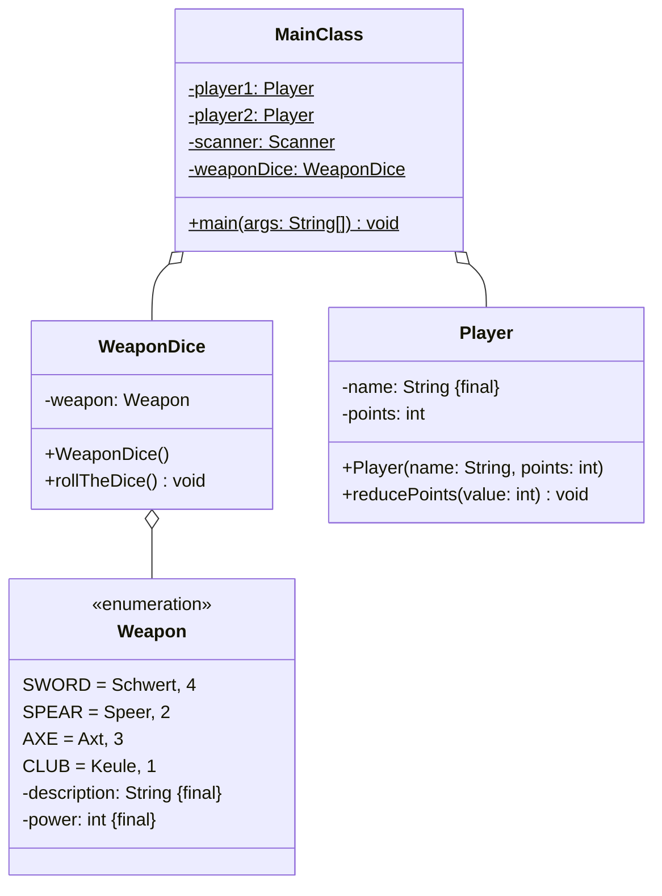

Setze das abgebildete Klassendiagramm vollständig um. Orientiere Dich bei der
Konsolenausgabe am abgebildeten Beispiel.

## Klassendiagramm



## Allgemeine Hinweise

- Aus Gründen der Übersicht werden im Klassendiagramm keine Getter und
  Object-Methoden dargestellt
- So nicht anders angegeben, sollen Konstruktoren, Setter, Getter sowie die
  Object-Methoden wie gewohnt implementiert werden

## Hinweise zur Klasse _WeaponDice_

- Der Konstruktor soll den Würfel werfen
- Die Methode `void rollTheDice()` soll mit einer gleichverteilten
  Wahrscheinlichkeit dem Waffen-Symbol einen Wert zuweisen

## Hinweis zur Klasse _Player_

Die Methode `void reducePoints(points: int)` soll die Punkte des Spielers um die
eingehenden Punkte reduzieren.

## Spielablauf

- Zu Beginn des Spiels sollen die Spieler ihre Namen eingeben können
- Jeder Spieler soll zu Beginn des Spiels 10 Punkte besitzen
- Zu Beginn jeder Runde soll der aktuelle Punktestand für beide Spieler
  ausgegeben werden
- Anschließend sollen beide Spieler abwechselnd den Würfel werfen
- Der Spieler mit dem niedrigeren Wurfwert (Stärke des gewürfelten
  Waffensymbols) soll Punkte in Höhe der Differenz der beiden Wurfwerte
  verlieren
- Das Spiel soll Enden, sobald ein Spieler keine Punkte mehr besitzt
- Am Ende soll der Gewinner des Spiels ausgegeben werden

## Beispielhafte Konsolenausgabe

```console
Spieler 1, gib bitte Deinen Namen ein: Lisa
Spieler 2, gib bitte Deinen Namen ein: Hans

Punkte Lisa: 10
Punkte Hans: 10
Waffen-Symbol Lisa: Schwert
Waffen-Symbol Hans: Speer
Punkte Hans: 8
...
Punkte Lisa: 1
Punkte Hans: 5
Waffen-Symbol Lisa: Keule
Waffen-Symbol Hans: Speer
Punkte Lisa: 0

Hans gewinnt
```
