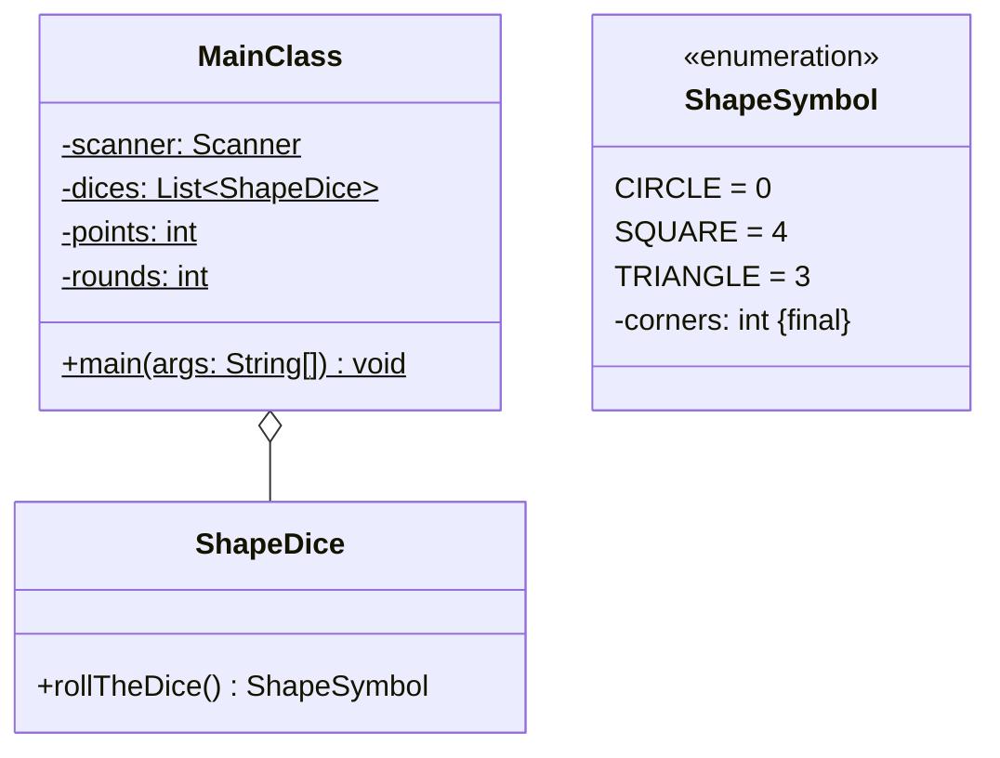

Setze das abgebildete Klassendiagramm vollständig um. Orientiere Dich bei der
Konsolenausgabe am abgebildeten Beispiel.

## Klassendiagramm



## Allgemeine Hinweise

- Aus Gründen der Übersicht werden im Klassendiagramm keine Getter und
  Object-Methoden dargestellt
- So nicht anders angegeben, sollen Konstruktoren, Setter, Getter sowie die
  Object-Methoden wie gewohnt implementiert werden

## Hinweis zur Klasse _ShapeDice_

Die Methode `ShapeSymbol rollTheDice()` soll mit einer gleichverteilten
Wahrscheinlichkeit ein Formensymbol zurückgeben.

## Spielablauf

- Das Spiel soll aus mehreren Runden bestehen
- Zu Beginn einer jeden Runde sollen 5 Würfel geworfen werden
- Nach dem Wurf soll der Spieler eingeben, ob die Anzahl Ecken (`corners`) aller
  Würfel höher als 12 ist oder nicht. Liegt der Spieler mit seiner Einschätzung
  richtig, bekommt er einen Punkt
- Am Ende einer Runde soll der Spieler eingeben, ob er eine weitere Runde
  spielen möchte
- Am Ende des Spiels soll die Anzahl der gespielten Runden sowie die Punktzahl
  ausgegeben werden

## Beispielhafte Konsolenausgabe

```console
Ist die Anzahl Ecken höher als 12 (Ja, Nein)?: Nein
Richtig (10)
Möchtest Du eine weitere Runde spielen (Ja, Nein)?: Ja

Ist die Anzahl Ecken höher als 12 (Ja, Nein)?: Ja
Falsch (6)
Möchtest Du eine weitere Runde spielen (Ja, Nein)?: Ja

Ist die Anzahl Ecken höher als 12 (Ja, Nein)?: Nein
Falsch (16)
Möchtest Du eine weitere Runde spielen (Ja, Nein)?: Nein

Gespielte Runden: 3
Erzielte Punkte: 1
```
