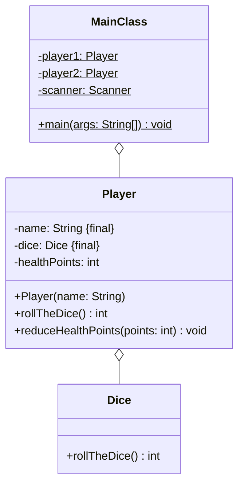

Setze das abgebildete Klassendiagramm vollständig um. Orientiere Dich bei der
Konsolenausgabe am abgebildeten Beispiel.

## Klassendiagramm



## Allgemeine Hinweise

- Aus Gründen der Übersicht werden im Klassendiagramm keine Getter und
  Object-Methoden dargestellt
- So nicht anders angegeben, sollen Konstruktoren, Setter, Getter sowie die
  Object-Methoden wie gewohnt implementiert werden

## Hinweis zur Klasse _Dice_

Die Methode `int rollTheDice()` soll mit einer gleichverteilten
Wahrscheinlichkeit einen Wert zwischen 1 und 6 zurückgeben.

## Hinweis zur Klasse _Player_

Der Konstruktor soll alle Attribute initialisieren und die Lebenspunkte auf den
Wert 10 setzen.

## Spielablauf

- Zu Beginn des Spiels sollen die Spieler ihre Namen eingeben können
- Beide Spieler sollen zu Beginn des Spiels 10 Lebenspunkte besitzen
- Zu Beginn einer jeder Runde soll der aktuelle Punktestand ausgegeben werden
- Anschließend sollen beide Spieler ihre Würfel werfen
- Der Spieler mit dem niedrigeren Wurfwert soll einen Lebenspunkt verlieren, bei
  Gleichstand soll keiner der Spieler einen Lebenspunkt verlieren
- Das Spiel soll Enden, sobald ein Spieler keine Lebenspunkte mehr besitzt
- Am Ende soll der Gewinner des Spiels ausgegeben werden

## Beispielhafte Konsolenausgabe

```console
Spieler 1, gib bitte Deinen Namen ein: Hans
Spieler 2, gib bitte Deinen Namen ein: Peter

Hans hat 10 Lebenspunkte
Peter hat 10 Lebenspunkte
Hans würfelt eine 6
Peter würfelt eine 6
...
Hans hat 4 Lebenspunkte
Peter hat 1 Lebenspunkte
Hans würfelt eine 5
Peter würfelt eine 1
Peter verliert einen Punkt

Hans gewinnt
```
